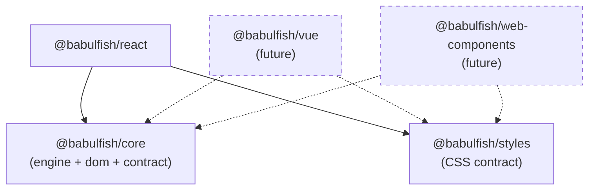

# babulfish

Client-side, in-browser translation powered by WebGPU machine learning.
No server round-trips, no API keys — the model runs entirely in the user's browser.

## Pick your binding

| You want... | Package | Demo |
|---|---|---|
| React UI (batteries included) | [`@babulfish/react`](packages/react/README.md) | [`packages/demo`](packages/demo/) |
| Any framework or no framework | [`@babulfish/core`](packages/core/README.md) | [`packages/demo-vanilla`](packages/demo-vanilla/README.md) |
| Web Components (`<babulfish-translator>`) | [`@babulfish/core`](packages/core/README.md) | [`packages/demo-webcomponent`](packages/demo-webcomponent/README.md) |

`@babulfish/react` is a thin projection of `@babulfish/core` — both share one engine singleton.
Use `@babulfish/core` directly when you need framework-agnostic access or are building your own binding.

## Quick start (React)

```bash
npm install @babulfish/react
```

```tsx
import { TranslatorProvider, useTranslator } from "@babulfish/react"
import "@babulfish/react/css"

function App() {
  return (
    <TranslatorProvider>
      <TranslatePage />
    </TranslatorProvider>
  )
}

function TranslatePage() {
  const { loadModel, translateTo, restore, model, translation } = useTranslator()

  return (
    <div>
      <button onClick={() => loadModel()} disabled={model.status !== "idle"}>
        Load model
      </button>
      <button onClick={() => translateTo("es")} disabled={model.status !== "ready"}>
        Translate to Spanish
      </button>
      <button onClick={() => restore()}>Restore</button>
      <p>Model: {model.status} | Translation: {translation.status}</p>
    </div>
  )
}
```

See [`packages/react/README.md`](packages/react/README.md) for the full API.

## Architecture



`@babulfish/core` bundles three layers: the translation **engine** (model lifecycle, WebGPU/WASM device selection), the **DOM** orchestrator (tree-walking, text-node replacement, Shadow DOM support), and the **contract** (`createBabulfish` facade unifying both).

## Repo layout

```
packages/
  core/               @babulfish/core — engine + DOM + contract
  react/              @babulfish/react — React binding
  styles/             @babulfish/styles — CSS custom properties and animations
  demo/               React / Next.js demo app (private)
  demo-vanilla/       Zero-framework vanilla DOM demo
  demo-webcomponent/  Shadow DOM custom element demo
docs/
  ui-agnostic-core.md Design document
  plans/              Execution plans
```

## Links

- [Design document](docs/ui-agnostic-core.md)
- [Execution plan](docs/plans/ui-agnostic-core.md)
