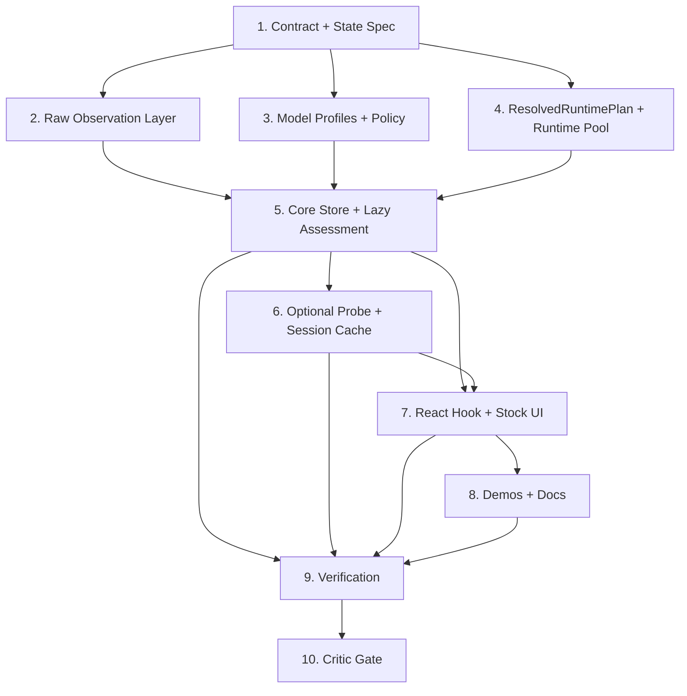

# Capability-Based Model Enablement

Date: 2026-04-16
Status: Recommended planning baseline for the later coding pass

## Recommendation

Use a two-layer model:

1. Keep `snapshot.capabilities` as immutable raw observations gathered from the browser and available without pretending we measured VRAM.
2. Add `snapshot.enablement` as a mutable assessment state machine that combines model profile data, policy inference, optional probe results, and the final product verdict.

Back that with one shared `ResolvedRuntimePlan` used by both assessment and execution. Do not let policy choose one backend while `createEngine()` or `loadModel()` quietly choose another.

Runner-up:

- Introduce a fuller shared `RuntimeProfile` service that owns observations, policy, probes, and engine pooling. That is cleaner long-term, but it is too much refactor for the repo as it exists today unless near-term roadmap already includes multiple shipped models, runtime switching, or persistent diagnostics reuse.

## Current Repo Constraints

- `createBabulfish()` currently detects capabilities once during construction and freezes them into the store.
- `snapshot.capabilities` is immutable by design today; replacing it throws.
- `engine.load()` resolves the backend again at load time, separately from the earlier capability snapshot.
- `engine-handle.ts` is a config-blind singleton. First core wins; later cores share the same engine even when config differs.
- `@babulfish/react` mirrors the core snapshot almost directly through `useTranslator()`.
- The stock `<TranslateButton />` and all demos already treat `capabilitiesReady`, `canTranslate`, `device`, and `isMobile` as user-visible truth.
- SSR today is intentionally inert. The server uses `SSR_CORE`, and the client swaps to a live core on mount.

Those constraints make a shallow “add more fields to `getTranslationCapabilities()`” plan wrong. The real seam is the core snapshot/store plus the engine-sharing layer.

## Design Decisions

### Policy Location

- Capability policy belongs in `@babulfish/core`, alongside engine detection and runtime planning.
- React, the demos, and the compat package should consume the resulting state. They should not implement policy.
- The planning path should live near `packages/core/src/engine/*` and be orchestrated from `packages/core/src/core/babulfish.ts`.

### Config Surface

- Keep low-level execution config and high-level enablement config distinct.
- Do not turn public `createEngine()` config into a planner kitchen sink.
- Introduce a broader `BabulfishConfig.engine` shape for `createBabulfish()` that can include:
  - current execution fields: `modelId`, `dtype`, `device`, `maxNewTokens`, `sourceLanguage`
  - new planning fields under `enablement`
  - optional `modelProfile` override or profile id
- Keep public `EngineConfig` narrowly execution-focused for the bare engine path.

Recommended `enablement` config shape:

```ts
type EnablementConfig = {
  policy?: "default" | CapabilityPolicy
  modelProfile?: "auto" | ModelProfileInput
  probe?: "off" | "if-needed" | "manual"
  cache?: "session" | "none"
}
```

Recommended `device` semantics:

- `"auto"`: let policy choose `webgpu` or `wasm`
- `"wasm"`: hard override to `wasm`
- `"webgpu"`: hard requirement for WebGPU; if policy or runtime says no, verdict is deny, not silent fallback

That keeps current meaning stable instead of turning `device` into a vague preference flag.

### Data Model

Keep the raw facts and the verdict separate.

```ts
type CapabilityObservation = {
  ready: boolean
  hasWebGPU: boolean
  isMobile: boolean
  approxDeviceMemoryGiB: number | null
  crossOriginIsolated: boolean
}

type FitInference = {
  outcome: "likely-fit" | "likely-no-fit" | "unknown"
  basis: "system-memory-heuristic"
  expectedModelMemoryGiB: number | null
  approxDeviceMemoryGiB: number | null
  note: string
}

type ProbeSummary = {
  status: "not-run" | "running" | "passed" | "failed" | "skipped" | "error"
  kind: "adapter-smoke" | "custom"
  cache: "hit" | "miss" | null
  note: string
}

type EnablementVerdict =
  | { outcome: "unknown"; resolvedDevice: null; reason: string }
  | { outcome: "needs-probe"; resolvedDevice: null; reason: string }
  | { outcome: "denied"; resolvedDevice: null; reason: string }
  | { outcome: "gpu-preferred"; resolvedDevice: "webgpu"; reason: string }
  | { outcome: "wasm-only"; resolvedDevice: "wasm"; reason: string }

type EnablementState = {
  status: "idle" | "assessing" | "probing" | "ready" | "error"
  modelProfile: ModelProfileSummary | null
  inference: FitInference | null
  probe: ProbeSummary
  verdict: EnablementVerdict
}
```

Recommended public contract shape:

- `snapshot.capabilities`: immutable `CapabilityObservation`
- `snapshot.enablement`: mutable `EnablementState`
- `useTranslator()` keeps the existing convenience aliases, but they become derived compat fields, not the source of truth

Compat alias guidance:

- `capabilitiesReady`: derived from `enablement.status === "ready" || enablement.status === "error"`
- `canTranslate`: `true` only for `gpu-preferred` and `wasm-only`
- `device`: `enablement.verdict.resolvedDevice`
- `hasWebGPU` and `isMobile`: raw observations

### Model Profiles

Model profiles should be explicit and curated, not guessed from adapter strings.

Recommended shape:

```ts
type ModelProfile = {
  id: string
  version: string
  modelId: string
  dtype: "q4" | "q8" | "fp16" | "fp32"
  estimatedWorkingSetGiB: number | null
  note: string
}
```

Rules:

- Ship a small built-in catalog for babulfish-supported defaults.
- Allow per-core override for custom models.
- Treat `estimatedWorkingSetGiB` as a maintained estimate, not measured truth.
- Keep one conservative estimate in v1. Do not publish fake device-specific fit tables unless the data is real.

### Assessment State Machine

- `idle`: SSR or first client render before any assessment work has started
- `assessing`: observation + profile + policy are being resolved
- `probing`: optional empirical probe is running
- `ready`: a final verdict exists
- `error`: assessment failed unexpectedly

Transitions:

- `idle -> assessing` after mount or on first `loadModel()` / explicit probe request
- `assessing -> ready` when policy alone can decide
- `assessing -> probing` when policy says the answer is inconclusive and probe mode allows a probe
- `assessing -> ready` with `needs-probe` when probe mode is manual or off
- `probing -> ready` on pass or fail
- `probing -> error` on unexpected probe failure
- `error -> assessing` on retry

Behavior rules:

- `loadModel()` must await assessment and only proceed on a ready allow verdict.
- `translateTo()` and `translateText()` continue to rely on `loadModel()` being successful; they should not invent their own capability checks.
- Aborted or partial probes must not become cached terminal results.

### Resolved Runtime Plan and Pooling

Introduce one planner output and use it everywhere:

```ts
type ResolvedRuntimePlan = {
  modelId: string
  dtype: "q4" | "q8" | "fp16" | "fp32"
  resolvedDevice: "webgpu" | "wasm"
  sourceLanguage: string
  maxNewTokens: number
}
```

Rules:

- Assessment produces either `denied(reason)` or `ResolvedRuntimePlan`.
- Engine acquisition and loading consume only `ResolvedRuntimePlan`.
- Remove backend re-resolution from `packages/core/src/engine/model.ts` for the `createBabulfish()` path.
- Replace the config-blind singleton with a page-session runtime pool keyed by the full resolved execution config.

For v1, include every behavior-affecting field in the pool key:

- `modelId`
- `dtype`
- `resolvedDevice`
- `sourceLanguage`
- `maxNewTokens`

If later reuse pressure matters, split pooled model/session resources from per-call translation behavior. Do not start there.

### Probe Strategy

Probe support is optional and should stay boring:

- Scope it as a mini backend smoke probe, not a fit oracle.
- Let it influence only inconclusive cases.
- Keep it coarse in the public snapshot: status plus short note.
- Hide exact timings and fit-score fantasies from the public API.

Recommended v1 probe:

- request adapter
- request device when needed
- check required feature bits such as `shader-f16`
- optionally run a tiny fixed-cost backend smoke operation

Do not claim:

- exact VRAM
- free memory
- deterministic pre-load fit
- exact benchmark thresholds

### Probe Cache and Invalidation

Use page-session memory only in v1.

- Default scope: in-memory `Map`, shared across cores/providers/elements in the same page session
- No persistence across reloads
- No smart eviction
- No cross-tab sharing

Probe cache key should include:

- model profile `id` and `version`
- `modelId`
- `dtype`
- requested `device`
- policy identity or version
- probe implementation version
- relevant observation fingerprint from the same page session

Invalidate on:

- model profile change
- model id or dtype change
- device override change
- policy change
- probe version change
- changed observation fingerprint

Do not cache as final:

- aborted runs
- partial runs
- thrown unexpected errors

### SSR and Client Behavior

- `SSR_CORE` stays inert.
- First client render must match SSR semantics.
- Assessment starts after mount or lazily on first action that needs it.
- Do not touch browser-only APIs during render.
- Keep the default stock UI SSR-safe by rendering neutral output until assessment is terminal.

Recommended initial states:

- SSR: `capabilities.ready = false`, `enablement.status = "idle"`, `enablement.verdict.outcome = "unknown"`
- first client render: same neutral snapshot
- client effect or first action: move into `assessing`

### Shared Singleton and Cross-Instance Risks

Current risk:

- the repo has a single shared engine that ignores later configs

Required fix:

- separate `AssessmentCache` from `RuntimePool`
- key both caches explicitly
- dedupe only for identical keys
- isolate different keys
- keep reset helpers for tests

Must remain true:

- same key shares assessment/probe/runtime work across direct cores, React providers, and web components
- different keys do not leak verdicts or backends across instances

### User-Facing Outcomes

Expose these as explicit verdicts or derived UI labels:

- `unknown`
- `needs-probe`
- `denied`
- `gpu-preferred`
- `wasm-only`

Derived convenience labels are acceptable:

- `allowed` for `gpu-preferred` or `wasm-only`
- `needs benchmark` for `needs-probe`

Do not overload `device` to mean planned, preferred, and active at different times.

## What Not To Implement

- Exact VRAM or free-memory reporting
- Public fit scores or confidence percentages
- Persistent probe caches in v1
- Smart eviction or ref-counted cache eviction in v1
- Vendor or adapter allowlists built from unstable browser strings
- Stock UI copy that hardcodes exact download size or exact benchmark claims unless that metadata is authoritative
- A “WebGPU exists, therefore allowed” shortcut

## Numbered Task Breakdown

| # | Owner | Task | Concrete deliverable | Blockers |
|---|---|---|---|---|
| 1 | [Architect] | Lock the type and migration contract | Specify `CapabilityObservation`, `EnablementState`, `ModelProfile`, `ResolvedRuntimePlan`, and compat alias semantics; update plan comments/docs for the coding pass | None |
| 2 | [Artisan] | Refactor raw observation collection | Narrow `packages/core/src/core/capabilities.ts` to raw observations only; add `deviceMemory` and `crossOriginIsolated`; keep SSR inert | 1 |
| 3 | [Artisan] | Add model profile catalog and policy evaluator | New engine-side modules for profile lookup, default phone/desktop policy, and heuristic inference | 1 |
| 4 | [Artisan] | Introduce `ResolvedRuntimePlan` and replace the config-blind singleton | Refactor `packages/core/src/core/engine-handle.ts` into a keyed page-session runtime pool; make the core path consume resolved plans only | 1 |
| 5 | [Artisan] | Add mutable `enablement` state to the core store | Extend `packages/core/src/core/store.ts`, `babulfish.ts`, and exports; gate `loadModel()` on assessment verdicts; keep first client render hydration-safe | 2, 3, 4 |
| 6 | [Experimenter] then [Artisan] | Add optional probe layer | Implement a tiny empirical smoke probe, session cache, invalidation rules, and a `needs-probe` path without pretending it proves fit | 3, 4, 5 |
| 7 | [Artisan] | Update React hook and stock UI contract | Add `enablement` to `useTranslator()`, keep narrow compat fields, migrate `<TranslateButton />` gating/copy to verdicts instead of old booleans | 5, 6 if probe ships in the same pass |
| 8 | [Artisan] | Update demos and package docs | Update all demo surfaces listed below plus root/core/react/babulfish READMEs to reflect observation vs inference vs probe vs verdict honestly | 5, 7 |
| 9 | [Test Maven] | Expand automated verification | Add unit, contract, conformance, React SSR, webcomponent, smoke, and docs coverage for the new model | 5, 6, 7, 8 |
| 10 | [Critic] | Final contract review before merge | Review docs, API wording, demo labels, and non-goals for fake precision or split-truth regressions | 8, 9 |

## Dependency Visualization



## Demo / Example / Playground Changes

Only these runnable demo/example/playground surfaces exist today:

- `packages/demo`
- `packages/demo-vanilla`
- `packages/demo-webcomponent`

Root docs also need updates because they serve as the package chooser.

### Root README

- Replace “WebGPU-first, with WASM fallback where supported” with the new capability-based story.
- Update the demo descriptions so they explain which surface proves assessment, fallback, unsupported states, and SSR/client behavior.
- Keep package chooser language honest about what is inferred versus observed.

### `packages/demo` (Next.js React demo)

Update:

- `README.md`
- `app/page.tsx`
- `app/model-status.tsx`
- `app/demo-translator-shell.tsx`
- `app/globals.css` if layout must expand
- `scripts/smoke.mjs`

Required changes:

- Replace the current boolean rows with explicit observation / inference / probe / verdict output.
- Remove copy that implies `WebGPU` alone decides support.
- Keep the first client render hydration-safe.
- Update smoke markers to the new headings and labels.

### `packages/demo-vanilla`

Update:

- `README.md`
- `index.html`
- `src/main.ts`
- `style.css`
- `vite.config.ts` and `src/vite-config.test.ts` only if the rationale text changes

Required changes:

- Add visible capability assessment state, fallback state, and unsupported state to the status card.
- Change button gating to follow the final verdict, not just `model.status`.
- Rewrite WebGPU/COOP/COEP copy so it reflects the new assessment model instead of the old shorthand.
- Add at least a lightweight behavior proof if new status logic is substantial; the current package has no demo-behavior tests.

### `packages/demo-webcomponent`

Update:

- `README.md`
- `index.html`
- `src/babulfish-translator.ts`
- `src/main.ts`
- `src/main-helpers.ts`
- `src/__tests__/babulfish-translator.test.ts`
- `src/main.test.ts`
- `vite.config.ts` and `src/vite-config.test.ts` only if the rationale text changes

Required changes:

- Extend the element-local status UI and host event log to surface the new enablement truth.
- If `Snapshot` shape changes, update the demo-local element contract docs and tests.
- Prove shared assessment/runtime behavior across two elements, not just shared model status.

### Package READMEs and Compat Surface

Update:

- `packages/core/README.md`
- `packages/react/README.md`
- `packages/babulfish/README.md`

Required changes:

- Document the new snapshot shape and hook fields.
- Explain what the old alias booleans mean after the migration.
- Correct any lifetime or ref-count claims that are no longer true or never were.

## Verification Checklist

Later coding pass must prove all of this:

- Core unit tests cover raw observation shaping, policy inference, probe state, cache keys, and invalidation.
- Core contract tests prove same-key dedupe and different-key isolation across two cores.
- Shared conformance gains at least one capability-assessment scenario and still passes for direct, vanilla DOM, and React drivers.
- React tests cover SSR neutrality, hydration, multi-provider sharing/isolation, and hook-field mapping.
- Stock button tests gate off the final verdict, not old booleans.
- Webcomponent tests prove shared assessment/runtime behavior across two elements.
- Demo smoke and README checks are updated for user-visible wording changes.
- Final repo validation remains `pnpm build`, `pnpm test`, and `pnpm docs:check`.

## Chain Of Verification

This plan answers every required question:

| Required question | Answered in |
|---|---|
| Where should capability policy live? | `Design Decisions -> Policy Location` |
| What should be configurable, and at what API layer? | `Design Decisions -> Config Surface` |
| How should raw observations / inference / probe / verdict be represented? | `Design Decisions -> Data Model` |
| What state machine is needed? | `Design Decisions -> Assessment State Machine` |
| How should model profiles be represented? | `Design Decisions -> Model Profiles` |
| How should probe results be cached and invalidated? | `Design Decisions -> Probe Cache and Invalidation` |
| What are the SSR/client implications? | `Design Decisions -> SSR and Client Behavior` |
| What are the singleton / global cache / cross-instance risks? | `Design Decisions -> Shared Singleton and Cross-Instance Risks` |
| What should user-facing outcomes be? | `Design Decisions -> User-Facing Outcomes` |
| Which demos/examples need updates, and how? | `Demo / Example / Playground Changes` |
| What should not be implemented because it implies false precision? | `What Not To Implement` |

Must-be-true conditions before the coding pass starts:

- There is one planner truth and one executor truth.
- The runtime pool key is explicit and complete enough for v1.
- SSR stays neutral until client assessment actually runs.
- Public booleans are either tightly defined compat shims or removed in a deliberate breaking pass.
- Probe support stays empirical and optional.

