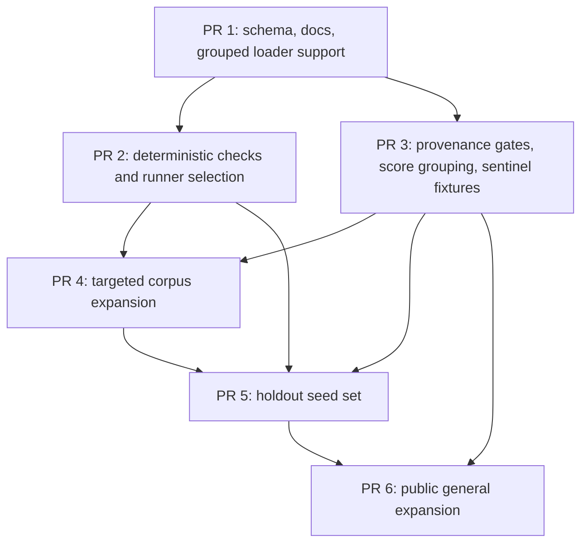

# Eval Corpus Expansion Plan

Date: 2026-04-28
Branch: `plan-eval-corpus-expansion`
Worktree: `/Users/hiren/dev/babulfish-eval-corpus-plan`
Status: planning only; do not implement harness or corpus changes in this PR.

## 1. Problem And Goals

`evals/translation/` is useful, but it is too small and too text-shaped for the behaviors babulfish sells: client-side translation that preserves UI structure, markdown, attributes, protected terms, and DOM state.

The bigger risk is false confidence. Public MT corpora and benchmarks are probably exposed to Qwen/Gemma/TranslateGemma-class models through pretraining, fine-tuning, or public benchmark evaluation. They can calibrate regressions, but they must not become the clean headline holdout.

Goals:

- Expand the corpus without contaminating clean evals with likely training data.
- Cover markdown, preservation, and DOM-specific behavior directly, not by proxy through plain text.
- Add provenance and validation gates before growing the corpus.
- Keep live WebGPU evals opt-in; default CI should stay deterministic and model-free.
- Split the work into PR-sized phases so schema, checks, holdout policy, and corpus growth do not blur together.

Non-goals:

- No harness implementation in this planning PR.
- No corpus additions in this planning PR.
- No claim that deterministic checks replace bilingual human review.

## 2. Current State

Current corpus shape:

- 38 flat JSON files in `evals/translation/`; filename stem is the case ID.
- Splits: 23 `targeted`, 15 legacy `general`.
- Target languages: 14 Spanish, 13 French, 11 Arabic.
- Content types: 25 `text`, 7 `markdown`, 6 `dom`.
- Categories: `ui-label`, `dom`, `plain`, `markdown`, `preservation`, `punctuation`, `rtl`, `named-entity`, `output-only`, `source-copy-trap`, `idiom`, `technical-docs`.

Current required fields:

- Top-level: `split`, `category`, `sourceLanguage`, `targetLanguage`, `contentType`, `source`, `references`, `checks`.
- `source.text` for `text` and `markdown`; `source.html` for `dom`.
- `reference.text` for non-DOM; `reference.html` for DOM.

Current checks:

- `sourceShouldChange`
- `expectedPatterns`
- `forbiddenPatterns`
- `preservedSubstrings`
- `markdownMarkers`
- `exactOutputOptions`
- `checkBalancedQuotes`
- `requiredSelectors`
- `preservedAttributes`

Current scoring:

- Text and markdown use `core.translateText()`.
- DOM uses `core.translateTo(lang, { root })` on an isolated fixture.
- Case pass/fail is deterministic checks.
- Case score is `check ratio * 0.85 + chrF reference similarity * 0.15`.
- Hard failures force score to 0.
- Model score is `avg check score * 0.70 + passed-case ratio * 0.20 + avg reference similarity * 0.10`.
- `pnpm eval:webgpu` is opt-in and requires Chromium/WebGPU/cross-origin isolation/model runtime support.

Known gaps:

- No standalone JSON schema or strict corpus audit.
- No required provenance metadata.
- No multiple-reference cases.
- Markdown checks are marker-substring checks, not structural checks.
- Preservation is boolean substring inclusion, not count-aware.
- DOM coverage is only 6 cases and mostly visible text plus selectors/attributes.
- No live eval coverage for rich text, structured inline DOM, linked groups, translated attributes, restore, or RTL `dir`.
- Core has no confirmed first-class `notranslate` / `translate="no"` / `.no-translate` convention, so evals must not pretend that behavior exists.

## 3. Contamination Policy

Clean holdout policy:

- `holdout` must contain only newly created private material:
  - first-party authored text
  - product-derived rewrites/paraphrases created after this policy
  - deterministic synthetic templates with human reference translations
- Clean holdout references must be human translated or human reviewed.
- Clean holdout cases must not be used for prompt tuning, model choice, threshold tuning, regex design, or check design.
- Any material edit to a clean holdout case moves it back to `targeted` or creates a new holdout ID.

Public corpus policy:

- Public corpora and benchmarks belong only in `general` with `sourceClass` `public_benchmark` or `public_web`.
- Public-source `general` cases are useful for regression/comparability, but are excluded from clean headline scores by source class.
- Public-derived cases must carry contamination warnings in provenance.

Treat these as unsafe for clean holdout:

- WMT/WMT24++/WMT25
- FLORES/FLORES-200
- OPUS/OPUS-100
- Tatoeba
- TED/IWSLT
- Europarl
- News Commentary / News Crawl
- ParaCrawl / JParaCrawl
- CCAligned / Common Crawl
- WikiMatrix / Wikipedia / Wikimedia
- OpenSubtitles
- GNOME/KDE/Ubuntu localization
- JRC-Acquis
- UN/MultiUN/UNPC

Rationale, with sources accessed 2026-04-28:

- Qwen training disclosures include public internet, third-party, labeled/contracted, and synthetic data: https://www.alibabacloud.com/help/en/model-studio/qwen-and-wan-training-data-disclosure
- Qwen3 reports 36T tokens across 119 languages/dialects and broad multilingual data: https://arxiv.org/abs/2505.09388
- Gemma 3 training includes web documents in 140+ languages: https://ai.google.dev/gemma/docs/core/model_card_3
- TranslateGemma is built on Gemma 3 and is evaluated on WMT24++; its model card reports public parallel documents in training: https://blog.google/innovation-and-ai/technology/developers-tools/translategemma/ and https://huggingface.co/google/translategemma-4b-it
- OPUS aggregates many public MT sources, including subtitles, Tatoeba, TED, ParaCrawl, WikiMatrix, WMT, localization, and UN data: https://opus.nlpl.eu/legacy/index.php
- WMT24 training data includes canonical public MT training sources: https://www2.statmt.org/wmt24/mtdata/
- Benchmark contamination is a known multilingual evaluation risk: https://arxiv.org/abs/2410.16186
- FLORES contamination can transfer across translation directions: https://arxiv.org/abs/2601.20858

Risk table:

| Source class | Clean holdout risk | Allowed use |
|---|---:|---|
| WMT, FLORES, Tatoeba, public benchmarks | Very high | Calibration only |
| OPUS, ParaCrawl, CCAligned, WikiMatrix, UN, Europarl, TED | Very high | Stress/regression only |
| Public web, Wikipedia, subtitles, localization corpora | High | Domain probes only |
| Newly authored first-party private text | Low | Clean holdout |
| Synthetic templates with human references | Low-medium | Clean holdout if private |
| Product-derived rewrites | Low-medium | Clean holdout if post-policy and private |

## 4. Corpus Design

Recommendation: move to a grouped corpus with typed provenance metadata.

Runner-up options:

- Keep flat files and add metadata. Cheapest, but weak governance and easy to mix public cases into headline scores.
- Create separate behavior suites/runners. Cleanest boundaries, but too much phase-1 churn.

Target layout:

```text
evals/translation/
  README.md
  schema.json
  targeted/
  general/
  holdout/
```

Case path:

```text
<split>/<contentType>/<category>/<source>-<target>/<slug>.json
```

Examples:

```text
targeted/markdown/markdown/en-es/release-note-link-list.json
holdout/dom/dom-attrs/en-ar/settings-button-aria-label.json
general/text/calibration-public/en-fr/flores-style-short-news.json
```

Path and JSON must agree. Accepted holdout IDs are immutable; deprecate and replace instead of renaming.

Required provenance block:

```json
{
  "provenance": {
    "sourceClass": "first_party_authored",
    "authorId": "stable-human-or-team-id",
    "createdAt": "2026-04-28",
    "sourceOrigin": "private-doc-or-ticket-id",
    "derivedFrom": null,
    "publicExposure": "private",
    "reviewStatus": "technical_reviewed",
    "referenceTranslatorId": "stable-human-or-vendor-id",
    "referenceReviewerId": "stable-human-or-vendor-id",
    "referenceReviewDate": "2026-04-28",
    "technicalReviewerId": "stable-human-or-team-id",
    "technicalReviewDate": "2026-04-28",
    "notes": "short rationale"
  }
}
```

Provenance must be specific enough to audit later. `sourceOrigin` should point to a private source doc, ticket, product screen, or template ID. `derivedFrom` is required for product rewrites and templates, and must describe the rewrite/template rule without exposing private customer text. Freeform "private" claims are not enough for `holdout`.

Allowed `sourceClass`:

- `first_party_authored`
- `product_derived_rewrite`
- `synthetic_template`
- `public_benchmark`
- `public_web`
- `unknown`

Allowed `publicExposure`:

- `private`
- `public`
- `mixed`
- `unknown`

Allowed `reviewStatus`:

- `draft`
- `reference_reviewed`
- `technical_reviewed`
- `holdout_approved`
- `deprecated`

Categories:

- Existing useful text categories: `plain`, `ui-label`, `idiom`, `technical-docs`, `punctuation`, `rtl`, `named-entity`, `source-copy-trap`, `output-only`, `preservation`, `markdown`.
- New DOM/product categories: `dom-structure`, `dom-rich-text`, `dom-attrs`, `dom-linked`, `dom-rtl`, `dom-restore`.
- Public bucket category: `calibration-public`.

Use `dom-*` categories instead of a single `dom` bucket. A flat `dom` category hides the product behavior under test.

Language matrix:

- Phase 1 core: `en->es`, `en->fr`, `en->ar` across all core categories.
- Phase 1 reverse smoke: `es->en`, `fr->en`, `ar->en` only for `plain`, `preservation`, and `markdown`.
- Later: add `en->de`, `en->ja`, and `en->hi`; expand reverse DOM only after forward DOM scoring is stable.

Target counts:

| Phase | Total | Targeted | Holdout | Public general | Notes |
|---|---:|---:|---:|---:|---|
| 1 | 120 target | 72 | 36 target | 12 | Establish governance and behavior coverage |
| 2 | 250 | TBD | TBD | TBD | At least 90 combined DOM/markdown/preservation |
| 3 | 500+ | TBD | TBD | TBD | Add new frozen holdout; do not tune against old holdout |

The phase-1 holdout target is 36 only if review capacity is real. If bilingual review is the bottleneck, ship a smaller honest seed of 12-18 `holdout` cases rather than rubber-stamping references to hit a round number.

Phase 1 allocation:

| Family | Targeted | Holdout | Public general |
|---|---:|---:|---:|
| text basics | 18 | 9 | 4 |
| preservation/entities/source-copy | 18 | 9 | 2 |
| markdown | 18 | 9 | 2 |
| DOM behavior | 18 | 9 | 4 |

## 5. Markdown Strategy

Markdown evals should verify structure, not just translated prose.

Phase 1 markdown coverage:

- headings by level and count
- ordered and unordered list item counts
- nested list depth
- fenced code block count
- fenced code language tag
- inline code span count and protected code text
- link count, labels, and href preservation
- image count, src preservation, and alt translation policy
- table row/cell counts
- blockquote structure
- frontmatter delimiter/key preservation if frontmatter cases are added

Checks should fail when:

- a list flattens into one paragraph
- a fenced block loses its language tag
- a link label translates but `href` disappears
- inline code is translated or dropped
- table rows/cells merge
- frontmatter keys translate when they should not

Important distinction:

- `contentType: "markdown"` through `translateText()` checks markdown-as-text behavior.
- DOM rich text cases check markdown authored in DOM source/attributes and rendered through DOM translation behavior.

Do not claim markdown coverage from `markdownMarkers` alone.

## 6. Preservation Strategy

Preservation must be count-aware.

Protect and count:

- product names: `babulfish`, `TranslateGemma`, `WebGPU`
- APIs and code identifiers
- placeholders and template variables
- URLs and route paths
- SKUs and IDs
- currency/date literals
- repeated linked labels
- punctuation and quote pairs when meaning depends on them

Validation rule:

- Count expected occurrences from source or explicit metadata.
- Normalize Unicode for counting.
- Keep case-sensitive exact matching for product names unless case-insensitive metadata says otherwise.
- Fail when output count is lower than expected, even if the substring appears once.

Do not use broad regexes that can pass by accident. If a protected token matters, the case should say how many times it must survive.

## 7. DOM Strategy

DOM evals must cover product behavior the plain-text path cannot see.

Phase 1 DOM categories:

- `dom-structure`: inline `a`, `strong`, `em`, `code`, `br`, lists, and form-adjacent structure.
- `dom-rich-text`: markdown-authored DOM text/attrs rendering and fallback.
- `dom-attrs`: translated attributes versus preserved attributes.
- `dom-linked`: keyed duplicate labels translate once and fan out consistently.
- `dom-rtl`: root `dir` and mixed-direction content.
- `dom-restore`: source recovery after translation, once runner support can observe before/after state.

Checks should include:

- required selectors with expected counts
- visible text checks scoped to selectors
- preserved attributes such as `href`, `data-testid`, `id`, and form values where appropriate
- translated attributes such as `title` and configured `aria-label`
- hidden text exclusion for `hidden`, `aria-hidden="true"`, `display:none`, and `visibility:hidden`
- skip islands for `script`, `style`, `noscript`, `code`, `pre`, number-only nodes, symbol-only nodes, and configured skip behavior
- optional `dir` assertions for RTL cases

Runner fixture support required before DOM-heavy cases are valid:

- per-case DOM translator config for `richText`, `structuredText`, `linkedBy`, translated attributes, preserve matchers, and skip rules
- selector-scoped output capture, not only whole-root `innerHTML`
- split/category/language filters so manual live runs can target small DOM or markdown slices
- artifact summaries grouped by split, content type, category, language pair, and source class

No-translate policy:

- Do not add headline no-translate cases until product behavior is explicitly supported.
- If the product adopts `translate="no"`, `notranslate`, or `.no-translate`, add product/runner support first, then add corpus cases.
- Until then, validation should reject corpus cases that claim no-translate semantics without a supported mechanism.

Restore policy:

- Keep `dom-restore` in the architecture now.
- Defer restore-heavy holdout cases until the runner can capture before/after state and assert source recovery.

## 8. Harness And Schema Upgrades

Implement these before adding the large corpus:

1. Add a strict schema or equivalent typed validator for every `evals/translation/**/*.json` case.
2. Accept grouped paths while preserving legacy flat files during migration.
3. Validate path-derived split/content type/category/language pair against JSON fields.
4. Reject unknown top-level keys and unknown `checks` keys.
5. Reject invalid regexes and invalid CSS selectors before live evals run.
6. Add provenance validation and holdout eligibility checks.
7. Add count-aware preservation checks.
8. Add markdown structural checks.
9. Add DOM structural/attribute/hidden/skip checks.
10. Add runner selection by split, category, content type, language pair, and source class.
11. Add artifact summaries by group so a 120-case run is readable and cheap to triage.
12. Aggregate scores by split and source class, excluding `public_benchmark` and `public_web` from clean headline scores.
13. Add a local optimization/report mode that uses `targeted,general` by default and excludes `holdout`.
14. Require explicit holdout-run metadata: runner, timestamp, model, filters, reason, and whether references were exposed.

Default CI should stay deterministic:

- unit tests for scorer/validator behavior
- `pnpm docs:check` for corpus audit, provenance, docs, and packaging smoke
- no model downloads or browser/WebGPU dependency in default CI

Live WebGPU evals remain manual:

```bash
pnpm eval:webgpu -- --model qwen-3-0.6b --split targeted --category markdown --output-dir .evals/manual-webgpu-run
pnpm eval:webgpu -- --model all --split targeted --output-dir .evals/manual-webgpu-all
```

Holdout runs require an explicit `--split holdout` choice and a recorded reason. That does not make anti-tuning foolproof, but it turns misuse from accidental behavior into an auditable decision.

## 9. Corpus Expansion Workflow

Case lifecycle:

1. Author creates a `targeted` case with provenance and draft checks.
2. Reference translator supplies one or more acceptable references.
3. Reference reviewer checks meaning, register, entities, and preservation.
4. Technical reviewer checks regexes, selectors, attributes, structural checks, and over-broad assertions.
5. Holdout gate verifies private provenance and confirms the case has not been used for tuning.
6. Case moves to `holdout` and freezes.

Review rules:

- Any reference edit after holdout approval requires re-review.
- Any material source/check edit after holdout approval mints a new ID or moves the case back to `targeted`.
- Public-derived cases never move to `holdout`.
- Synthetic templates must document generation rules and must have human references.
- Target references must not be generated by the evaluated model family.
- Every target language needs an owner for reference review and a separate owner for technical review.
- Review in batches of 6-12 cases per language; do not approve a 36-case holdout seed in one giant pass.
- If reviewer capacity is missing, reduce holdout scope instead of weakening the gate.
- Holdout approval requires stable reviewer IDs, review dates, source-origin references, and explicit confirmation that the case was not used for tuning.
- Holdout run artifacts must record who ran them, why, which model, which filters, and whether expected references were visible.

## 10. PR Stack



1. `[Architect] PR 1: Schema, docs, grouped loader support`
   - Add schema/provenance docs.
   - Teach loader grouped paths while accepting legacy flat files during migration.
   - Validate path split/content type/category/language pair against JSON fields.
   - Do not move all cases yet.
   - Blocks every later PR.

2. `[Test Maven] PR 2: Deterministic checks and runner selection`
   - Add count-aware preservation checks.
   - Add markdown structure checks.
   - Add DOM selector-count, visible text, preserved attribute, translated attribute, hidden, skip, optional RTL, and executable-attribute safety checks.
   - Add per-case DOM runner config for `richText`, `structuredText`, `linkedBy`, translated attrs, preserve matchers, and skip rules.
   - Add split/category/content type/language/source-class filters and grouped artifact summaries.
   - Add paired negative tests for every new check type.
   - Depends on PR 1.

3. `[Test Maven] PR 3: Provenance gates, score grouping, sentinel fixtures`
   - Require provenance metadata.
   - Enforce holdout eligibility.
   - Add holdout run metadata and default local optimization mode that excludes holdout.
   - Aggregate by split/source class.
   - Exclude `public_benchmark` and `public_web` from clean headline scores.
   - Add tiny public-labeled sentinel fixtures so aggregation/reporting is tested before the full public bucket exists.
   - Depends on PR 1.

4. `[Artisan] PR 4: Targeted corpus expansion`
   - Add the 72 phase-1 `targeted` cases under the full validators.
   - Prioritize markdown, preservation, and DOM forward directions.
   - Keep headline score semantics unchanged.
   - Depends on PR 2 and PR 3.

5. `[Critic] PR 5: Holdout seed set`
   - Add 36 reviewed `holdout` cases if reviewer capacity is real; otherwise seed 12-18 and document the gap.
   - Freeze IDs and record reviewer IDs, review dates, source origins, and holdout approval metadata.
   - Reduce accidental tuning and make any holdout use explicit and auditable.
   - Depends on PR 2, PR 3, and PR 4.

6. `[Researcher] PR 6: Public general probes`
   - Expand to 12 public-source general cases with contamination warnings.
   - Label results as regression/comparability only.
   - Confirm no clean score aggregation includes them.
   - Depends on PR 3 and should follow PR 5 to avoid muddying the clean holdout rollout.

## 11. Validation

Add a deterministic corpus audit and include it in `pnpm docs:check`.

Validation must fail for:

- unknown top-level keys
- unknown or misspelled `checks` keys
- duplicate path-derived IDs
- path/JSON split mismatch
- path/JSON content type mismatch
- path/JSON category mismatch
- invalid source/target language pair
- `dom` case without `source.html` and `reference.html`
- `text` or `markdown` case without `source.text` and `reference.text`
- invalid regex syntax
- invalid CSS selectors
- attribute checks missing selector, attribute, or expected value
- `holdout` with public, mixed, unknown, or missing provenance
- `public_benchmark` or `public_web` included in clean headline score aggregation
- repeated preserved token count loss
- markdown structure loss
- required DOM selector loss
- preserved attribute mutation
- translated HTML or attributes introduce executable URLs, event-handler attributes, or raw markup outside allowed DOM rehydration
- hidden text translated when the case asserts exclusion
- no-translate claims before product support exists
- a new check type lacks paired positive and negative tests
- a case-specific broad regex has no technical-review note explaining why it is safe

Unit test surface:

- scorer/validator tests with synthetic valid and invalid cases
- deterministic check tests for markdown, preservation, DOM selectors, attributes, hidden text, and hard failures
- paired passing/failing fixtures for every new check type
- no browser, model, or network dependency

Docs/check surface:

- corpus schema audit
- provenance audit
- matrix count audit
- docs/artifact contract drift
- package consumer smoke stays in `docs:check`

Live eval surface:

- manual `pnpm eval:webgpu` run for model-facing regressions
- default single-model run for broad corpus changes
- full `--model all` sweep before release or major prompt/runtime changes
- split/category/language filters for targeted runs
- artifact summaries grouped by split, content type, category, language pair, and source class

Recommended local commands during implementation:

```bash
pnpm --filter @babulfish/demo-vanilla test -- webgpu-eval-scorer
pnpm test
pnpm docs:check
pnpm eval:webgpu -- --model qwen-3-0.6b --split targeted --category markdown --output-dir .evals/manual-webgpu-run
```

## 12. Risks And Mitigations

| Risk | Mitigation |
|---|---|
| Public corpus leakage makes headline scores look better than real product quality | `holdout` provenance gate; public sources only in `general` and excluded from clean scoring by source class |
| Holdout becomes a tuning loop | Default optimization reports exclude holdout; holdout runs require explicit filters, reason, and run metadata |
| Regex checks become gameable | Prefer structural checks, count-aware preservation, scoped selectors, paired negative tests, and technical-review notes for broad regexes |
| Markdown checks only preserve punctuation | Add structure-specific checks for lists, links, code, tables, headings, and frontmatter |
| DOM evals collapse into visible-text similarity | Require selector counts, attrs, hidden/skip checks, RTL, linked, rich text, and restore coverage |
| DOM output introduces script/URL/attribute injection risk | Validate executable URLs, event attributes, raw markup, and preserved URL attributes in deterministic checks |
| Validation slows corpus creation | Make `targeted` visible/mutable; reserve heavy gates for `holdout` |
| Runtime cost grows too fast | Keep deterministic validation in CI; keep live WebGPU opt-in; add split/category/language filters and group summaries |
| Human review burden becomes the bottleneck | Use per-language owners, 6-12 case batches, smaller honest holdout seed if needed, and clear review metadata |

## 13. What Not To Do

- Do not import WMT, FLORES, OPUS, Tatoeba, TED/IWSLT, Europarl, ParaCrawl, WikiMatrix, Wikipedia, OpenSubtitles, GNOME/KDE/Ubuntu, UN, or similar public corpora into `holdout`.
- Do not mix `public_benchmark` or `public_web` cases into clean headline scores.
- Do not tune prompts, thresholds, regexes, or model choice from holdout failures.
- Do not add large targeted or holdout corpus batches before the structural validators exist.
- Do not generate target references with the evaluated model family.
- Do not claim markdown coverage from marker substring checks alone.
- Do not claim DOM coverage from visible text alone.
- Do not accept broad case-specific regexes without a technical-review note and negative test.
- Do not add no-translate evals before the product has a supported no-translate convention.
- Do not make live WebGPU evals part of default CI.
- Do not rename accepted holdout IDs; deprecate and replace.

## 14. Acceptance Checklist

- [x] Plan was written in an isolated worktree, not the original checkout.
- [x] Current eval schema, counts, scoring, docs, tests, and gaps were mapped by `[Scout] Current eval map`.
- [x] Product-critical DOM/markdown/preservation behavior was mapped by `[Scout] DOM/markdown behavior map`.
- [x] Contamination-safe source policy was researched by `[Researcher] Contamination-safe corpus sources`.
- [x] Corpus architecture was designed by `[Architect] Corpus architecture`.
- [x] Validation strategy was designed by `[Test Maven] Validation strategy`.
- [x] `[Critic] Plan review` reviewed the draft.
- [x] Material Critic fixes were revised once and focused re-reviewed.
- [x] Final plan includes numbered tasks with agent assignments.
- [x] Final plan includes blocking dependencies and a Mermaid dependency diagram.
- [x] Final plan splits work into PR-sized phases.
- [x] Final plan includes what not to do.
- [x] Final plan includes acceptance criteria and verification commands.
- [x] Final repo diff contains only this plan and scratchpad artifacts in the isolated worktree.
