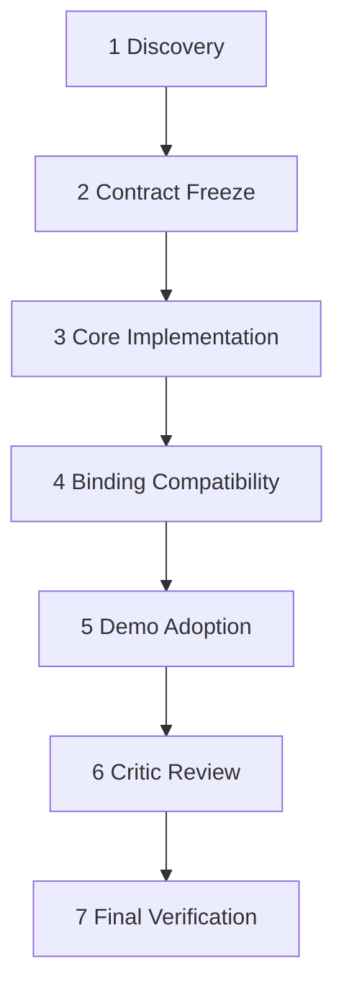

# Multi-Model Translation Adapters

## Goal

Implement the approved translation adapter/model-spec layer in `@babulfish/core`, then update demo apps to expose built-in model choices without breaking practical `modelId` compatibility.

## Dependency Graph

## Tasks

1. Discovery: `[Scout/Core]`, `[Scout/Bindings]`, `[Scout/Demos]`
2. Contract Freeze: `[Architect/CoreContract]`, `[Architect/DemoSurface]`
3. Core Implementation: `[Artisan/CoreRegistry]`, `[Artisan/PipelineLoader]`
4. Binding Compatibility: orchestrator validation, plus follow-up worker only if needed
5. Demo Adoption: `[Artisan/DemoShared]`, `[Artisan/ReactDemo]`, `[Artisan/VanillaDemo]`, `[Artisan/WebComponentDemo]`
6. Critic Review: `[Critic/API]`, `[Critic/UX]`, `[Critic/Maintainer]`
7. Final Verification: `[Test Maven/Core]`, `[Test Maven/Demos]`, then root checks

## Phase Gates

- No contract freeze until all discovery manifests are present and read.
- No implementation until contract manifests are present and read.
- No demo adoption until core implementation tests pass for `@babulfish/core` and `@babulfish/react`.
- No final verification until Critic review accepts or bounded revision tasks are complete.

## Acceptance Criteria

- Built-ins exist for `translategemma-4`, `qwen-2.5-0.5b`, `qwen-3-0.6b`, and `gemma-3-1b-it`.
- Default engine behavior remains TranslateGemma-compatible without config changes.
- `engine.model` accepts built-in ids or custom specs; legacy `modelId` overrides remain valid.
- Runtime identity includes resolved model id, adapter id, dtype, device, source language, max tokens, subfolder, and model file name.
- Demos expose registry ids while preserving practical `modelId` deep links.
- Core, React, and demo tests cover adapter invocation/extraction, registry resolution, URL config, and compatibility.
