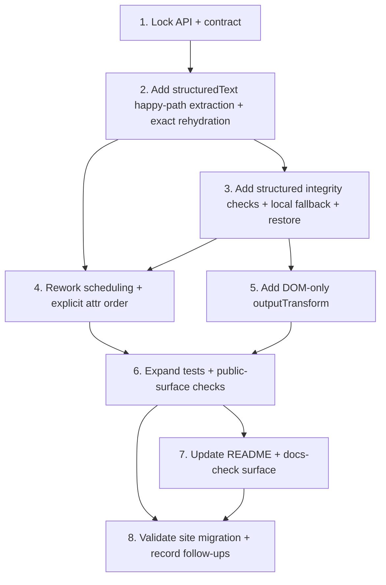

# Productionizing `babulfish` Without Baking In Site Policy

## Problem Statement

`babulfish` already ships the library-grade primitives that matter most: model lifecycle, DOM roots, phased work, authored `richText`, `linkedBy`, translated attrs, RTL, restore, abort, and the React/provider boundary.

The missing work is narrower:

- add one opt-in way to translate some live inline-rich DOM as one logical unit
- make mixed visible work inside a phase deterministic enough to reason about
- add a DOM-only normalization seam without changing engine output or `translateText()`

This plan may learn from `bigH.github.io`, but it must not standardize that site's DOM, selectors, animation policy, device policy, or recovery heuristics as package contract.

## Scope And Hard Contract

These rules are non-negotiable for the implementation work that follows:

- authored `richText` keeps its current meaning and behavior
- `translateText()` stays raw, root-free, and unchanged
- any new DOM feature is opt-in and additive
- unsupported or ambiguous live DOM shapes preserve structure first and fall back safely
- site policy stays in site config, hooks, migration notes, or follow-ups

## Validated Against Current Code

This plan was checked against:

- `AGENTS.md`
- `docs/plans/productionizing.md`
- `packages/core/README.md`
- `packages/react/README.md`
- `packages/core/src/dom/translator.ts`
- `packages/core/src/dom/walker.ts`
- `packages/core/src/dom/batcher.ts`
- `packages/core/src/dom/preserve.ts`
- `packages/core/src/dom/__tests__/dom.test.ts`
- `packages/core/src/dom/__tests__/translator.shadow.test.ts`
- `packages/core/src/core/__tests__/contract.smoke.test.ts`
- `packages/core/src/core/babulfish.ts`
- `packages/core/src/smoke.test.ts`
- `packages/core/src/dom/index.ts`
- `packages/core/src/index.ts`
- `packages/react/src/__tests__/public-api.test.ts`
- `packages/react/src/use-translate-dom.ts`
- `packages/react/src/index.ts`

Confirmed current behavior:

- `@babulfish/core` root and `@babulfish/core/dom` both expose the DOM translator surface today.
- `BabulfishConfig.dom` already re-exposes the core DOM config through React provider config.
- Reservation today is effectively `linkedBy` first, then authored `richText`, then plain text batches, then attrs.
- Phase partitioning already exists, but visible work inside a phase is **not** merged by document order yet.
- Hooks and progress are unit-based today, not slot-based.
- `abort()` stops future writes but does not roll back already-committed units; `restore()` is the rollback path.

Current-code mismatches that this plan now makes explicit:

- The previous draft said "document-order visible work inside a phase" without saying that current code still runs all `richText` before plain text in the same phase.
- Attr ordering was previously fuzzy. Current code is attr-name-major; this plan locks a different, explicit ordering for the scheduler rework.
- React docs currently imply richer DOM progress than the implementation emits today. That plumbing is not part of Run 2.
- Per-call `root` overrides on `translateTo` / `restore` are under-specified today because override translators are throwaway instances. This productionizing plan does not widen or fix that contract.
- `linkedBy` is still direct-text-node-only. Nested linked markup is not part of the current or new contract.

## Locked Public API

Run 2 should implement exactly this additive public surface, and nothing broader:

```ts
export type StructuredTextConfig = {
  readonly selector: string
}

export type DOMOutputTransformContext = {
  readonly kind: "linked" | "richText" | "structuredText" | "text" | "attr"
  readonly targetLang: string
  readonly source: string
  readonly attribute?: string
}

export type DOMTranslatorConfig = {
  // existing fields...
  readonly structuredText?: StructuredTextConfig
  readonly outputTransform?: (
    translated: string,
    context: DOMOutputTransformContext,
  ) => string
}
```

Export boundary:

- `StructuredTextConfig` and `DOMOutputTransformContext` are exported from both `@babulfish/core` and `@babulfish/core/dom`.
- `BabulfishConfig.dom` picks up the new fields automatically because it already mirrors `DOMTranslatorConfig`.
- `@babulfish/react` does **not** add new named exports for these types. The new config shape is exposed through existing `TranslatorConfig = BabulfishConfig`.
- Do **not** publish slot kinds, placeholder token types, phase indexes, scheduler-inspection types, or any recovery internals.

Non-decisions that stay non-public:

- no new placeholder token syntax
- no inline-tag DSL
- no public scheduler API
- no React-specific wrapper API for `structuredText`

## Exact Semantics For `structuredText`

### Selector Resolution

`structuredText.selector` is resolved exactly like current `richText.selector`:

- per configured DOM root
- with `root.querySelectorAll(selector)`
- against descendants only, not the root element itself

If a consumer wants a whole visible region to be a structured unit, it must wrap that region in a descendant element and target that element.

### What "Visible Text" Means Here

This feature is DOM-structural, not CSS-aware.

- "Visible text" means text nodes that would be eligible under the existing DOM walker rules: non-empty after trimming, not skipped by `skipTags`, not rejected by `shouldSkip`, and not inside another claimed visible unit.
- It does **not** mean computed CSS visibility, layout visibility, or viewport visibility.

### Supported v1 DOM Shapes

`structuredText` is intentionally narrow in v1. A candidate is supported only when its descendant tree is made of:

- eligible text nodes
- `br`
- `a`
- `strong`, `b`
- `em`, `i`
- `u`
- `s`, `del`
- `mark`
- `code`
- inert `span` wrappers

Published behavior for these shapes:

- text is translated as one logical prose unit
- `br` round-trips as a logical line break
- links and inline emphasis survive structure-preserving rehydration
- `code` is preserved as an opaque island and its descendant text is not translated
- `span` wrappers are allowed only as inert inline containers; they are not a way to sneak in custom semantics

Everything else is non-contract at best and should be rejected for v1 rather than guessed through.

### Unsupported v1 DOM Shapes

A `structuredText` candidate is ineligible when it contains any of the following:

- nested block content such as `p`, `div`, headings, lists, tables, blockquote, figure, sectioning elements, or anything else that would require layout-aware rewriting
- form controls, editable regions, or interactive widgets
- media or embedded content such as `img`, `picture`, `video`, `audio`, `canvas`, `iframe`
- `svg`, `math`, ruby/annotation content, or unknown namespaces
- custom elements
- `script`, `style`, `noscript`, or `template`
- descendants already claimed by `linkedBy` or authored `richText`
- nested or overlapping `structuredText` candidates

Unsupported means:

- the candidate is not claimed as `structuredText`
- the original DOM stays untouched
- its descendants fall back to the normal plain-text + attr collection path

### Source Serialization Contract

For a claimed `structuredText` root, the logical source string is defined as:

- descendant walk in DOM order
- original text-node content verbatim
- each `br` serialized as `\n`
- `code` preserved out-of-band and excluded from translatable text
- attrs excluded from the visible source string

Top-level `preserve.matchers` apply to `structuredText` just as they already apply to authored `richText`.

Implementation freedom:

- Run 2 may choose any internal placeholder or slot encoding it wants.
- The placeholder syntax remains private.
- The public contract is exact structure preservation on success, or safe fallback on failure.

## Ownership, Reservation, And Precedence

Visible ownership is now explicitly locked:

1. `linkedBy`
2. authored `richText`
3. `structuredText`
4. plain text batches

Attrs are not a visible owner. They are collected separately after visible ownership is resolved.

Exact rules:

- `linkedBy` keeps current semantics. It claims keyed groups first and remains direct-text-node-only.
- authored `richText` keeps current semantics. It is still attribute-backed, using `sourceAttribute` as the authored source of truth.
- a `structuredText` candidate is rejected if it is inside, contains, or overlaps another claimed visible unit
- nested `structuredText` matches are rejected; v1 does not carve around them
- plain text is the residual collector for visible text not claimed by earlier owners
- attrs remain separate work, even inside authored `richText` or `structuredText` roots

Implications:

- `linkedBy` continues to win over everything else
- authored `richText` and `structuredText` may coexist in one DOM root, but not on the same claimed region
- attr-bearing descendants inside a `structuredText` root still translate once, later, as attrs
- this plan does **not** define semantics for overlapping configured top-level DOM roots; that remains a separate ownership problem

## `outputTransform` Contract

`outputTransform` stays DOM-only and intentionally small.

What it applies to:

- linked visible writes
- authored `richText` writes
- successful or fallback `structuredText` writes
- plain text batch writes
- attr writes

What it does **not** apply to:

- engine output
- `translateText()`
- scheduler internals
- placeholder internals

`context.source` is always the human-readable pre-translation source for the logical unit:

- `linked`: the keyed source text
- `richText`: the authored `sourceAttribute` value
- `structuredText`: the extracted logical source string for the claimed root
- `text`: the newline-joined batch source string
- `attr`: the original attribute value

Timing:

- `linked`, `text`, `attr`: after translation returns and immediately before DOM write
- `richText`: after placeholder restoration and immediately before validate/render or plain-text rich fallback
- `structuredText`: after placeholder restoration and immediately before structured rehydration or structured local fallback commit

If `outputTransform` causes invalid `richText` markdown or invalid structured output, the same fallback rules apply. The transform does not get privileged recovery semantics.

## Progress, Hooks, Restore, And Attr Order

The contract below is the one Run 2 and later runs should implement.

| Work kind | Progress unit | `onTranslateStart` / `onTranslateEnd` target | `outputTransform.context.kind` | Restore source |
|---|---|---|---|---|
| `linkedBy` group | 1 per key | each writable target element in the group | `"linked"` | current keyed linked restore behavior |
| authored `richText` | 1 per claimed element | claimed element | `"richText"` | original `innerHTML` snapshot |
| `structuredText` | 1 per claimed root | claimed root | `"structuredText"` | exact original subtree snapshot |
| plain text batch | 1 per built batch | each distinct parent element touched by the batch | `"text"` | existing original text-node snapshots |
| attr write | 1 per element+attr pair | none | `"attr"` | existing original attr snapshot |

Additional rules:

- progress totals are based on claimed logical units, not internal placeholders or slots
- successful `structuredText` work contributes exactly one progress increment
- local `structuredText` fallback also contributes exactly one progress increment, not per descendant slot
- extraction failures that never claim a structured root contribute no structured progress unit
- attrs never fire `onTranslateStart` / `onTranslateEnd`; keep current behavior

Attr ordering inside a phase is now explicit:

- all visible work in the phase runs before attrs
- attrs then run in document order by owning element
- for one element, attrs run in the order given by `translateAttributes`

This is the desired scheduler contract. It is intentionally stricter than the current attr-name-major implementation.

## Fallback, Failure, And Abort Semantics

### Extraction Failure

If `structuredText` extraction fails before a candidate is claimed:

- do not mutate the DOM
- do not fire structured hooks
- do not increment structured progress
- do not reserve the candidate
- let existing plain text + attr collection handle the subtree normally

### Late Rehydration Or Integrity Failure

If a claimed `structuredText` unit fails after translation because the output cannot be rehydrated safely:

- restore the original subtree snapshot for that root before any fallback write
- run a **local structured fallback** for that same root
- local structured fallback translates the root's eligible descendant text as one logical unit
- local structured fallback writes back through existing text-node application semantics, preserving DOM structure even if inline formatting meaning is lost
- attrs inside that root still run later as separate attr units
- the unit still counts as one structured progress unit and one structured hook pair

The only success path for structured rehydration in this plan is exact placeholder survival:

- same slot count
- same slot order
- same slot kind / identity expectations
- no duplicates
- no missing slots

If that is not true, fall back. Do not guess.

### Abort

Abort stays conservative:

- abort stops future writes
- abort does not roll back already committed units
- if a structured unit is aborted before structured commit or structured local fallback commit, the original subtree must remain unchanged
- do not commit partial structured output
- do not commit partial structured fallback output
- `restore()` remains the only full rollback path

## Scheduling Contract

This section is internal behavior, not new public scheduler API.

Root and phase order:

- configured DOM roots are still considered in `roots` config order
- phases still run in configured selector order, followed by the existing catch-all phase
- `linkedBy` visible work remains first overall, preserving current behavior

Inside one phase:

- authored `richText`, `structuredText`, and plain text visible work must be merged by document order
- document order for a plain batch is the position of its first text node
- attrs run after visible work, using the explicit attr ordering contract above

Do not widen this section into:

- overlapping top-level root semantics
- phase-inspection APIs
- scheduler hooks
- site-specific prioritization knobs

## Adopt / Adapt / Reject From `bigH.github.io`

- Adopt: live inline-rich DOM as one logical unit when plain batching is not enough
- Adopt: DOM-only normalization instead of engine-level normalization
- Adapt: strict placeholder integrity into exact-or-fallback library behavior
- Adapt: deterministic in-phase ordering as internal behavior, not public scheduler API
- Reject: site DOM shapes as package law
- Reject: site class hooks, animation policy, device policy, and selector policy
- Reject: public placeholder tokens or sibling-install assumptions

## Task Graph



## Task Breakdown

1. **Lock the additive API and library contract**
   - Owner: Architect
   - Blocked by: none
   - Blocks: 2, 5
   - Acceptance criteria:
     - `structuredText` is a sibling config, not a reinterpretation of authored `richText`
     - `outputTransform` is DOM-only and locked to stable public context
     - supported and unsupported `structuredText` shapes are explicit
     - ownership, fallback, progress, hook, restore, and attr semantics are written down exactly
   - Validation:
     - review against the files listed in "Validated Against Current Code"

2. **Add live DOM-derived structured units to the core DOM translator**
   - Owner: Artisan
   - Blocked by: 1
   - Blocks: 3, 4
   - Acceptance criteria:
     - `StructuredTextConfig` and `DOMTranslatorConfig.structuredText` exist and are exported from both core entry points
     - selector resolution, eligibility, ownership rejection, and supported shape rules follow this doc exactly
     - successful structured rehydration preserves structure for supported shapes
   - Validation:
     - new core DOM tests for supported shapes, unsupported shapes, and ownership rejection

3. **Add structured integrity checks, local fallback, and exact restore**
   - Owner: Artisan
   - Blocked by: 2
   - Blocks: 4, 5, 6
   - Acceptance criteria:
     - exact slot survival is the only success contract
     - structured local fallback behaves exactly as specified above
     - abort-before-commit preserves the original subtree
     - restore reinstates the exact original subtree for structured roots
   - Validation:
     - new core DOM tests for exact survival, damaged output, fallback, abort-before-commit, and restore-after-fallback

4. **Rework phase scheduling to deterministic visible-unit ordering**
   - Owner: Artisan
   - Blocked by: 2, 3
   - Blocks: 6
   - Acceptance criteria:
     - `linkedBy` remains first overall
     - visible work inside a phase is merged by document order across authored `richText`, `structuredText`, and plain text
     - attrs run after visible work, in explicit document-order / config-order semantics
     - hooks and progress stay logical-unit oriented
   - Validation:
     - new ordering tests in the core DOM suite
     - existing linked, phase, hook, restore, and attr tests stay green

5. **Add the opt-in DOM-only `outputTransform` seam**
   - Owner: Artisan
   - Blocked by: 1, 3
   - Blocks: 6, 7
   - Acceptance criteria:
     - `outputTransform` exists only on DOM config
     - it runs on the exact kinds and timing defined above
     - `translateText()` and engine output remain unchanged
   - Validation:
     - new DOM transform tests
     - keep `translateText()` purity tests green

6. **Expand tests, conformance, and public-surface checks**
   - Owner: Test Maven
   - Blocked by: 3, 4, 5
   - Blocks: 7, 8
   - Acceptance criteria:
     - current advanced DOM suites stay green
     - new structured-unit, fallback, ordering, and transform coverage lands
     - smoke tests pin new exported core DOM types
     - React public-surface tests confirm the provider-facing surface stays intentionally minimal
   - Validation:
     - `pnpm --filter @babulfish/core test`
     - `pnpm --filter @babulfish/react test`
     - `pnpm test`

7. **Update package docs and docs-check surface**
   - Owner: Artisan
   - Blocked by: 6
   - Blocks: 8
   - Acceptance criteria:
     - `packages/core/README.md` documents `structuredText`, supported/unsupported shapes, fallback, and `outputTransform`
     - `packages/react/README.md` updates config examples only where the provider config shape actually changed
     - public surface docs stay aligned with smoke tests
   - Validation:
     - `pnpm build`
     - `pnpm docs:check`

8. **Validate the site migration and record follow-ups explicitly**
   - Owner: Critic
   - Blocked by: 6, 7
   - Blocks: none
   - Acceptance criteria:
     - `bigH.github.io` can express its needs with config, hooks, and optional DOM transform instead of local core patches
     - migration-only follow-ups are written down explicitly instead of smuggled into library behavior
   - Validation:
     - re-run target site tests for inline-rich prose, restore, RTL, and normalization behavior

## Concrete Test Plan

### Existing suites that must stay green

- `packages/core/src/dom/__tests__/dom.test.ts`
- `packages/core/src/dom/__tests__/translator.shadow.test.ts`
- `packages/core/src/core/__tests__/contract.smoke.test.ts`
- `packages/core/src/__tests__/conformance.direct.test.ts`
- `packages/core/src/__tests__/conformance.vanilla-dom.test.ts`
- `packages/core/src/smoke.test.ts`
- `packages/react/src/__tests__/conformance.test.tsx`
- `packages/react/src/__tests__/public-api.test.ts`

### New coverage to add

- structured selection and ownership:
  - descendants-only selector resolution
  - supported shapes
  - unsupported shapes
  - nested / overlapping structured rejection
  - authored `richText` and `structuredText` coexistence without collisions
  - `linkedBy` + `structuredText` precedence without double work
- integrity and fallback:
  - exact slot survival
  - damaged or ambiguous structured output fallback
  - abort-before-commit leaves DOM unchanged
  - restore after structured success
  - restore after structured fallback
- ordering and lifecycle:
  - mixed `richText` + `structuredText` + plain text document order
  - attrs-last ordering in a phase
  - attr order by element then `translateAttributes` order
  - hooks fire once per successful or fallback structured root
  - progress counts logical units, not slots
- output transform:
  - transform affects DOM units only
  - transform context kind/source semantics are pinned
  - authored `richText` preserve behavior stays intact
  - `translateText()` stays raw
- public surface:
  - new core DOM types are pinned in `packages/core/src/smoke.test.ts`
  - React continues to expose only the intended runtime names and type surface

### Full verification before shipping

- `pnpm build`
- `pnpm test`
- `pnpm docs:check`

## Migration Notes For `bigH.github.io`

- keep site preserve policy in site config via `shouldSkip` and existing preserve matchers
- keep site animation policy in hooks
- keep site normalization in `outputTransform`
- keep site device policy in site config
- use published packages or tarballs, not raw sibling `file:` installs

Run 6 validation status from this workspace:

- workspace-local inspection of `../bigH.github.io/app/components/translation-engine.ts` and `../bigH.github.io/app/lib/translate-dom.ts` says preserve policy maps to `dom.shouldSkip` and `dom.preserve.matchers`
- the same local inspection says normalization policy maps to `dom.outputTransform`
- animation policy maps to DOM hooks such as `onTranslateStart`, `onTranslateEnd`, and `onDirectionChange`
- device policy maps to `engine.device` plus site-side capability gating
- no site runtime suite was run from this repo; inline-rich prose, restore, RTL, and normalization still need final site-side validation against published packages or tarballs

Migration-only follow-ups that remain separate from this library plan:

- overlapping root cleanup if the site insists on overlapping selectors
- React snapshot plumbing for real DOM progress if the site wants stock progress parity
- final site-side package-consumer validation against published packages or tarballs
- real page validation for inline-rich prose, restore, RTL, and normalization behavior

## Explicit Defers

- overlapping configured root semantics
- inline-tag expansion beyond the supported v1 list
- engine-level normalization
- public placeholder token API
- fixing per-call root override restore/abort behavior
- React progress plumbing beyond the current snapshot contract

## Risks And What Not To Do

- do not standardize one site's DOM as package law
- do not flatten unsupported DOM shapes just to "get a translation through"
- do not guess through ambiguous placeholder recovery
- do not smuggle site preserve lists, selectors, class hooks, or device policy into core
- do not change `translateText()` while adding DOM normalization
- do not reinterpret current attribute-backed `richText`

## Published Surface Follow-Through

- this plan changes the published `@babulfish/core` DOM config surface and, by alias, the `@babulfish/react` provider config surface
- keep the new published surface minimal:
  - `StructuredTextConfig`
  - `DOMOutputTransformContext`
  - `DOMTranslatorConfig` additions for `structuredText` and `outputTransform`
- update:
  - `packages/core/README.md`
  - `packages/react/README.md` config examples if needed
  - `packages/core/src/smoke.test.ts`
  - `packages/react/src/__tests__/public-api.test.ts` only if the visible type surface actually changes
- no Changeset file; published packages still version manually in lockstep at release time

## Explicit Open Decisions

None for Run 2's API or behavior contract.

The remaining questions are implementation follow-ups or explicit defers, not API-design blockers.

## Run Split

Remaining work should be split into separate runs with clean boundaries:

1. **Run 2: `structuredText` public types, selection, ownership, and happy-path rehydration**
   - Add exported types and config shape.
   - Implement descendants-only selector resolution, supported-shape selection, ownership rejection, and exact happy-path rehydration.
   - Do **not** add fallback heuristics, scheduler rework, or `outputTransform`.

2. **Run 3: structured integrity checks, local fallback, abort-before-commit, and restore**
   - Add exact slot-survival checks.
   - Add structured local fallback semantics.
   - Add structured subtree snapshot restore behavior.
   - Do **not** rework phase ordering or add `outputTransform`.

3. **Run 4: scheduler rework for mixed visible ordering and explicit attr order**
   - Merge authored `richText`, `structuredText`, and plain text by document order inside a phase.
   - Keep `linkedBy` first overall.
   - Lock attrs-last ordering by document order and `translateAttributes` order.
   - Do **not** touch transform semantics yet.

4. **Run 5: DOM-only `outputTransform`**
   - Add the DOM-only transform seam with the exact context and timing in this doc.
   - Add tests proving `translateText()` and engine output stay unchanged.
   - Do **not** widen the public API beyond this doc.

5. **Run 6: public-surface tests, README/docs-check, and migration validation**
   - Update smoke/public API tests.
   - Update package READMEs.
   - Run `pnpm build`, `pnpm test`, and `pnpm docs:check`.
   - Validate the site migration and write down any remaining follow-ups explicitly.
