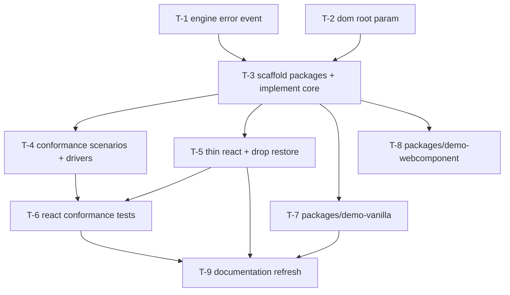

# Execution Plan — UI-Agnostic Core

**Source design:** [`docs/ui-agnostic-core.md`](../ui-agnostic-core.md)
**Interview date:** 2026-04-13 · **Replan date:** 2026-04-13 (pre-publish surgery: collapsed phases, added UI-agnostic proof phase, deferred publish-only work to [`ui-agnostic-polish.md`](./ui-agnostic-polish.md))
**Status:** committed; ready for execution.

---

## Decisions captured from Hiren

| # | Question | Decision | Notes |
|---|---|---|---|
| Q2 | Tier-3 (package split) timing | **C** — do the package split now | Library is unshipped; the rename never gets cheaper. Phase 1 scaffolds the target topology directly — no in-place extraction then re-move. |
| Q3 | `"restore"` sentinel | **A** — remove from `DEFAULT_LANGUAGES` | Bindings render an "Original" entry locally and call `core.restore()`. No back-compat shim — library is unshipped |
| Q4 | Conformance suite location | **A** — public subpath `@babulfish/core/testing` (experimental) | Ships with core from day one; the scenarios power the vanilla DOM driver (Phase 1) AND the React binding (Phase 1) AND the vanilla demo sanity check (Phase 2) |
| Q5 | Error propagation (`use-translator.ts:106`) | **A** — separate PR first, lands before contract work | Lower risk; isolates the engine-event-shape change |
| Q6 | Shadow DOM in `dom/translator.ts` | **A** — parameterize `root: ParentNode \| Document` now | Designing the contract around a hypothetical limitation is worse than fixing the limitation |
| Q7 | Snapshot granularity | **A** — monolithic frozen snapshot with structural sharing | One `subscribe`, one `snapshot`. Untouched slices retain reference equality across transitions — binding-level selector equality (`Object.is`) is cheap. Selectors are a binding concern, not a core concern. |
| Q8 | Multi-instance `createBabulfish` | **Commit from T-3** | Isolation is clean (DOM state is closure-scoped, engine is ref-counted). Deferring means walking back the contract when T-8's two-element WC demo ships. Conformance asserts engine sharing + cross-core dispose safety. |
| Q9 | Cancellation | **`AbortSignal` opt-in + `abort()` shortcut; `AbortError` rejections** | Web-Platform convention. Last-caller-wins on `translateTo`. `dispose()` returns `Promise<void>` and rejects in-flight ops. Engine cancellation via `InterruptableStoppingCriteria` (transformers.js has no `AbortSignal` support). |
| Q10 | `root` lifetime | **Set-once default + per-call override** | `createBabulfish({ dom: { root } })` sets the default; `translateTo(lang, { root })` and `restore({ root })` override. `translate(text, lang)` is root-free (pure string output). |

**Deferred to [`ui-agnostic-polish.md`](./ui-agnostic-polish.md)**: Q1 (unscoped `babulfish` compat meta-package) — implement at publish time, not before.

### Operating constraints

- **Library is unshipped** (pre-`0.1.0`). No external consumers. No semver theatre, no migration shims, no fixed-versioning, no release pipeline here — all publish-adjacent work lives in [`ui-agnostic-polish.md`](./ui-agnostic-polish.md).
- **End state this plan delivers:** a UI-agnostic `@babulfish/core` with a **React binding demo** AND a **vanilla-JS demo** AND (stretch) a **Web Component demo**. "UI-agnostic" is proven by runnable demos + a vanilla DOM conformance driver, not asserted.
- **npm scope `@babulfish` is assumed available.** If not, a single-PR rename follow-up handles it.
- **Plan-adherence rules apply** (`~/.claude/CLAUDE.md`): each task is its own PR unless explicitly marked "folded into T-N". No collapsing or shortcutting.

---

## Phases

- **Phase 0 — Pre-work.** Independent enabling PRs that unblock the contract work.
- **Phase 1 — UI-agnostic core + React binding + package topology.** Scaffold `@babulfish/core`, `@babulfish/react`, `@babulfish/styles` directly (no in-place detour), implement `createBabulfish`, produce the conformance suite, slim the React binding.
- **Phase 2 — UI-agnostic proof.** A vanilla-JS demo and a Web Component demo (stretch) that prove the contract holds outside React.
- **Phase 3 — Polish.** Documentation refresh aligning all READMEs with the final layout.

---

## Task graph



T-8 is a stretch task — if scope or time pressures appear, cut it without losing the agnosticism proof (T-4's vanilla DOM driver + T-7's vanilla demo already carry that weight).

---

## Common PR constraints (apply to every dispatch template)

Per `~/.claude/CLAUDE.md`:

- **One task = one PR.** Stack if needed; never combine.
- **Mermaid diagram in the PR description** highlighting components touched by this PR (use `style` to color the touched nodes).
- **PR name maps to the task ID** — title format: `T-N — {short subject}`.
- **Cross-link** to all sibling PRs in the plan (including merged) in the PR description.
- **Footer** every PR description with:
  ```
  🤖 Generated with [Claude Code](https://claude.com/claude-code)
  🧠 Steered & Validated by [Hiren Hiranandani](https://github.com/bigH)
  ```
- **Critic review (`subagent_type=general-purpose`, persona `[Critic]`)** before requesting human review. Max 2 reflexion rounds, then escalate.
- **Test Maven check** for any task that adds or changes behavior.

The dispatch templates below assume these constraints — they are not repeated in each one.

---

## Phase 0 — Pre-work

### T-1 — Engine `status-change` event carries error detail

- **Owner:** `[Artisan]`
- **Phase:** 0
- **Blocks:** T-3
- **Blocked by:** —
- **Files:**
  - `packages/babulfish/src/engine/model.ts` — emit `{ status, error }` on transition into `"error"`
  - `packages/babulfish/src/engine/index.ts` — re-export updated `TranslatorEvents`
  - `packages/babulfish/src/react/use-translator.ts:106` — consume real error instead of `new Error("Model loading failed")`
- **Acceptance:**
  - `TranslatorEvents["status-change"]` payload type is `{ status: TranslatorStatus, error?: unknown }` (or equivalent — `error` only present when `status === "error"`).
  - Forced-failure test (mock the lazy `@huggingface/transformers` import to reject with a typed error) shows the same error object surfaces in `useTranslator`'s state.
  - No occurrence of `new Error("Model loading failed")` remains in the repo.
- **Dispatch template:**
  ```
  [Artisan] T-1 — Engine status-change event carries error detail

  Goal: stop synthesizing errors at the React boundary; let the engine's status-change event carry the real failure.

  Context: today engine/model.ts emits `status-change` with just a status string. The React provider at src/react/use-translator.ts:106 has to fabricate `new Error("Model loading failed")` because no error is available. This blocks the upcoming `BabulfishCore` contract — `Snapshot.model.error` must carry the real cause.

  Task:
  1. Update the `TranslatorEvents` shape in src/engine/model.ts so that the `status-change` event payload includes an optional `error: unknown` field, populated only when the new status is "error".
  2. Wire src/engine/model.ts to capture the real failure (the rejected promise from the lazy `@huggingface/transformers` import or model construction) and emit it.
  3. Update src/react/use-translator.ts:106 to read the propagated error directly. Remove the `new Error("Model loading failed")` synthesis.
  4. Add a unit test under packages/babulfish/src/engine/__tests__/ that mocks the dynamic import to reject with `new Error("forced failure for test")` and asserts the listener receives that exact error.

  Deliverable: a single PR titled `T-1 — Engine status-change event carries error detail`.

  Constraints:
  - Do NOT touch src/dom/, src/core/, or any React component beyond use-translator.ts.
  - Do NOT introduce a new error class. Use whatever the failing import gave us.
  - Do NOT change `TranslatorStatus` itself.
  - Backward-compat is irrelevant (library unshipped); prefer the cleanest event shape.
  ```

---

### T-2 — `dom/translator.ts` accepts `root: ParentNode | Document`

- **Owner:** `[Artisan]`
- **Phase:** 0
- **Blocks:** T-3
- **Blocked by:** —
- **Files:**
  - `packages/babulfish/src/dom/translator.ts` — replace global `document` references at lines 83, 371, 496 with `(config.root ?? document)` and use `el.ownerDocument` for tree-walker construction
  - `packages/babulfish/src/dom/translator.ts` — extend `DOMTranslatorConfig` with `root?: ParentNode | Document`
  - `packages/babulfish/src/dom/walker.ts:56` — replace the hard-coded `document.createTreeWalker(root, ...)` with `root.ownerDocument!.createTreeWalker(root, ...)` (same bleed-point as the translator sites; without this, Shadow-DOM cores still reach through the host document)
  - `packages/babulfish/src/dom/index.ts` — type re-export already covers it; verify
  - `packages/babulfish/src/dom/__tests__/` — new test exercising a detached `DocumentFragment` and a `ShadowRoot`
- **Acceptance:**
  - `DOMTranslatorConfig.root` defaults to `document` when omitted (zero-config consumers see no behavior change).
  - All `querySelector` / `querySelectorAll` / `createTreeWalker` calls in `src/dom/translator.ts` reach through the configured root.
  - Tree-walker construction uses `el.ownerDocument.createTreeWalker(...)` so it works with elements inside a `ShadowRoot` (whose `ownerDocument` is the host document).
  - `packages/babulfish/src/dom/walker.ts` no longer contains a hard-coded `document.createTreeWalker`; it uses `root.ownerDocument.createTreeWalker(root, ...)` so Shadow-DOM children resolve against the host document.
  - New test: a `DocumentFragment` with two text nodes is translated end-to-end and the global `document` is not touched.
- **Dispatch template:**
  ```
  [Artisan] T-2 — Parameterize dom/translator.ts root

  Goal: let DOM translation target arbitrary roots (Shadow DOM, detached fragments, multi-document iframes) without changing default behavior.

  Context: src/dom/translator.ts hard-codes the global `document` at three sites (~lines 83, 371, 496). A future Web Component binding rendering into Shadow DOM cannot retarget. This is a non-breaking change because we keep `document` as the default.

  Task:
  1. Add `root?: ParentNode | Document` to `DOMTranslatorConfig` in src/dom/translator.ts. Default to `document` when omitted. Document the default in the type.
  2. Replace each `document.querySelector*` and `document.createTreeWalker` reference with `(config.root ?? document)`. For `createTreeWalker`, prefer `el.ownerDocument.createTreeWalker(...)` when iterating from a known element, since ShadowRoots inherit `ownerDocument` from the host.
  3. Fix src/dom/walker.ts:56 — replace `document.createTreeWalker(root, ...)` with `root.ownerDocument!.createTreeWalker(root, ...)`. Same hazard as the translator sites; without this, Shadow-DOM cores still reach through the host document.
  4. Add tests under packages/babulfish/src/dom/__tests__/translator.shadow.test.ts: one that translates inside a `DocumentFragment`, one that translates inside an attached `ShadowRoot`. Assert the global `document` is untouched (use a spy on `document.querySelector` to confirm zero calls in the shadow case).

  Deliverable: a single PR titled `T-2 — dom/translator.ts accepts ParentNode root`.

  Constraints:
  - Do NOT change behavior for callers that don't pass `root`.
  - Do NOT pull in any framework or polyfill.
  - Do NOT touch the React layer.
  - The `navigator.maxTouchPoints` cosmetic issue from §1.1 of the design doc is OUT OF SCOPE for this PR.
  ```

---

## Phase 1 — UI-agnostic core + React binding + package topology

### T-3 — Scaffold `@babulfish/{core,react,styles}` and implement core

- **Owner:** `[Artisan]`
- **Phase:** 1
- **Blocks:** T-4, T-5, T-7, T-8
- **Blocked by:** T-1, T-2
- **Scope:** This is the big topology PR. It scaffolds the three target packages, moves existing code into its permanent home, writes the new framework-neutral `src/core/` module inside `@babulfish/core`, keeps the React binding working (still "fat" — T-5 slims it), and migrates the demo's imports so the workspace stays green. **`packages/babulfish/` is deleted outright** — no compat meta-package; that lives in [`ui-agnostic-polish.md`](./ui-agnostic-polish.md) P-1 for publish time.
- **Files:**
  - New: `packages/core/` — `package.json`, `tsup.config.ts`, `tsconfig.json`, `README.md` stub
  - Move: `packages/babulfish/src/{engine,dom,translator.ts}` → `packages/core/src/`
  - New: `packages/core/src/core/` module (`index.ts`, `babulfish.ts`, `store.ts`, `progress.ts`, `languages.ts`, `capabilities.ts`, `engine-handle.ts`, `__tests__/contract.smoke.test.ts`)
  - New: `packages/core/src/testing/` scaffold (empty scenarios module; populated in T-4)
  - New: `packages/core/src/index.ts` re-exporting `./core`
  - New: `packages/react/` — `package.json` (peer `react`, dep `@babulfish/core` workspace exact), `tsup.config.ts`, `tsconfig.json`, `README.md` stub
  - Move: `packages/babulfish/src/react/` → `packages/react/src/` with imports rewritten `"../core/*"`/`"../engine/*"`/`"../dom/*"` → `"@babulfish/core"`/`"@babulfish/core/engine"`/`"@babulfish/core/dom"`
  - New: `packages/styles/` — `package.json` (no peer deps, `exports["./css"]`), `README.md` documenting the CSS custom-property contract
  - Move: `packages/babulfish/src/css/babulfish.css` → `packages/styles/src/babulfish.css`
  - Update: `packages/react/package.json` — dep on `@babulfish/styles`; `exports["./css"]` re-exports `@babulfish/styles/css`
  - Update: `packages/demo/package.json` — replace `"babulfish": "workspace:*"` with `"@babulfish/react": "workspace:*"` (and `@babulfish/styles` if the demo imports CSS directly)
  - Update: all `packages/demo/**/*.{ts,tsx}` — `from "babulfish"` → `from "@babulfish/react"`, `"babulfish/css"` → `"@babulfish/react/css"`
  - **Delete:** `packages/babulfish/` entirely
  - Update: root `pnpm-workspace.yaml` / `package.json` scripts if needed
- **Acceptance:**
  - `pnpm -r install && pnpm -r build && pnpm -r test` all green.
  - `import { createBabulfish, type Snapshot } from "@babulfish/core"` resolves; `createBabulfish(config).snapshot` is `Object.isFrozen`.
  - `createBabulfish(config)` produces a store whose snapshot changes ONLY via `subscribe` notifications; `dispose()` detaches all subscribers.
  - Two overlapping `translateTo("a")` then `translateTo("b")` calls end with `currentLanguage === "b"` regardless of completion order.
  - SSR-style first render (no `window`, no `navigator`) resolves `snapshot.capabilities.ready === false` without throwing.
  - **Engine singleton invariant holds:** the `@huggingface/transformers` runtime lives in a single module-level lazy singleton in `packages/core/src/engine/`. `createBabulfish` calls `acquireEngine()` / `releaseEngine()` from `packages/core/src/core/engine-handle.ts` (a ref-counted handle). Two sequential `createBabulfish` calls share the same engine instance. A smoke test asserts this by constructing two cores and checking `engine.getDebugIdentity()` (or an equivalent reference-equality probe) matches.
  - **Multi-instance isolation (Q8):** two cores (A and B) coexist sharing one engine. `core.dispose()` on A does NOT disrupt B — B's listeners remain attached, B's active `translateTo` resolves normally, B's snapshot is unchanged. `releaseEngine()` is FORBIDDEN from calling `listeners.clear()` on the engine (today's `engine/model.ts:204-205` does; the T-3 implementation removes that behavior). Each core owns the unsubscribe thunks `engine.on()` returned to it and calls them on its own dispose.
  - **Concurrent loadModel dedup:** two cores calling `loadModel()` in parallel within the same tick trigger exactly ONE `pipeline(...)` call to `@huggingface/transformers`. Preserve the `if (loadPromise) await loadPromise; return` guard at `engine/model.ts:121-123`. Spy the mocked import to verify `.calls.length === 1`.
  - **Snapshot granularity (Q7):** a single monolithic frozen `Snapshot` is emitted through `core.subscribe`. Untouched slices retain reference equality between transitions — a `translation.progress` tick produces a new top-level `snapshot` reference but `snapshot.model`, `snapshot.capabilities`, and `snapshot.currentLanguage` keep their prior reference (structural sharing). `subscribe` has no selector argument; there are no per-slice subscribe methods. No spurious notifications: a method call that doesn't change state does NOT invoke subscribers.
  - **Cancellation contract (Q9):** `loadModel`, `translateTo`, and `translate` accept an optional `{ signal?: AbortSignal }`. A new `translateTo(lang)` aborts the previous (last-caller-wins); the prior Promise rejects with `DOMException("...", "AbortError")`. `core.abort()` is a zero-arg shortcut that aborts the active translation only (NOT model load — transformers.js has no download cancel hook). `core.dispose()` returns `Promise<void>` and rejects all in-flight ops with `AbortError`.
  - **Engine cancellation mechanics:** generation is cancelled via `InterruptableStoppingCriteria` (transformers.js; see `@huggingface/transformers`'s `generation/stopping_criteria.js:136-153` and the per-token poll at `modeling_utils.js:1016`) wired to the composed signal. Download is cancelled via `Promise.race` against the signal — the background download still completes and caches, so the next `loadModel` is instant.
  - **Root lifetime (Q10):** `createBabulfish({ dom: { root } })` sets the default root (defaults to `document`). `translateTo(lang, opts?)` and `restore(opts?)` accept a per-call `{ root?: ParentNode | Document }` override. `translate(text, lang)` is root-free (pure string output, no DOM side effects). `root` lives under `config.dom`, not at the top level of `BabulfishConfig`.
  - **No `"restore"` in core data:** `DEFAULT_LANGUAGES` does not contain `{ code: "restore" }`. `translateTo("restore")` throws: `Unknown language code: restore. Use core.restore() to restore the original DOM.`
  - `packages/core/dist/` has zero `react` string references.
  - `packages/react/dist/` does not bundle `@babulfish/core` (it is external).
  - `packages/demo` boots: `pnpm --filter demo dev` renders the page.
  - `packages/babulfish/` directory no longer exists.
- **Dispatch template:**
  ```
  [Artisan] T-3 — Scaffold @babulfish/{core,react,styles} + implement core

  Goal: move the whole repo from one fat `packages/babulfish/` package into the final three-package topology AND introduce the framework-neutral createBabulfish contract in a single PR. Big but mechanical — the only net-new code is the `packages/core/src/core/` module.

  Context: the library is unshipped. There is no compat meta-package in this PR (deferred to ui-agnostic-polish.md P-1 for publish time). packages/babulfish/ is deleted outright. All callers inside the repo — just packages/demo/ — are migrated in the same PR so the workspace never leaves green.

  Inputs to read first:
  - docs/ui-agnostic-core.md §2.2 (BabulfishCore contract), §4.1 (module sketch), §6.2 (invariants), §6.1 (CSS contract).
  - docs/plans/ui-agnostic-core.md (this file) — the T-3 section and the engine-singleton invariant below.
  - packages/babulfish/src/react/provider.tsx (source of the run-ID race guard ~lines 92-171 and DEFAULT_LANGUAGES ~lines 35-50).
  - packages/babulfish/src/react/use-translator.ts (post-T-1: reads real error from engine event).
  - packages/babulfish/src/engine/detect.ts (capability snapshot source).
  - packages/babulfish/src/engine/model.ts (post-T-1 status-change shape with `error?: unknown`).
  - packages/babulfish/src/dom/translator.ts (post-T-2: accepts `root: ParentNode | Document`).
  - packages/babulfish/src/translator.ts (27-line convenience factory; moves to packages/core/src/translator.ts as-is).
  - packages/babulfish/package.json, tsup.config.ts, tsconfig.json (sources of scaffolding).
  - packages/demo/package.json + packages/demo/src/ (imports to rewrite).

  Task:
  1. Create packages/core/, packages/react/, packages/styles/ directory skeletons. Mirror existing tsconfig/tsup styles.
  2. **Move**, don't copy (use git mv):
     - packages/babulfish/src/engine/ → packages/core/src/engine/
     - packages/babulfish/src/dom/ → packages/core/src/dom/
     - packages/babulfish/src/translator.ts → packages/core/src/translator.ts
     - packages/babulfish/src/react/ → packages/react/src/
     - packages/babulfish/src/css/babulfish.css → packages/styles/src/babulfish.css
     - packages/babulfish/src/__tests__/ → split between core and react based on what each test imports.
  3. Write packages/core/src/core/ as the new UI-agnostic contract:
     - index.ts — public barrel exporting createBabulfish, types from store.ts, DEFAULT_LANGUAGES (restore-free).
     - babulfish.ts — `createBabulfish(config): BabulfishCore` factory. Acquires an engine handle via acquireEngine(). Builds the store. Returns snapshot + subscribe + loadModel + translateTo + restore + translate + abort + dispose.
     - store.ts — frozen-snapshot pub/sub. Every transition calls Object.freeze on the new snapshot. subscribe returns () => void.
     - progress.ts — run-ID race guard lifted from src/react/provider.tsx:92-171 as a pure class/function.
     - languages.ts — DEFAULT_LANGUAGES without the `"restore"` sentinel (Q3 decision). Do NOT emit a "restore" entry.
     - capabilities.ts — wraps src/engine/detect.ts with SSR-safe defaults (`ready: false` until detection completes).
     - engine-handle.ts — **ENGINE SINGLETON INVARIANT** (see below).
     - __tests__/contract.smoke.test.ts — four invariants from design doc §6.2 plus engine-singleton sharing.
  4. CORE CONTRACT INVARIANTS — the four non-negotiables the new `packages/core/src/core/` module bakes in. Each is tested by T-4 conformance scenarios.

     4.1 ENGINE SINGLETON + MULTI-INSTANCE (Q8):
     - `packages/core/src/engine/` exports a module-level lazy singleton that owns the `@huggingface/transformers` runtime state (WASM/WebGPU contexts, model cache). Never construct it eagerly.
     - `packages/core/src/core/engine-handle.ts` exposes `acquireEngine()` → handle + ref-count increment; `releaseEngine(handle)` → ref-count decrement. When ref-count hits zero, DO NOT tear down synchronously — leave the engine alive (tear-down is async and expensive; HMR remounts would otherwise thrash).
     - `createBabulfish` calls `acquireEngine` on construction and `releaseEngine` on `dispose`.
     - **`releaseEngine()` MUST NOT clear cross-core listeners.** Each core owns the unsubscribe thunks `engine.on()` returned to it and calls them on its own dispose. The singleton NEVER blanket-clears `listeners[event]` — otherwise disposing core A rips the rug out from under core B. (Today's `engine/model.ts:204-205` calls `listeners.clear()`; the T-3 implementation removes that behavior.)
     - **Concurrent `loadModel()` from N cores MUST share one in-flight `pipeline()` call.** Preserve the `if (loadPromise) await loadPromise; return` guard at `engine/model.ts:121-123`. Two cores constructed in parallel, both calling `loadModel()`, trigger exactly one `pipeline(...)` call.
     - Result: multiple `createBabulfish` instances in the same process share one engine. Next dev-HMR remounts, Storybook mounts, and two-element WC demos don't double-load. Subpath imports (`@babulfish/core` + `@babulfish/core/engine`) resolve to the same module instance — bundlers handle that for us, but document the expectation.

     4.2 SNAPSHOT — monolithic + structural sharing (Q7):
     - One `core.snapshot` per core. One `core.subscribe(listener)` per core. The snapshot is a frozen monolithic object: `{ model, translation, capabilities, currentLanguage, progress, ... }`.
     - Each transition produces a new top-level snapshot reference via structural sharing: untouched slices keep their prior reference. A `translation.progress` tick changes `snapshot` and `snapshot.translation` but `snapshot.model`, `snapshot.capabilities`, `snapshot.currentLanguage` MUST retain reference equality with the prior snapshot.
     - `subscribe` has no selector argument. No per-slice subscribe methods (`core.model.subscribe`, etc.). Selectors are a binding concern — React gets `useSyncExternalStoreWithSelector` on top; Vue/Svelte use their native reactivity.
     - No spurious notifications: a method call that doesn't change state (e.g. `restore()` from an already-idle snapshot) MUST NOT invoke subscribers.

     4.3 CANCELLATION — AbortSignal + imperative shortcut (Q9):
     - Every async method accepts an optional `{ signal?: AbortSignal }`. Contract signatures:
       ```ts
       type TranslateOptions = { readonly signal?: AbortSignal; readonly root?: ParentNode | Document }

       interface BabulfishCore {
         readonly snapshot: Snapshot
         subscribe(listener: (s: Snapshot) => void): () => void
         loadModel(opts?: { signal?: AbortSignal }): Promise<void>
         translateTo(lang: string, opts?: TranslateOptions): Promise<void>
         translate(text: string, lang: string, opts?: { signal?: AbortSignal }): Promise<string>
         restore(opts?: { root?: ParentNode | Document }): void
         abort(): void
         dispose(): Promise<void>
         readonly languages: ReadonlyArray<Language>
       }
       ```
     - On cancellation, Promises reject with `DOMException("...", "AbortError")` — use `signal.throwIfAborted()` / `signal.reason`. Never a custom `CancelledError`, never a tagged `{ cancelled: true }` resolved value.
     - **Last-caller-wins on `translateTo`:** starting a new `translateTo` aborts the prior controller; the prior Promise rejects with `AbortError`. This REPLACES the ad-hoc run-ID counter at the React layer. `progress.ts` owns the per-translation `AbortController` lifecycle.
     - `core.abort()` is a zero-arg shortcut equivalent to aborting the currently-active translation's controller. It does NOT abort `loadModel` (transformers.js has no download cancellation primitive; aborting just forces a re-download).
     - `core.dispose()` returns `Promise<void>`. Synchronously flips an internal `disposed` flag, aborts in-flight ops (their Promises reject with `AbortError`), detaches subscribers, and awaits pipeline teardown. WC's `disconnectedCallback` calls it fire-and-forget.
     - **Engine cancellation mechanics:**
       - Generation: construct `InterruptableStoppingCriteria` (from `@huggingface/transformers`, `.../generation/stopping_criteria.js:136-153`) per call, pass via `stopping_criteria` to `generator(messages, ...)` at `engine/model.ts:177`. Wire `signal.addEventListener("abort", () => criteria.interrupt())`. The generate loop polls each token at `.../modeling_utils.js:1016`. After `await generator(...)`, call `signal.throwIfAborted()` — the pipeline resolves even after interrupt with partial output, so the post-await check is what actually honors the contract.
       - Download: race `pipelinePromise` against `signal` via `Promise.race`. On abort, the caller's Promise rejects with `AbortError`, but the background download continues and populates the cache; next `loadModel` hits that cache.

     4.4 ROOT LIFETIME — set-once default + per-call override (Q10):
     - `createBabulfish({ dom: { root } })` sets the default DOM root. Default: `document`.
     - `translateTo(lang, { root })` and `restore({ root })` accept per-call root overrides for portaled dialogs and multi-region pages.
     - `translate(text, lang)` is root-free — it returns a translated string with no DOM side effects.
     - `BabulfishConfig` shape:
       ```ts
       type BabulfishConfig = {
         readonly engine?: EngineConfig
         readonly dom?: Omit<DOMTranslatorConfig, "translate" | "root"> & {
           readonly root?: ParentNode | Document  // default: document
         }
         readonly languages?: readonly Language[]
       }
       ```
     - NO top-level `root` on `BabulfishConfig` — nest it under `dom`; it's a DOM-translator concern, not an engine one.
  5. Rewrite imports in packages/react/src/: `../core/*` → `@babulfish/core`; `../engine/*` → `@babulfish/core/engine`; `../dom/*` → `@babulfish/core/dom`; `../translator.js` → `@babulfish/core`.
  6. Keep the React binding fat in this PR. Provider still holds the run-ID race guard inline from src/react/provider.tsx:92-171 and the inline DEFAULT_LANGUAGES with "restore" still present. T-5 slims the binding and removes the sentinel. The only goal here is "existing React tests still pass".
  7. Write packages/core/package.json: name "@babulfish/core", exports ".", "./engine", "./dom", "./testing" (testing entry points at src/testing/index.ts which is currently an empty-ish scaffold for T-4 to fill).
  8. Write packages/react/package.json: name "@babulfish/react", peerDependencies { react: "^18 || ^19" }, dependencies { "@babulfish/core": "workspace:^", "@babulfish/styles": "workspace:^" }, exports ".", "./css" (re-export from @babulfish/styles/css).
  9. Write packages/styles/package.json: name "@babulfish/styles", exports "./css", files ["src/babulfish.css"]. No build step needed; CSS ships as-is.
  10. Write packages/styles/README.md listing every `--babulfish-*` custom property the stylesheet relies on.
  11. Delete packages/babulfish/ entirely. It has no job in the unshipped state.
  12. Update packages/demo/: package.json dep swap, grep-replace all `from "babulfish"` → `from "@babulfish/react"`, `"babulfish/css"` → `"@babulfish/react/css"`.
  13. Run `pnpm install`, `pnpm -r build`, `pnpm -r test`, `pnpm --filter demo build`, `pnpm --filter demo dev`. Confirm green across the board.
  14. Grep packages/core/dist/ for the string `react` — should return zero matches.

  Deliverable: a single PR titled `T-3 — Scaffold @babulfish/{core,react,styles} + implement core`.

  Constraints:
  - Do NOT add a packages/babulfish/ compat shim. That is ui-agnostic-polish.md P-1, at publish time.
  - Do NOT slim the React provider in this PR. T-5 owns that. Keep existing React tests passing unchanged.
  - Do NOT export framework-typed values from packages/core/. Pure TS data + functions only.
  - Do NOT include "restore" in DEFAULT_LANGUAGES — T-5 is the cleanup PR for the sentinel in the React UI; the core-side data is born clean.
  - Do NOT introduce a second engine instance anywhere. `new Engine()` or equivalent happens exactly once in the repo, inside the module-level lazy singleton.
  ```

---

### T-4 — Conformance scenarios + direct + vanilla DOM drivers

- **Owner:** `[Test Maven]`
- **Phase:** 1
- **Blocks:** T-6
- **Blocked by:** T-3
- **Files:**
  - New: `packages/core/src/testing/index.ts` — public barrel for scenarios + driver interface (`@experimental` JSDoc)
  - New: `packages/core/src/testing/scenarios.ts` — framework-neutral scenarios as data + runner
  - New: `packages/core/src/testing/drivers/direct.ts` — driver that calls `createBabulfish` directly
  - New: `packages/core/src/testing/drivers/vanilla-dom.ts` — driver that wires `createBabulfish` to a real DOM (`jsdom` inside tests; also usable from a real browser with zero framework)
  - New: `packages/core/src/__tests__/conformance.direct.test.ts` — runs every scenario through the direct driver
  - New: `packages/core/src/__tests__/conformance.vanilla-dom.test.ts` — runs every scenario through the vanilla DOM driver
- **Acceptance:**
  - Scenarios are values, not hard-coded tests. Each has `{ id, description, run(driver): Promise<Result> }`. The driver interface exposes a `root: ParentNode | Document` hook so scenarios that assert DOM state work against Shadow DOM / detached fragments.
  - The four invariants from design doc §6.2 are each backed by at least one scenario.
  - **Snapshot scenarios (Q7):**
    - `loadModel` resolves → `snapshot.model.status === "ready"`.
    - Progress monotonicity — downloading progress is non-decreasing within a load.
    - **Structural sharing** — a `translation.progress` tick produces a new `snapshot` reference, but `snapshot.model`, `snapshot.capabilities`, `snapshot.currentLanguage` retain reference equality with the prior snapshot.
    - **No spurious notify** — `restore()` from an already-idle snapshot does NOT invoke subscribers.
  - **Lifecycle / multi-instance scenarios (Q8):**
    - `dispose()` detaches subscribers; subsequent `subscribe()` returns a no-op unsubscriber.
    - SSR-style first render has `capabilities.ready === false` without throwing.
    - **Engine-singleton sharing** — two cores share one engine via the `getEngineIdentity(core)` probe exported from `@babulfish/core/testing`.
    - **Mount → dispose → remount** — engine identity is preserved across a full cycle; new core's state is clean (no listener carryover).
    - **Concurrent loadModel dedup** — two cores both call `loadModel()` in the same tick; the mocked `pipeline(...)` is invoked exactly once.
    - **Cross-core dispose safety** — start a `translateTo` on core B, dispose core A mid-flight; B's Promise resolves normally, B's snapshot unchanged.
  - **Cancellation scenarios (Q9):**
    - Last-caller-wins — `translateTo("a")` then `translateTo("b")`; the first Promise rejects with `DOMException("...", "AbortError")`, the second resolves.
    - External signal — `translateTo(lang, { signal })` followed by `controller.abort()` rejects with `AbortError`.
    - Dispose mid-translation — `dispose()` while translating; the pending Promise rejects with `AbortError`; `dispose()` itself resolves after teardown.
    - `abort()` mid-translation returns state to `translation.idle`; no listener receives a stale completion.
  - **Root override scenario (Q10):**
    - `translateTo(lang, { root: fragment })` translates inside the fragment; the global `document` and the default root are untouched (verified via a spy on `document.querySelector`).
  - Both conformance test files (`conformance.direct.test.ts` and `conformance.vanilla-dom.test.ts`) are green.
  - Every public symbol in `packages/core/src/testing/index.ts` carries an `@experimental — subject to change` JSDoc banner.
- **Dispatch template:**
  ```
  [Test Maven] T-4 — Conformance scenarios + direct + vanilla DOM drivers

  Goal: produce a reusable conformance suite that any binding (React today, Web Component tomorrow, Vue whenever) can run against itself to prove it honors the BabulfishCore contract. Ship a direct driver AND a vanilla DOM driver to prove the core works outside any framework.

  Context: the contract was implemented in T-3 at packages/core/src/core/. Decision Q4=A makes the conformance suite a public subpath export (@babulfish/core/testing). The vanilla DOM driver is the proof-of-agnosticism — if scenarios run green through a zero-framework driver, the contract really is UI-neutral. The React driver (T-6) then has to run the same scenarios.

  Inputs to read first:
  - docs/ui-agnostic-core.md §6.2 invariants.
  - packages/core/src/core/ — the contract you're testing.
  - packages/core/src/core/engine-handle.ts — the ref-counted engine handle you'll assert on in the singleton scenario.

  Task:
  1. Define the driver interface in packages/core/src/testing/drivers/types.ts:
     ```ts
     export interface ConformanceDriver {
       readonly id: string; // "direct" | "vanilla-dom" | "react" | "web-component" | ...
       create(config: BabulfishConfig): Promise<BabulfishCore>;
       dispose(core: BabulfishCore): void;
       // Optional DOM hooks for scenarios that assert on real DOM state:
       readonly root?: ParentNode | Document;
     }
     ```
  2. Write scenarios in packages/core/src/testing/scenarios.ts. Each scenario is a value: `{ id, description, run(driver): Promise<void> }`. Any scenario that fails throws with a message including driver.id + scenario.id.
  3. Implement scenarios, grouped by the contract concern each exercises:

     Snapshot (Q7):
     a. loadModel resolves → snapshot.model.status === "ready".
     b. Progress monotonicity — downloading progress is non-decreasing within a load.
     c. Structural sharing — a translation.progress tick produces a new `snapshot` and `snapshot.translation` reference, but `snapshot.model`, `snapshot.capabilities`, `snapshot.currentLanguage` retain reference equality with the prior snapshot (binding-level `Object.is` selectors stay cheap).
     d. No spurious notify — `restore()` from an already-idle snapshot does NOT invoke subscribers.

     Lifecycle / multi-instance (Q8):
     e. dispose detaches subscribers; subsequent subscribe returns a no-op unsubscriber.
     f. SSR-style first render has capabilities.ready === false without throwing.
     g. Engine singleton sharing — create two cores via driver; use `getEngineIdentity(core)` probe (exported from `@babulfish/core/testing`) to assert both reference the same engine.
     h. Mount → dispose → remount — engine identity is preserved; new core's state is clean.
     i. Concurrent loadModel dedup — construct two cores, both call loadModel in the same tick; assert the mocked `pipeline(...)` was invoked exactly once (`.mock.calls.length === 1`).
     j. Cross-core dispose safety — start a translateTo on core B, dispose core A mid-flight, assert B's Promise resolves normally and B's snapshot is unaffected.

     Cancellation (Q9):
     k. Last-caller-wins — translateTo("a") then translateTo("b") — the first rejects with `DOMException("...", "AbortError")`, the second resolves.
     l. External signal — translateTo(lang, { signal }) followed by controller.abort() → rejects AbortError.
     m. Dispose mid-translation — call dispose() while translating; the pending Promise rejects with AbortError; dispose itself resolves after teardown.
     n. `abort()` mid-translation returns to translation.idle; no stale completion delivered to subscribers.

     Root override (Q10):
     o. translateTo(lang, { root: fragment }) — text inside the fragment is translated; global `document` and the default root are untouched (verify via `vi.spyOn(document, "querySelector")` reporting zero calls).
  4. Write packages/core/src/testing/drivers/direct.ts: `ConformanceDriver` that calls createBabulfish directly.
  5. Write packages/core/src/testing/drivers/vanilla-dom.ts: `ConformanceDriver` that accepts a `root: ParentNode | Document` (default: fresh `JSDOM` document in tests) and creates createBabulfish wired to that root. For scenarios that assert DOM state, the driver exposes its root.
  6. Write packages/core/src/testing/index.ts exporting: scenarios, ConformanceDriver interface, DirectDriver, VanillaDomDriver, getEngineIdentity. Every export carries `@experimental` JSDoc.
  7. Write packages/core/src/__tests__/conformance.direct.test.ts — iterates scenarios, runs each through DirectDriver, uses vitest it.each so failures name the scenario id.
  8. Write packages/core/src/__tests__/conformance.vanilla-dom.test.ts — same, via VanillaDomDriver. Uses JSDOM or `@happy-dom/jest-environment` (match repo convention).
  9. Stub the @huggingface/transformers import across tests so scenarios don't require a real model load. The engine module exposes a test-seam for this under `@babulfish/core/engine/testing` or via a vitest mock.
  10. Run `pnpm --filter @babulfish/core test`. Both conformance files green.

  Deliverable: a single PR titled `T-4 — Conformance scenarios + drivers`.

  Constraints:
  - Scenarios must NOT import from @babulfish/react or any framework. They run against the BabulfishCore contract only.
  - Scenarios must NOT depend on a real model load. Stub the engine.
  - The vanilla DOM driver must use a real DOM (JSDOM in tests) — no fake DOM. The whole point is to prove real-DOM compatibility.
  - Do NOT export internal helpers from testing/index.ts; only the public conformance API.
  - The engine-identity probe is deliberately in @babulfish/core/testing, not in the main barrel. It is a debugging/conformance primitive, not a runtime API.
  ```

---

### T-5 — Thin React binding + drop `"restore"` sentinel

- **Owner:** `[Artisan]`
- **Phase:** 1
- **Blocks:** T-6, T-9
- **Blocked by:** T-3
- **Files:**
  - Rewrite: `packages/react/src/provider.tsx` — ≤ 50 non-comment/non-import lines: create core, put in context, dispose on unmount
  - Rewrite: `packages/react/src/use-translator.ts` — `useSyncExternalStore(core.subscribe, () => core.snapshot, () => core.snapshot)` + stable method refs
  - Rewrite: `packages/react/src/use-translate-dom.ts` — same pattern
  - Update: `packages/react/src/index.ts` — re-export `DEFAULT_LANGUAGES` from `@babulfish/core` only; drop any React-local copy
  - Update: `packages/react/src/translate-dropdown.tsx` — render an "Original" UI affordance locally (NOT a `Language`) that calls `core.restore()` when selected
  - Update: `packages/react/src/translate-button.tsx` — verify no dependency on the sentinel
  - New/update: tests asserting the dropdown shows an "Original" entry and selecting it triggers restore
  - Update (if still present): `packages/core/src/core/babulfish.ts` — `translateTo("restore")` throws with a clear error (core was born clean in T-3, so this may already be the case — verify)
- **Acceptance:**
  - `provider.tsx` body is ≤ 50 non-comment, non-import lines.
  - `useSyncExternalStore` is the only subscription primitive in `use-translator.ts` and `use-translate-dom.ts`.
  - No state held in any React module that also lives in `BabulfishCore` (no `useState` for model status, translation status, capabilities, currentLanguage, or progress).
  - `DEFAULT_LANGUAGES` does not contain `{ code: "restore" }` anywhere.
  - `translateTo("restore")` throws: `Unknown language code: restore. Use core.restore() to restore the original DOM.`
  - React `TranslateDropdown` still offers an "Original" affordance at the top of the list; selecting it calls `core.restore()`. Snapshot/behavior test proves it.
  - All existing React tests pass (some may need updating to assert observable behavior rather than internal state — those updates are fair game).
- **Dispatch template:**
  ```
  [Artisan] T-5 — Thin React binding + remove "restore" sentinel

  Goal: collapse the React provider to wiring-only by projecting `core.snapshot` via useSyncExternalStore. Remove the "restore" control code from DEFAULT_LANGUAGES and relocate the "Original" UI affordance to the binding. No state should live in React that also lives in core.

  Context: T-3 landed createBabulfish and moved the React binding into packages/react/ with its imports rewritten, but kept the provider fat and left DEFAULT_LANGUAGES untouched in the React tree. This PR finishes the job: the provider becomes wiring-only, and the "restore" sentinel is replaced by a binding-local UI primitive.

  Inputs to read first:
  - packages/core/src/core/index.ts (the contract you're projecting).
  - packages/react/src/provider.tsx (the file you're shrinking).
  - packages/react/src/use-translator.ts (currently hand-rolled useState/useEffect).
  - packages/react/src/use-translate-dom.ts (same shape).
  - packages/react/src/translate-dropdown.tsx (needs the "Original" UI affordance split out from DEFAULT_LANGUAGES).

  Task:
  1. Rewrite packages/react/src/provider.tsx. Body: createBabulfish(config) on mount, put into a React context, dispose on unmount, render children. No more useState for model/translation/capabilities/currentLanguage.
  2. Rewrite packages/react/src/use-translator.ts: read core from context; return useSyncExternalStore(core.subscribe, () => core.snapshot, () => core.snapshot) plus stable method refs (loadModel, translateTo, restore, abort).
  3. Rewrite packages/react/src/use-translate-dom.ts similarly.
  4. Delete any React-local DEFAULT_LANGUAGES. Re-export from @babulfish/core.
  5. In packages/react/src/translate-dropdown.tsx: render the consumer-supplied languages list as-is, then render an extra "Original" item ABOVE the list. The "Original" item is a UI primitive owned by the binding — NOT a Language. Selecting it calls core.restore() via the hook API.
  6. Update existing dropdown tests (or add one if none) to assert (a) "Original" appears, (b) clicking it triggers restore, (c) the consumer's languages list is unchanged.
  7. Verify packages/core/src/core/babulfish.ts's translateTo throws on unknown codes including "restore" (it was born clean in T-3; just confirm the error message is the one specified in Acceptance).
  8. Run `pnpm --filter @babulfish/react test` and `pnpm --filter @babulfish/core test`. Green.
  9. Run `pnpm --filter demo build` and `pnpm --filter demo dev`. Page renders; "Original" entry works.
  10. Confirm provider.tsx is ≤ 50 non-comment, non-import lines.

  Deliverable: a single PR titled `T-5 — Thin React binding + drop "restore" sentinel`.

  Constraints:
  - Do NOT change the public hook API shape. Consumer-visible surface is unchanged; only internals shrink and "Original" moves out of the languages list.
  - Do NOT add a back-compat shim that silently routes "restore" to restore(). Library is unshipped.
  - Do NOT touch packages/core/ except to verify the error message in translateTo.
  - If a React test breaks because it asserted on the OLD internal state shape, the test is wrong — update it to assert observable behavior.
  ```

---

### T-6 — React conformance tests over shared scenarios

- **Owner:** `[Test Maven]`
- **Phase:** 1
- **Blocks:** T-9
- **Blocked by:** T-4, T-5
- **Files:**
  - New: `packages/react/src/__tests__/conformance.test.tsx`
  - New: `packages/react/src/testing/react-driver.ts` (a `ConformanceDriver` implementation, exported for reuse but marked `@experimental`)
- **Acceptance:**
  - Imports scenarios from `@babulfish/core/testing`.
  - Each scenario runs through the React driver: `<TranslatorProvider>` + `useTranslator()` projecting the BabulfishCore contract.
  - All scenarios pass.
  - A failing scenario produces a useful error message naming both `driver.id === "react"` and the scenario id.
  - `packages/react/src/testing/react-driver.ts` exports `ReactConformanceDriver` with `@experimental` JSDoc.
- **Dispatch template:**
  ```
  [Test Maven] T-6 — React conformance over shared scenarios

  Goal: prove the React binding honors the BabulfishCore contract by re-running the same scenarios T-4 defined, this time driven through TranslatorProvider + useTranslator.

  Context: T-4 produced framework-neutral scenarios at packages/core/src/testing/. T-5 made the React binding a thin projection. This task wires them together.

  Inputs to read first:
  - @babulfish/core/testing scenarios + ConformanceDriver interface.
  - packages/react/src/provider.tsx and use-translator.ts (the React surface you're driving).
  - packages/core/src/testing/drivers/direct.ts (reference driver implementation).

  Task:
  1. Write packages/react/src/testing/react-driver.ts implementing ConformanceDriver. `create(config)` mounts TranslatorProvider via @testing-library/react and returns an object exposing the BabulfishCore contract methods. Snapshot reads come through useSyncExternalStore in a test component — NOT by bypassing to the underlying core. The point is to prove the binding faithfully exposes core state.
  2. Mark the export `@experimental`.
  3. Write packages/react/src/__tests__/conformance.test.tsx: iterate scenarios from @babulfish/core/testing via it.each; run each against ReactConformanceDriver.
  4. On failure, assertion messages include `driver.id="react"` and scenario.id.
  5. Run the test file. Green.

  Deliverable: a single PR titled `T-6 — React conformance over shared scenarios`.

  Constraints:
  - Do NOT modify any scenario in packages/core/src/testing/. If a scenario is wrong, fix it in a follow-up.
  - Do NOT bypass React to read the core directly. Prove the React projection, not the underlying core (T-4 already proves that).
  - Do NOT add a real model load. Stub the engine.
  ```

---

## Phase 2 — UI-agnostic proof

### T-7 — `packages/demo-vanilla` (zero-framework demo)

- **Owner:** `[Artisan]`
- **Phase:** 2
- **Blocks:** T-9
- **Blocked by:** T-3
- **Files:**
  - New directory: `packages/demo-vanilla/`
  - New: `packages/demo-vanilla/package.json` (name `@babulfish/demo-vanilla`, `private: true`, deps `@babulfish/core` + `@babulfish/styles`)
  - New: `packages/demo-vanilla/index.html` (static HTML, `<link rel="stylesheet" href="./style.css">`, an `<article>` of sample text, a `<select>` for language, a `<button>` for Original, a `<div>` for status)
  - New: `packages/demo-vanilla/src/main.ts` (ESM `<script type="module" src="./src/main.ts">` entry — imports createBabulfish, loads model, subscribes to snapshot, wires button + select to translateTo / restore)
  - New: `packages/demo-vanilla/vite.config.ts` (or equivalent dev server config — match repo convention; the other demo uses Next, so pick a minimal dev server such as Vite in plain HTML mode)
  - New: `packages/demo-vanilla/README.md` (one-paragraph "zero-framework translation demo; run `pnpm --filter @babulfish/demo-vanilla dev`")
- **Acceptance:**
  - `pnpm --filter @babulfish/demo-vanilla dev` serves a static HTML page with functional translation.
  - Page has zero framework dependencies — `node_modules` under the resolved graph contains no `react`, `vue`, `svelte`, `solid-js`, `preact`.
  - Loading a model, picking a target language, and clicking "Original" all work end-to-end (may use a tiny/fast model by default — match what packages/demo uses).
  - `pnpm --filter @babulfish/demo-vanilla build` produces a static bundle.
  - A note in `packages/demo-vanilla/README.md` links from the root README "Pick your binding" matrix.
- **Dispatch template:**
  ```
  [Artisan] T-7 — packages/demo-vanilla (zero-framework demo)

  Goal: prove UI-agnosticism with a runnable demo. If createBabulfish really is framework-neutral, a ~80-line main.ts calling it should translate a paragraph, react to snapshot changes, and restore — no framework, just DOM APIs.

  Context: the plan's end state is "UI-agnostic framework + demos for each UI." packages/demo is the React demo. This PR adds the zero-framework counterpart.

  Inputs to read first:
  - @babulfish/core contract (createBabulfish, Snapshot, subscribe, dispose).
  - packages/demo — especially how model selection + progress UI work, so the vanilla demo feels comparable.
  - @babulfish/styles/css — the stylesheet is binding-agnostic; use it.

  Task:
  1. Create packages/demo-vanilla/ scaffolding. Minimal dev server (Vite in SPA/HTML mode recommended for lowest ceremony).
  2. index.html: a header, an <article> with 2-3 paragraphs of sample text, a <select> for target language populated from DEFAULT_LANGUAGES imported via the ESM script, a "Restore original" button, a status region showing model loading progress and translation status.
  3. src/main.ts:
     - Import { createBabulfish, DEFAULT_LANGUAGES } from "@babulfish/core".
     - Import "@babulfish/styles/css".
     - const core = createBabulfish({ root: document }); core.subscribe(() => render(core.snapshot));
     - On <select> change: core.translateTo(selectedCode).
     - On "Restore" click: core.restore().
     - render(snapshot) updates the status region with model.status and translation.status/progress.
  4. README one paragraph + link to root README.
  5. Run `pnpm --filter @babulfish/demo-vanilla dev`. Open the served URL manually, load model, translate, restore. All work.
  6. Run `pnpm --filter @babulfish/demo-vanilla build`. Static bundle produced.
  7. Verify the resolved dependency graph: `pnpm --filter @babulfish/demo-vanilla list` or inspect package.json — no framework deps.

  Deliverable: a single PR titled `T-7 — packages/demo-vanilla`.

  Constraints:
  - No React, Vue, Svelte, Solid, Preact. Zero frameworks. Pure DOM + ESM.
  - No UI libraries (no Tailwind runtime, no shadcn). Plain CSS is fine.
  - Do NOT duplicate scenario logic — this is a runnable demo, not a test. Tests live in T-4.
  - Do NOT add this package to a publish list. It's `private: true` forever.
  ```

---

### T-8 — `packages/demo-webcomponent` (stretch)

- **Owner:** `[Artisan]`
- **Phase:** 2
- **Blocks:** T-9
- **Blocked by:** T-3
- **Stretch:** cut if schedule pressure appears — T-4's vanilla DOM driver and T-7's vanilla demo already prove agnosticism. This task additionally proves the Shadow DOM story from T-2.
- **Files:**
  - New directory: `packages/demo-webcomponent/`
  - New: `packages/demo-webcomponent/package.json` (`@babulfish/demo-webcomponent`, `private: true`)
  - New: `packages/demo-webcomponent/index.html` (hosts the custom element)
  - New: `packages/demo-webcomponent/src/babulfish-translator.ts` (custom element defined via `class extends HTMLElement`; attaches Shadow DOM; creates `createBabulfish({ root: shadowRoot })`; dispatches `CustomEvent`s for status changes)
  - New: `packages/demo-webcomponent/README.md`
- **Acceptance:**
  - Custom element `<babulfish-translator>` renders into Shadow DOM; translation works inside the shadow root; the host document is untouched (verify via a listener on `document.DOMContentLoaded`-style observers).
  - Status changes dispatch `CustomEvent`s (e.g. `babulfish-status`) that the host page can listen to.
  - Zero framework deps, just like T-7.
  - README documents the event contract.
- **Dispatch template:**
  ```
  [Artisan] T-8 — packages/demo-webcomponent (stretch)

  Goal: a single custom element binding that proves the Shadow DOM story from T-2 and the CustomEvent integration pattern from design doc §2.2 table. Optional — cut if schedule pressure appears.

  Context: T-7 already demonstrates zero-framework use of createBabulfish in the main document. This demo puts it in Shadow DOM and exposes a CustomEvent interface.

  Inputs to read first:
  - @babulfish/core contract.
  - packages/core/src/dom/translator.ts (post-T-2 root parameter).
  - design doc §2.2 — especially the Web Components row of the integration table.

  Task:
  1. Create packages/demo-webcomponent/ with a static HTML page that hosts `<babulfish-translator data-model="...">` twice on the page (to prove singleton engine sharing across elements).
  2. Implement the custom element:
     - connectedCallback: attachShadow({ mode: "open" }); render inner template (sample paragraph + controls); const core = createBabulfish({ root: this.shadowRoot }); core.subscribe(snapshot => this.dispatchEvent(new CustomEvent("babulfish-status", { detail: snapshot, bubbles: true, composed: true }))); translate on attribute change; restore on a method/event.
     - disconnectedCallback: core.dispose().
  3. Host page binds to `babulfish-status` events to log status transitions to console.
  4. Verify both custom elements share one engine (check console; engine loads the model once).
  5. README documents the custom element's attributes + event contract.

  Deliverable: a single PR titled `T-8 — packages/demo-webcomponent (stretch)`.

  Constraints:
  - No framework. Custom element only.
  - Must render into Shadow DOM, not light DOM.
  - Must use core.dispose() in disconnectedCallback; verify via re-adding and checking the engine singleton ref-count.
  - This task is CUTTABLE without invalidating the plan's goal.
  ```

---

## Phase 3 — Polish

### T-9 — Documentation refresh

- **Owner:** `[Artisan]`
- **Phase:** 3
- **Blocks:** —
- **Blocked by:** T-5, T-6, T-7 (T-8 if shipped)
- **Files:**
  - Update: root `README.md` with "Pick your binding" matrix, repo overview, links to per-package READMEs, links to all demos
  - Expand: `packages/core/README.md` — quick-start (`createBabulfish` + vanilla DOM), API summary, link to design doc, link to `@babulfish/core/testing`
  - Expand: `packages/react/README.md` — quick-start (install, `<TranslatorProvider>`, `useTranslator`), components, link to `packages/demo`
  - Expand: `packages/styles/README.md` — custom-property contract (already drafted in T-3)
  - Expand: `packages/demo-vanilla/README.md` and (if shipped) `packages/demo-webcomponent/README.md` — runnable instructions
  - Update: `docs/ui-agnostic-core.md` if any decision changed during execution (probably not)
- **Acceptance:**
  - Root README's first navigation item is "Pick your binding" with a matrix showing: React (`@babulfish/react`, see demo), Vanilla / Web Component / custom (`@babulfish/core` directly, see vanilla demo, see WC demo if shipped).
  - Every package's quick-start is copy-pastable into a fresh project and actually works.
  - All cross-links between READMEs resolve.
- **Dispatch template:**
  ```
  [Artisan] T-9 — Documentation refresh

  Goal: align all READMEs with the final package layout. Root README is the navigation hub; each package and demo has its own quick-start.

  Context: design doc §6.3 sketched the Tier-3 doc layout. This task implements it minus the compat-meta-package wording (which lives in ui-agnostic-polish.md P-1).

  Inputs to read first:
  - docs/ui-agnostic-core.md §3.1 (Pick-your-surface matrix), §6.3 (doc strategy), §8 (architecture diagrams).
  - Each new package README stub from T-3 / T-7 / T-8.
  - packages/demo (the React demo; its README may need updating too).

  Task:
  1. Rewrite root README.md:
     - Project description (2-3 sentences).
     - Pick-your-binding matrix (table from §3.1): React via @babulfish/react; any framework or no framework via @babulfish/core; stretch row for Web Components if T-8 shipped.
     - Quick-start linking to packages/react/README.md (most common case).
     - Architecture diagram (Mermaid from design doc §8 "After Tier 3").
     - Repo layout (workspace overview naming all demo packages).
     - Links to design doc and plan.
  2. Expand packages/core/README.md: quick-start using createBabulfish + vanilla DOM (copy the essence of T-7's main.ts); API summary referencing design doc §2.2; "for binding authors: see @babulfish/core/testing"; link to docs/ui-agnostic-core.md.
  3. Expand packages/react/README.md: quick-start (npm install, TranslatorProvider, useTranslator); components reference (TranslateButton, TranslateDropdown); link to packages/demo; CSS instructions (`import "@babulfish/react/css"`).
  4. Expand packages/styles/README.md: confirm the custom-property contract list from T-3 is comprehensive; add usage examples for theming.
  5. Expand packages/demo-vanilla/README.md: one paragraph + link to root README + `pnpm --filter @babulfish/demo-vanilla dev` instructions.
  6. If T-8 shipped, same for packages/demo-webcomponent/README.md.
  7. Cross-link: every README has a section linking to siblings.

  Deliverable: a single PR titled `T-9 — Documentation refresh`.

  Constraints:
  - Quick-starts must actually work — copy-paste them into a fresh dir and run.
  - No emoji in code blocks.
  - Do NOT contradict the decisions captured in this plan or in docs/ui-agnostic-core.md §10.
  - Do NOT reference a `babulfish` unscoped compat package in this PR. That doc lives in ui-agnostic-polish.md (it doesn't exist yet).
  ```

---

## Smallest first PR

**Pick up T-1 first.** It is independent of everything else, lands cleanly as a single small PR, and unblocks Phase 1.

If two coding agents are available in parallel, the second can pick up **T-2** simultaneously — also independent.
