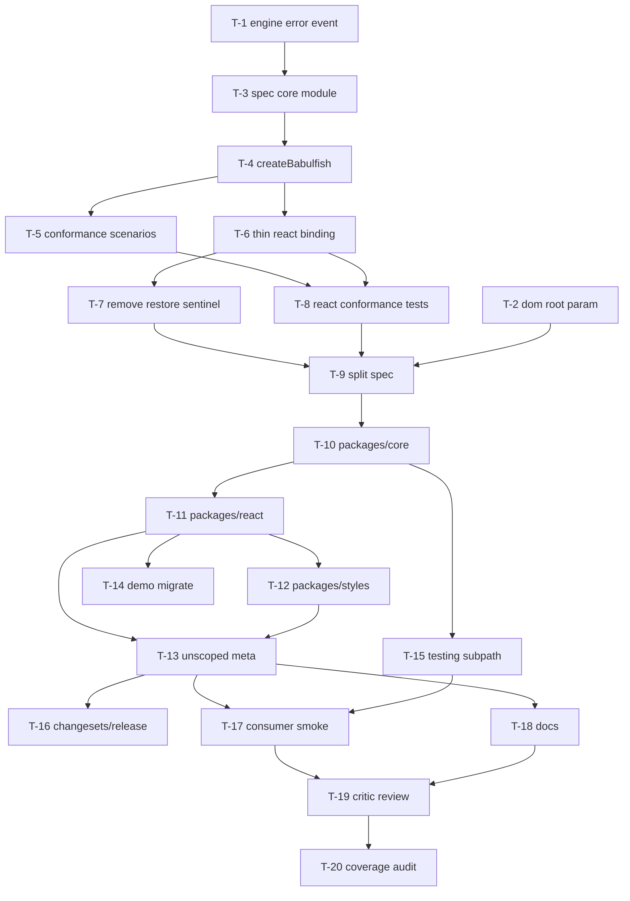

# Execution Plan — UI-Agnostic Core

**Source design:** [`docs/ui-agnostic-core.md`](../ui-agnostic-core.md)
**Interview date:** 2026-04-13
**Status:** committed; ready for execution.

---

## Decisions captured from Hiren

| # | Question | Decision | Notes |
|---|---|---|---|
| Q1 | Root `babulfish` post-deprecation | **A** — permanent alias to `@babulfish/react` | Under Tier 3, the unscoped `babulfish` becomes a permanent (not deprecated) compat meta-package |
| Q2 | Tier-3 (package split) timing | **C** — do the package split now | **Override** of the architect's "wait for a second binding" lean. Library is unshipped; the rename never gets cheaper |
| Q3 | `"restore"` sentinel | **A** — remove from `DEFAULT_LANGUAGES` | Bindings render an "Original" entry locally and call `core.restore()`. No back-compat shim — library is unshipped |
| Q4 | Conformance suite location | **A** — public subpath `@babulfish/core/testing` (experimental) | Natural home given Tier 3; avoids a future rename |
| Q5 | Error propagation (`use-translator.ts:106`) | **A** — separate PR first, lands before contract work | Lower risk; isolates the engine-event-shape change |
| Q6 | Shadow DOM in `dom/translator.ts` | **A** — parameterize `root: ParentNode \| Document` now | Designing the contract around a hypothetical limitation is worse than fixing the limitation |

### Operating constraints

- **Library is unshipped** (pre-`0.1.0`). No semver compatibility train; phases below are PR-ordering gates, not version-numbered alphas. The first published version on npm will already include the Tier-3 split.
- **npm scope `@babulfish` is assumed available.** If not, a single-PR rename follow-up handles it.
- **Plan-adherence rules apply** (`~/.claude/CLAUDE.md`): each task is its own PR unless explicitly marked "folded into T-N". No collapsing or shortcutting.

---

## Phases

Phases are gates on PR readiness, not release versions. No PR in a later phase merges until **all** of its blockers in earlier phases land.

- **Phase 0 — Pre-work.** Independent enabling PRs that unblock the contract work.
- **Phase 1 — Contract in single package.** Introduce `BabulfishCore` while still under `packages/babulfish/`. Validates the seams before file moves.
- **Phase 2 — Package split (Tier 3).** Scoped packages, meta-package, demo migration.
- **Phase 3 — Polish.** Smoke, docs, critic review, coverage audit.

---

## Task graph



---

## Common PR constraints (apply to every dispatch template)

Per `~/.claude/CLAUDE.md`:

- **One task = one PR.** Stack if needed; never combine.
- **Mermaid diagram in the PR description** highlighting components touched by this PR (use `style` to color the touched nodes).
- **PR name maps to the task ID** — title format: `T-N — {short subject}`.
- **Cross-link** to all sibling PRs in the plan (including merged) in the PR description.
- **Footer** every PR description with:
  ```
  🤖 Generated with [Claude Code](https://claude.com/claude-code)
  🧠 Steered & Validated by [Hiren Hiranandani](https://github.com/bigH)
  ```
- **Critic review (`subagent_type=general-purpose`, persona `[Critic]`)** before requesting human review. Max 2 reflexion rounds, then escalate.
- **Test Maven check** for any task that adds or changes behavior.

The dispatch templates below assume these constraints — they are not repeated in each one.

---

## Phase 0 — Pre-work

### T-1 — Engine `status-change` event carries error detail

- **Owner:** `[Artisan]`
- **Phase:** 0
- **Blocks:** T-3
- **Blocked by:** —
- **Files:**
  - `packages/babulfish/src/engine/model.ts` — emit `{ status, error }` on transition into `"error"`
  - `packages/babulfish/src/engine/index.ts` — re-export updated `TranslatorEvents`
  - `packages/babulfish/src/react/use-translator.ts:106` — consume real error instead of `new Error("Model loading failed")`
- **Acceptance:**
  - `TranslatorEvents["status-change"]` payload type is `{ status: TranslatorStatus, error?: unknown }` (or equivalent — `error` only present when `status === "error"`).
  - Forced-failure test (mock the lazy `@huggingface/transformers` import to reject with a typed error) shows the same error object surfaces in `useTranslator`'s state.
  - No occurrence of `new Error("Model loading failed")` remains in the repo.
- **Dispatch template:**
  ```
  [Artisan] T-1 — Engine status-change event carries error detail

  Goal: stop synthesizing errors at the React boundary; let the engine's status-change event carry the real failure.

  Context: today engine/model.ts emits `status-change` with just a status string. The React provider at src/react/use-translator.ts:106 has to fabricate `new Error("Model loading failed")` because no error is available. This blocks the upcoming `BabulfishCore` contract — `Snapshot.model.error` must carry the real cause.

  Task:
  1. Update the `TranslatorEvents` shape in src/engine/model.ts so that the `status-change` event payload includes an optional `error: unknown` field, populated only when the new status is "error".
  2. Wire src/engine/model.ts to capture the real failure (the rejected promise from the lazy `@huggingface/transformers` import or model construction) and emit it.
  3. Update src/react/use-translator.ts:106 to read the propagated error directly. Remove the `new Error("Model loading failed")` synthesis.
  4. Add a unit test under packages/babulfish/src/engine/__tests__/ that mocks the dynamic import to reject with `new Error("forced failure for test")` and asserts the listener receives that exact error.

  Deliverable: a single PR titled `T-1 — Engine status-change event carries error detail`.

  Constraints:
  - Do NOT touch src/dom/, src/core/, or any React component beyond use-translator.ts.
  - Do NOT introduce a new error class. Use whatever the failing import gave us.
  - Do NOT change `TranslatorStatus` itself.
  - Backward-compat is irrelevant (library unshipped); prefer the cleanest event shape.
  ```

---

### T-2 — `dom/translator.ts` accepts `root: ParentNode | Document`

- **Owner:** `[Artisan]`
- **Phase:** 0
- **Blocks:** T-9 (informs the `@babulfish/core` package shape)
- **Blocked by:** —
- **Files:**
  - `packages/babulfish/src/dom/translator.ts` — replace global `document` references at lines 83, 371, 496 with `(config.root ?? document)` and use `el.ownerDocument` for tree-walker construction
  - `packages/babulfish/src/dom/translator.ts` — extend `DOMTranslatorConfig` with `root?: ParentNode | Document`
  - `packages/babulfish/src/dom/index.ts` — type re-export already covers it; verify
  - `packages/babulfish/src/dom/__tests__/` — new test exercising a detached `DocumentFragment` and a `ShadowRoot`
- **Acceptance:**
  - `DOMTranslatorConfig.root` defaults to `document` when omitted (zero-config consumers see no behavior change).
  - All `querySelector` / `querySelectorAll` / `createTreeWalker` calls in `src/dom/translator.ts` reach through the configured root.
  - Tree-walker construction uses `el.ownerDocument.createTreeWalker(...)` so it works with elements inside a `ShadowRoot` (whose `ownerDocument` is the host document).
  - New test: a `DocumentFragment` with two text nodes is translated end-to-end and the global `document` is not touched.
- **Dispatch template:**
  ```
  [Artisan] T-2 — Parameterize dom/translator.ts root

  Goal: let DOM translation target arbitrary roots (Shadow DOM, detached fragments, multi-document iframes) without changing default behavior.

  Context: src/dom/translator.ts hard-codes the global `document` at three sites (~lines 83, 371, 496). A future Web Component binding rendering into Shadow DOM cannot retarget. This is a non-breaking change because we keep `document` as the default.

  Task:
  1. Add `root?: ParentNode | Document` to `DOMTranslatorConfig` in src/dom/translator.ts. Default to `document` when omitted. Document the default in the type.
  2. Replace each `document.querySelector*` and `document.createTreeWalker` reference with `(config.root ?? document)`. For `createTreeWalker`, prefer `el.ownerDocument.createTreeWalker(...)` when iterating from a known element, since ShadowRoots inherit `ownerDocument` from the host.
  3. Add tests under packages/babulfish/src/dom/__tests__/translator.shadow.test.ts: one that translates inside a `DocumentFragment`, one that translates inside an attached `ShadowRoot`. Assert the global `document` is untouched (use a spy on `document.querySelector` to confirm zero calls in the shadow case).

  Deliverable: a single PR titled `T-2 — dom/translator.ts accepts ParentNode root`.

  Constraints:
  - Do NOT change behavior for callers that don't pass `root`.
  - Do NOT pull in any framework or polyfill.
  - Do NOT touch the React layer.
  - The `navigator.maxTouchPoints` cosmetic issue from §1.1 of the design doc is OUT OF SCOPE for this PR.
  ```

---

## Phase 1 — Contract in single package

All Phase 1 work happens inside `packages/babulfish/` (no package moves yet). This validates the contract's seams in-place; Phase 2 then file-moves the resulting modules.

### T-3 — Spec the `src/core/` module layout

- **Owner:** `[Architect]`
- **Phase:** 1
- **Blocks:** T-4
- **Blocked by:** T-1
- **Files:** `.scratchpad/ui-agnostic-core/architect-core/manifest.md` + `details/` (no source changes)
- **Acceptance:**
  - Manifest specifies the file tree under `packages/babulfish/src/core/` (`babulfish.ts`, `store.ts`, `progress.ts`, `languages.ts`, `capabilities.ts`, `index.ts`, `testing/index.ts`, `__tests__/`).
  - Manifest specifies the public export surface (re-export list for `src/core/index.ts`) and the internal-only modules.
  - Manifest specifies how the existing race-guard + capability-snapshot logic in `src/react/provider.tsx:92-171` and the `useState`-wrapped `getTranslationCapabilities()` call lift into pure, framework-neutral modules.
  - Manifest names what NOT to do (e.g., no `unknown`-typed payloads in the public `Snapshot`; `error: unknown` only inside `ModelState`).
- **Dispatch template:**
  ```
  [Architect] T-3 — Spec packages/babulfish/src/core/ module layout

  Goal: produce a complete, executable spec for the new `src/core/` module that the next Artisan task (T-4) can implement without further architectural decisions.

  Context: docs/ui-agnostic-core.md §2.2 defines the BabulfishCore contract. §4.1 sketches the module layout. We are doing Tier 3 (decision Q2=C), but Phase 1 keeps everything inside packages/babulfish/src/ — Phase 2 moves files into packages/core/. Your spec is for the in-place version.

  Inputs to read first:
  - docs/ui-agnostic-core.md §1.3 (React binding leaks), §2.2 (TypeScript interface), §4.1 (module sketch), §6.2 (invariants).
  - packages/babulfish/src/react/provider.tsx (especially lines 35-50 for DEFAULT_LANGUAGES and 92-171 for the run-ID race guard).
  - packages/babulfish/src/engine/detect.ts (capability snapshot source).
  - packages/babulfish/src/engine/model.ts (the post-T-1 status-change shape — already merged when this task starts).

  Task: write a manifest at .scratchpad/ui-agnostic-core/architect-core/manifest.md (max 30 lines) plus a details/ directory containing:
  1. file-tree.md — the exact files under packages/babulfish/src/core/, with one-line purpose each.
  2. public-api.md — verbatim TypeScript signatures for everything `src/core/index.ts` re-exports. Must match §2.2 exactly except where this task intentionally diverges (call those out).
  3. lift-plan.md — for each piece of logic being moved out of src/react/provider.tsx, name the source line range, the destination module, and the shape change required to make it framework-neutral. Cover: DEFAULT_LANGUAGES, run-ID race guard, capability snapshot, model error propagation.
  4. invariants.md — the 4 non-negotiable invariants from design doc §6.2, restated in implementation terms (what code path enforces each).
  5. what-not-to-do.md — anti-patterns to avoid (e.g., do not expose mutable Snapshots; do not store framework primitives anywhere in core; do not add `"restore"` to languages.ts — Q3 removes it).

  Deliverable: the manifest + details/, no source changes. Reply summarizes the spec in <200 words.

  Constraints:
  - Spec for the in-place layout under packages/babulfish/src/core/. Do NOT design the @babulfish/core package — that is T-9.
  - Do NOT include `"restore"` anywhere in DEFAULT_LANGUAGES (Q3 decision — sentinel removed).
  - Honor the post-T-1 event shape (status-change carries `error?: unknown`).
  ```

---

### T-4 — Implement `src/core/` (createBabulfish + store + lifted logic)

- **Owner:** `[Artisan]`
- **Phase:** 1
- **Blocks:** T-5, T-6
- **Blocked by:** T-3
- **Files:**
  - New: `packages/babulfish/src/core/index.ts` (public barrel)
  - New: `packages/babulfish/src/core/babulfish.ts` (`createBabulfish` factory)
  - New: `packages/babulfish/src/core/store.ts` (frozen-snapshot pub/sub)
  - New: `packages/babulfish/src/core/progress.ts` (lifted run-ID race guard from `src/react/provider.tsx:92-171`)
  - New: `packages/babulfish/src/core/languages.ts` (`DEFAULT_LANGUAGES` lifted from `src/react/provider.tsx:35-50`, **without** the `"restore"` entry)
  - New: `packages/babulfish/src/core/capabilities.ts` (capability snapshot wrapper around `src/engine/detect.ts`)
  - Update: `packages/babulfish/src/index.ts` — additive re-export of new core types and `createBabulfish` (no removals yet)
  - Update: `packages/babulfish/tsup.config.ts` — add `core: "src/core/index.ts"` entry
  - Update: `packages/babulfish/package.json` — add `./core` exports map entry
- **Acceptance:**
  - `import { createBabulfish, type Snapshot } from "babulfish/core"` resolves and types match design doc §2.2.
  - `createBabulfish(config).snapshot` is `Object.isFrozen` and changes only via `subscribe` notifications.
  - Two overlapping `translateTo("a")` then `translateTo("b")` calls end with `currentLanguage === "b"` regardless of completion order (matches invariant §6.2.2).
  - `dispose()` detaches all subscribers; subsequent `subscribe()` calls return a no-op unsubscriber (invariant §6.2.3).
  - SSR-style first render (no `window`, no `navigator`): `snapshot.capabilities.ready === false`; no throw (invariant §6.2.4).
  - `tsup` build emits `dist/core.js` and `dist/core.d.ts`; no React in either.
  - All existing React tests still pass (provider/use-translator have not been refactored yet — that is T-6).
- **Dispatch template:**
  ```
  [Artisan] T-4 — Implement src/core/ module

  Goal: create the framework-neutral `BabulfishCore` contract in-place under packages/babulfish/src/core/. After this PR merges, both old React code AND a hypothetical new binding can sit on top of it.

  Context: T-3 produced a complete spec at .scratchpad/ui-agnostic-core/architect-core/manifest.md. Read that spec end-to-end before writing a line of code. The contract surface is in design doc §2.2.

  Inputs to read first:
  - The full T-3 spec.
  - docs/ui-agnostic-core.md §2 (contract), §4.1 (module sketch), §6.2 (invariants).
  - packages/babulfish/src/react/provider.tsx — the source of the race guard (~lines 92-171), DEFAULT_LANGUAGES (~lines 35-50), and capability wiring.
  - packages/babulfish/src/engine/detect.ts — capability detection function.
  - packages/babulfish/src/translator.ts — current composition layer; createBabulfish supersedes it but keeps it working.

  Task:
  1. Create files exactly as the T-3 spec dictates under packages/babulfish/src/core/.
  2. Implement createBabulfish per design doc §2.2. Snapshot is always frozen via Object.freeze on each transition. `subscribe` returns a `() => void` unsubscriber. `dispose` detaches all listeners and aborts in-flight work.
  3. Lift the run-ID race guard from src/react/provider.tsx:92-171 into src/core/progress.ts as a pure function/class (no React imports). The React provider continues to work using the OLD inline guard for now — T-6 swaps it.
  4. Lift DEFAULT_LANGUAGES into src/core/languages.ts. CRITICAL: do NOT include the `"restore"` entry. Q3 decision removed it. The existing `src/react/provider.tsx` still re-exports the old version — leave it as-is for this PR; T-7 cleans it up.
  5. Wire src/core/capabilities.ts to wrap getTranslationCapabilities() with SSR-safe defaults (`ready: false` until detection completes).
  6. Update packages/babulfish/tsup.config.ts to add `core: "src/core/index.ts"`.
  7. Update packages/babulfish/package.json to add the `./core` exports entry mapping to `./dist/core.js` + `./dist/core.d.ts`.
  8. Add a contract-level test at packages/babulfish/src/core/__tests__/contract.smoke.test.ts that exercises the four invariants from §6.2.
  9. Run `pnpm --filter babulfish build` and confirm dist/core.js has zero `react` references.

  Deliverable: a single PR titled `T-4 — Implement src/core/ module`.

  Constraints:
  - Do NOT modify src/react/provider.tsx, src/react/use-translator.ts, or src/react/use-translate-dom.ts in this PR. T-6 owns the React simplification.
  - Do NOT delete the existing src/translator.ts. T-13 / a later cleanup decides its fate.
  - Do NOT add anything to src/core/languages.ts that has code === "restore".
  - Do NOT export framework-typed values from src/core/. Pure TS data + functions only.
  - Do NOT regress any existing test. If an existing test breaks, the breakage IS the bug — fix it.
  ```

---

### T-5 — Conformance scenarios + core-direct contract tests

- **Owner:** `[Test Maven]`
- **Phase:** 1
- **Blocks:** T-8
- **Blocked by:** T-4
- **Files:**
  - New: `packages/babulfish/src/core/testing/index.ts` (public barrel for scenarios — experimental banner in JSDoc)
  - New: `packages/babulfish/src/core/testing/scenarios.ts` (framework-neutral scenarios as data + driver functions)
  - New: `packages/babulfish/src/core/__tests__/contract.test.ts` (exercises every scenario directly against `createBabulfish`)
  - Update: `packages/babulfish/package.json` — add `./core/testing` exports entry (will become `@babulfish/core/testing` after Phase 2)
  - Update: `packages/babulfish/tsup.config.ts` — add `"core/testing": "src/core/testing/index.ts"` entry
- **Acceptance:**
  - Each scenario is a value, not a hard-coded test, so other bindings can drive the same scenario through their own setup.
  - The four invariants from design doc §6.2 are each backed by at least one scenario.
  - One additional scenario covers progress monotonicity (downloading progress never decreases within a single load).
  - One additional scenario covers `abort()` mid-translation: state returns to `translation.idle` and no listener receives a stale completion.
  - JSDoc on every public symbol in `src/core/testing/index.ts` carries an `@experimental — subject to change` banner.
- **Dispatch template:**
  ```
  [Test Maven] T-5 — Conformance scenarios + core-direct contract tests

  Goal: produce a reusable conformance suite that any binding (React today, Vue/Svelte/WC tomorrow) can run against itself to prove it honors the BabulfishCore contract. Also use the suite to test core directly.

  Context: design doc §6.2 lists 4 non-negotiable invariants. Decision Q4=A makes this a public subpath export (`@babulfish/core/testing` after Phase 2; `babulfish/core/testing` for now). The scenarios must be data, not hardcoded tests, so the React conformance task (T-8) can run the same set through TranslatorProvider.

  Inputs to read first:
  - docs/ui-agnostic-core.md §6.2 (invariants).
  - packages/babulfish/src/core/index.ts and src/core/babulfish.ts (the contract you're testing).

  Task:
  1. Create packages/babulfish/src/core/testing/scenarios.ts. Each scenario is shaped like `{ id: string; description: string; run(driver): Promise<Result> }`, where `driver` is an interface like `{ create(config): BabulfishCore | Promise<BabulfishCore>; dispose(core): void }`. Bindings provide their own driver.
  2. Implement scenarios for: (a) loadModel resolves → snapshot.model.status === "ready"; (b) overlapping translateTo race ends on the LAST request; (c) dispose detaches subscribers; (d) SSR-style first render has capabilities.ready === false without throwing; (e) downloading progress is monotonically non-decreasing within a load; (f) abort mid-translation returns to translation.idle and no listener receives a stale completion.
  3. Create packages/babulfish/src/core/testing/index.ts — public barrel re-exporting scenarios + driver type. Every export carries `@experimental` JSDoc.
  4. Create packages/babulfish/src/core/__tests__/contract.test.ts — provides a direct driver (`create: createBabulfish, dispose: c => c.dispose()`) and runs all scenarios. Uses vitest.
  5. Update packages/babulfish/package.json exports map: `./core/testing` → `./dist/core/testing.js` + `./dist/core/testing.d.ts`.
  6. Update packages/babulfish/tsup.config.ts entries with `"core/testing": "src/core/testing/index.ts"`.
  7. Run `pnpm --filter babulfish test` and `pnpm --filter babulfish build`. Both must pass.

  Deliverable: a single PR titled `T-5 — Conformance scenarios + core contract tests`.

  Constraints:
  - Scenarios must NOT import from src/react/. They must run against the BabulfishCore contract surface only.
  - Scenarios must NOT depend on a real model. Stub the engine via the `engine` config entrypoint or by injecting a fake into the test driver. Real-model tests are out of scope.
  - Do NOT export anything that is not part of the public conformance API (no internal helpers leaking).
  ```

---

### T-6 — Thin React binding (useSyncExternalStore over core)

- **Owner:** `[Artisan]`
- **Phase:** 1
- **Blocks:** T-7, T-8
- **Blocked by:** T-4
- **Files:**
  - `packages/babulfish/src/react/provider.tsx` — collapses to: create core, put in context, dispose on unmount
  - `packages/babulfish/src/react/use-translator.ts` — becomes a `useSyncExternalStore` projection of `core.snapshot`
  - `packages/babulfish/src/react/use-translate-dom.ts` — same treatment
- **Acceptance:**
  - `provider.tsx` ≤ 50 non-comment, non-import lines.
  - No state held in any React module that also lives in `BabulfishCore` (no `useState` for model status, translation status, capabilities, currentLanguage, or progress).
  - All existing React tests pass without modification.
  - `useSyncExternalStore` is the only state-subscription primitive used in `use-translator.ts` and `use-translate-dom.ts`.
  - The synthesized `new Error("Model loading failed")` is gone (already removed in T-1; verify here).
- **Dispatch template:**
  ```
  [Artisan] T-6 — Thin React binding over BabulfishCore

  Goal: collapse the React provider to wiring-only by projecting `core.snapshot` via useSyncExternalStore. No state should live in React that also lives in core.

  Context: T-4 has landed `createBabulfish` with frozen snapshot + subscribe. The current React provider holds ~100 lines of duplicated state machinery (run-ID race guard, capability snapshot, progress wrapper). All of that now lives in core. Your job is to delete the duplication.

  Inputs to read first:
  - packages/babulfish/src/core/index.ts (the contract you're projecting).
  - packages/babulfish/src/react/provider.tsx (the file you're shrinking).
  - packages/babulfish/src/react/use-translator.ts (currently hand-rolled useState/useEffect).
  - packages/babulfish/src/react/use-translate-dom.ts (same shape).

  Task:
  1. Rewrite src/react/provider.tsx so its body is: createBabulfish(config) on mount, put it in a React context, dispose on unmount, render children. No more useState for model/translation/capabilities/currentLanguage. The component is ~30-50 lines.
  2. Rewrite src/react/use-translator.ts: read core from context; return useSyncExternalStore(core.subscribe, () => core.snapshot, () => core.snapshot) plus stable method refs (loadModel, translateTo, restore, abort). The hook body should be tiny.
  3. Rewrite src/react/use-translate-dom.ts similarly.
  4. Confirm `pnpm --filter babulfish test` is green. If a React test breaks because it asserted on the OLD internal state shape, the test is wrong — update the test to assert on observable behavior, not internals.
  5. Confirm provider.tsx is ≤ 50 non-comment, non-import lines.

  Deliverable: a single PR titled `T-6 — Thin React binding over BabulfishCore`.

  Constraints:
  - Do NOT change any component file (translate-button.tsx, translate-dropdown.tsx). They consume the hooks; the hook contract is unchanged.
  - Do NOT change any public type or hook name. Only their internals shrink.
  - Do NOT remove `DEFAULT_LANGUAGES` from src/react/provider.tsx in this PR — T-7 owns that move.
  - Do NOT touch src/core/.
  ```

---

### T-7 — Remove `"restore"` sentinel from `DEFAULT_LANGUAGES`

- **Owner:** `[Artisan]`
- **Phase:** 1
- **Blocks:** T-9
- **Blocked by:** T-6
- **Files:**
  - `packages/babulfish/src/react/provider.tsx` — stop re-exporting `DEFAULT_LANGUAGES` from React; React imports it from core
  - `packages/babulfish/src/react/index.ts` — adjust re-export
  - `packages/babulfish/src/index.ts` — adjust re-export to come from core
  - `packages/babulfish/src/core/babulfish.ts` — `translateTo("restore")` is no longer special-cased; throws on unknown language code
  - `packages/babulfish/src/react/translate-dropdown.tsx` — render an "Original" entry from a binding-local source (NOT a `Language`), and call `core.restore()` when picked
  - `packages/babulfish/src/react/translate-button.tsx` — verify nothing depends on the sentinel
  - Tests covering the dropdown's "Original" affordance
- **Acceptance:**
  - `DEFAULT_LANGUAGES` (everywhere it appears) does not contain an entry with `code === "restore"`.
  - `translateTo("restore")` throws a clear error (e.g., `Error("Unknown language code: restore. Use core.restore() to restore the original DOM.")`).
  - The React `TranslateDropdown` still offers an "Original" affordance to the user; selecting it calls `core.restore()`.
  - Snapshot test or behavior test confirms the dropdown shows the "Original" item and clicking it triggers a restore.
- **Dispatch template:**
  ```
  [Artisan] T-7 — Remove "restore" sentinel from DEFAULT_LANGUAGES

  Goal: stop encoding a control code as a language. DEFAULT_LANGUAGES contains languages; restoration is a separate operation already exposed as core.restore().

  Context: decision Q3=A. Today DEFAULT_LANGUAGES[0] is `{ label: "Original", code: "restore" }`, and translateTo("restore") special-cases the call to invoke restore. The contract from design doc §2.2 already has core.restore(). The library is unshipped, so no compatibility shim is needed — clean break.

  Inputs to read first:
  - packages/babulfish/src/core/languages.ts (already has the restore-free list from T-4).
  - packages/babulfish/src/core/babulfish.ts (currently translateTo("restore") branches to restore — remove it).
  - packages/babulfish/src/react/provider.tsx (currently still exports its own DEFAULT_LANGUAGES — remove that export).
  - packages/babulfish/src/react/translate-dropdown.tsx (renders the languages list — needs to add the "Original" affordance separately).

  Task:
  1. Delete the legacy DEFAULT_LANGUAGES export from src/react/provider.tsx. Update src/react/index.ts and src/index.ts so DEFAULT_LANGUAGES is re-exported from src/core/languages.ts only.
  2. In src/core/babulfish.ts, change translateTo so it throws a clear error when given the literal "restore" (and any unknown language code generally). Wording: `Unknown language code: ${lang}. Use core.restore() to restore the original DOM.`
  3. In src/react/translate-dropdown.tsx, render the user-supplied languages list as-is, then render an extra "Original" item ABOVE the list. The "Original" item is a UI primitive owned by the binding — NOT a Language. Selecting it calls `core.restore()` (or the equivalent from useTranslator).
  4. Add a test under packages/babulfish/src/react/__tests__/translate-dropdown.test.tsx (create if missing) asserting (a) "Original" appears, (b) clicking it triggers restore, (c) the languages list is unchanged from what the consumer passed.
  5. Add a test in core that translateTo("restore") throws with a clear message.

  Deliverable: a single PR titled `T-7 — Remove "restore" sentinel`.

  Constraints:
  - Do NOT add a back-compat shim that silently routes "restore" to restore(). The library is unshipped — clean break is the call.
  - Do NOT change the shape of `Language`. The "Original" affordance lives outside the languages list.
  - Do NOT touch translate-button.tsx unless you discover it actually depends on the sentinel (read it and report).
  ```

---

### T-8 — React conformance tests over shared scenarios

- **Owner:** `[Test Maven]`
- **Phase:** 1
- **Blocks:** T-9
- **Blocked by:** T-5, T-6
- **Files:**
  - New: `packages/babulfish/src/react/__tests__/conformance.test.tsx`
- **Acceptance:**
  - Imports scenarios from `babulfish/core/testing` (relative path inside the package).
  - Each scenario runs through a React driver: `<TranslatorProvider>` + `useTranslator()` exposing the same surface as `BabulfishCore`.
  - All scenarios pass.
  - A failing scenario produces a useful error message naming the scenario id.
- **Dispatch template:**
  ```
  [Test Maven] T-8 — React conformance over shared scenarios

  Goal: prove the React binding honors the BabulfishCore contract by re-running the same scenario set defined in T-5, this time driven through TranslatorProvider + useTranslator.

  Context: T-5 produced framework-neutral scenarios at packages/babulfish/src/core/testing/scenarios.ts. T-6 made the React binding a thin projection. This task wires them together.

  Inputs to read first:
  - packages/babulfish/src/core/testing/scenarios.ts (the scenarios + driver interface).
  - packages/babulfish/src/react/provider.tsx and use-translator.ts (the React surface you're driving).
  - packages/babulfish/src/react/__tests__/ if any — match style.

  Task:
  1. Write a React driver that satisfies the scenario driver interface from T-5. `create(config)` mounts a TranslatorProvider via @testing-library/react, returns an object exposing the BabulfishCore contract methods (loadModel, translateTo, restore, translate, abort, snapshot, subscribe). Snapshot reads come through useSyncExternalStore-on-the-client; subscribe wires through React effects or direct context access.
  2. The driver's snapshot getter must read through React's rendered output (via useSyncExternalStore in a test component) — NOT bypass to the underlying core. The point is to prove the binding faithfully exposes core state.
  3. In packages/babulfish/src/react/__tests__/conformance.test.tsx, iterate over every scenario from T-5 and call `scenario.run(reactDriver)`. Use vitest's it.each.
  4. On failure, the assertion message must include the scenario.id.
  5. Run the test file in isolation and confirm green.

  Deliverable: a single PR titled `T-8 — React conformance over shared scenarios`.

  Constraints:
  - Do NOT modify any scenario in src/core/testing/scenarios.ts. If a scenario is wrong, fix it in a follow-up; this PR consumes them as-is.
  - Do NOT add a real model load. Stub the engine in the test driver.
  ```

---

## Phase 2 — Package split (Tier 3)

Phase 2 file-moves the in-place modules from Phase 1 into scoped workspaces. Each task is its own PR; T-10 → T-13 form a stack since they share the workspace `package.json` plumbing.

### T-9 — Architect the package split

- **Owner:** `[Architect]`
- **Phase:** 2
- **Blocks:** T-10
- **Blocked by:** T-2, T-7, T-8
- **Files:** `.scratchpad/ui-agnostic-core/architect-split/manifest.md` + `details/`. Optionally a long-form doc at `docs/plans/ui-agnostic-core-split-spec.md` (sub-spec).
- **Acceptance:**
  - Spec includes per-package `package.json` skeletons (name, version, exports, peerDependencies, peerDependenciesMeta, dependencies) for `@babulfish/core`, `@babulfish/react`, `@babulfish/styles`, and the unscoped `babulfish` meta-package.
  - Spec includes per-package `tsup.config.ts` skeletons.
  - Spec includes the file-move map: source path under `packages/babulfish/src/` → destination path under `packages/{core,react,styles}/src/`. Every source file is accounted for.
  - Spec includes the workspace-level changes: root `pnpm-workspace.yaml` (already exists; verify), root `package.json` scripts, build orchestration (does each package have its own `build` script and is there a top-level orchestrator?).
  - Spec specifies the Changesets fixed-versioning configuration.
  - Spec calls out version-on-disk: every `@babulfish/*` package starts at `0.1.0` (or whatever the unscoped current version is); the unscoped `babulfish` meta starts at the same.
  - Spec calls out what the `@babulfish/core/testing` subpath looks like in the new layout.
- **Dispatch template:**
  ```
  [Architect] T-9 — Spec the Tier-3 package split

  Goal: produce a complete spec for splitting packages/babulfish/ into @babulfish/core, @babulfish/react, @babulfish/styles, and a permanent unscoped `babulfish` compat meta-package. After this PR, the next Artisan tasks (T-10..T-13) can do file moves with no further architectural input.

  Context: decision Q2=C — package split happens NOW even without a second binding. Decision Q1=A — the unscoped `babulfish` is a permanent (not deprecated) compat meta-package re-exporting @babulfish/react. Library is unshipped, so no semver-bump theatre.

  Inputs to read first:
  - docs/ui-agnostic-core.md §5 (Tier 3 layout), §6.1 (CSS), §6.2 (testing), §6.4 (semver).
  - Current packages/babulfish/package.json, tsup.config.ts, pnpm-workspace.yaml.
  - packages/babulfish/src/ post-Phase-1 (engine/, dom/, core/, react/, css/, translator.ts, index.ts).
  - packages/demo/package.json (so the demo migration plan in T-14 is consistent).

  Task: write a manifest at .scratchpad/ui-agnostic-core/architect-split/manifest.md (max 30 lines) plus a details/ directory containing:
  1. file-tree.md — final monorepo layout under packages/, file-by-file.
  2. file-move-map.md — table of source → destination for every file currently under packages/babulfish/src/ and packages/babulfish/scripts/.
  3. package-jsons.md — full package.json contents for @babulfish/core, @babulfish/react, @babulfish/styles, and the unscoped `babulfish` meta. Include name, version, type, exports, peerDependencies, peerDependenciesMeta, dependencies, files, scripts, repository.directory.
  4. tsup-configs.md — full tsup.config.ts contents per package.
  5. workspace-orchestration.md — root package.json script changes, build order, how `pnpm -r build` works after the split.
  6. changesets-config.md — .changeset/config.json with fixed-versioning across the four packages.
  7. testing-subpath.md — exactly how @babulfish/core/testing is wired in the new layout (exports map entry, build entry, public banner).
  8. risks-and-anti-patterns.md — common pitfalls (circular workspace deps, peer-mismatch warnings, exports-map typos that break `npm pack`, CSS file resolution under the styles package, etc.).

  Deliverable: the manifest + details/, plus optionally docs/plans/ui-agnostic-core-split-spec.md as a long-form copy. No source changes. Reply summarizes the spec in <250 words.

  Constraints:
  - Every @babulfish/* package starts at 0.1.0. Fixed-versioning until 1.0.
  - The unscoped `babulfish` package is NOT deprecated. JSDoc says "convenience meta-package; prefer @babulfish/react for clarity" — neutral, not warning.
  - `@babulfish/core` carries the engine + dom + contract. `@huggingface/transformers` is an OPTIONAL peer (engine-less consumers can compose dom + remote API).
  - `@babulfish/react` peer-deps: `react ^18 || ^19` (required), `@babulfish/core` (workspace exact in dev, ^minor in published).
  - `@babulfish/styles` carries packages/babulfish/src/css/babulfish.css and the custom-property contract documentation. `@babulfish/react` has it as a regular dep and re-exports `./css`.
  - Do NOT design Vue/Svelte/WC packages. They are out of scope.
  ```

---

### T-10 — Scaffold `packages/core/` (`@babulfish/core`)

- **Owner:** `[Artisan]`
- **Phase:** 2
- **Blocks:** T-11, T-15
- **Blocked by:** T-9
- **Files:**
  - New directory: `packages/core/`
  - Move: `packages/babulfish/src/{engine,dom,core,translator.ts}` → `packages/core/src/`
  - New: `packages/core/package.json` (per T-9 spec)
  - New: `packages/core/tsup.config.ts` (per T-9 spec)
  - New: `packages/core/tsconfig.json` (mirror existing)
  - New: `packages/core/README.md` (stub; T-18 expands)
- **Acceptance:**
  - `pnpm -r install` resolves with no peer-warning regressions.
  - `pnpm --filter @babulfish/core build` succeeds; `dist/` contains `index.js`, `engine.js`, `dom.js`, `testing/index.js` (or equivalent), `.d.ts` siblings, no `react` strings.
  - `pnpm --filter @babulfish/core pack` produces a tarball that, when unpacked, has working subpath imports.
  - `packages/babulfish/src/{engine,dom,core,translator.ts}` no longer exist (they live under `packages/core/src/` now).
- **Dispatch template:**
  ```
  [Artisan] T-10 — Scaffold @babulfish/core package

  Goal: extract the framework-neutral code into its own workspace package, named @babulfish/core. This is a file-move + package.json scaffold operation; logic does not change.

  Context: T-9 produced the complete spec at .scratchpad/ui-agnostic-core/architect-split/. Read that spec. The file-move map is authoritative.

  Inputs to read first:
  - The full T-9 spec, especially file-move-map.md, package-jsons.md, tsup-configs.md.
  - Current packages/babulfish/src/{engine,dom,core,translator.ts}.

  Task:
  1. Create packages/core/ with the directory tree from the T-9 spec.
  2. Move (don't copy) src/engine/, src/dom/, src/core/, src/translator.ts from packages/babulfish/src/ to packages/core/src/. Update relative imports inside the moved files (the relative paths between engine/dom/core/translator do not change since they all moved together).
  3. Write packages/core/package.json verbatim from T-9 spec. Name: @babulfish/core. Exports: ., ./engine, ./dom, ./testing.
  4. Write packages/core/tsup.config.ts verbatim from T-9 spec.
  5. Write packages/core/tsconfig.json mirroring the existing packages/babulfish/tsconfig.json (adjust paths).
  6. Write packages/core/README.md as a one-paragraph stub: name, what's inside, links to root README. T-18 expands it.
  7. Run `pnpm install` at repo root to refresh the workspace.
  8. Run `pnpm --filter @babulfish/core build` and `pnpm --filter @babulfish/core test`. Both must pass.
  9. Run `pnpm --filter @babulfish/core pack` and inspect the tarball: no `react` references in any .js/.d.ts.

  Deliverable: a single PR titled `T-10 — Scaffold @babulfish/core`.

  Constraints:
  - Do NOT touch packages/babulfish/src/react/, src/css/, scripts/, or tests under it. Those move in later tasks.
  - Do NOT modify packages/demo. Its imports break temporarily — T-14 fixes that.
  - Do NOT publish. `version` is `0.1.0` on disk; nothing goes to npm.
  - Existing tests inside src/core/, src/engine/, src/dom/ move with their files. They must still pass.
  ```

---

### T-11 — Scaffold `packages/react/` (`@babulfish/react`)

- **Owner:** `[Artisan]`
- **Phase:** 2
- **Blocks:** T-12, T-13, T-14
- **Blocked by:** T-10
- **Files:**
  - New directory: `packages/react/`
  - Move: `packages/babulfish/src/react/` → `packages/react/src/`
  - New: `packages/react/package.json` (per T-9 spec; peer: `react`, `@babulfish/core` workspace exact)
  - New: `packages/react/tsup.config.ts`
  - New: `packages/react/tsconfig.json`
  - New: `packages/react/README.md` (stub)
  - Update imports inside moved react files: `from "../core/..."` → `from "@babulfish/core"`
- **Acceptance:**
  - `pnpm --filter @babulfish/react build` succeeds; `dist/index.js` externalizes `react` and `react/jsx-runtime` and does not bundle `@babulfish/core` (it's a peer or dep).
  - `pnpm --filter @babulfish/react test` passes (tests move with the source).
  - All imports in `packages/react/src/` reference `@babulfish/core` rather than relative paths into `../core/`.
- **Dispatch template:**
  ```
  [Artisan] T-11 — Scaffold @babulfish/react package

  Goal: extract the React binding into its own workspace package, @babulfish/react, depending on @babulfish/core.

  Context: T-9 spec authoritative. T-10 already established @babulfish/core. This task moves src/react/ out of packages/babulfish/ and rewires imports.

  Inputs to read first:
  - T-9 spec: file-move-map.md, package-jsons.md, tsup-configs.md.
  - Current packages/babulfish/src/react/.
  - packages/core/package.json (so you can confirm @babulfish/core's exported names).

  Task:
  1. Create packages/react/ with the directory tree from the T-9 spec.
  2. Move packages/babulfish/src/react/ to packages/react/src/.
  3. Rewrite imports in the moved files: any `from "../core/..."`, `from "../engine/..."`, `from "../dom/..."`, `from "../translator.js"` becomes `from "@babulfish/core"` (or appropriate subpath like `@babulfish/core/engine`).
  4. Write packages/react/package.json per T-9 spec: name @babulfish/react, peerDependencies { react: ^18 || ^19 }, dependencies { "@babulfish/core": "workspace:^" }.
  5. Write packages/react/tsup.config.ts: external `react`, `react/jsx-runtime`, `@babulfish/core`.
  6. Write packages/react/tsconfig.json mirroring existing.
  7. Write packages/react/README.md stub.
  8. Move React-only tests with their source.
  9. `pnpm install`, then `pnpm --filter @babulfish/react build` and `pnpm --filter @babulfish/react test`. Both pass.
  10. Inspect packages/react/dist/index.js: confirm `@babulfish/core` is not bundled in.

  Deliverable: a single PR titled `T-11 — Scaffold @babulfish/react`.

  Constraints:
  - Do NOT touch packages/core/. T-10 owns it.
  - Do NOT migrate the demo. T-14 owns that.
  - Do NOT touch packages/babulfish/ in any other way; T-13 turns it into the meta-package.
  - Do NOT bundle @babulfish/core into the React dist. It must be external.
  ```

---

### T-12 — Scaffold `packages/styles/` (`@babulfish/styles`)

- **Owner:** `[Artisan]`
- **Phase:** 2
- **Blocks:** T-13
- **Blocked by:** T-11
- **Files:**
  - New directory: `packages/styles/`
  - Move: `packages/babulfish/src/css/babulfish.css` → `packages/styles/src/babulfish.css`
  - New: `packages/styles/package.json` (per T-9 spec; no peer deps, exports `./css`)
  - New: `packages/styles/README.md` (documents the CSS custom-property contract: `--babulfish-accent`, etc.)
  - Update: `packages/react/package.json` — `dependencies` includes `@babulfish/styles: workspace:^`
  - Update: `packages/react/` — re-export `./css` from `@babulfish/styles/css`
- **Acceptance:**
  - `import "@babulfish/styles/css"` resolves to the stylesheet.
  - `import "@babulfish/react/css"` continues to work (re-export of `@babulfish/styles/css`).
  - `packages/styles/README.md` lists every CSS custom property the contract guarantees.
- **Dispatch template:**
  ```
  [Artisan] T-12 — Scaffold @babulfish/styles package

  Goal: extract the CSS into its own package so future bindings can consume the same stylesheet (or just the custom-property contract) without depending on @babulfish/react.

  Context: T-9 spec authoritative. Decision Q2=C means we do this now even without a second binding, so the contract is locked in early. @babulfish/react re-exports its `./css` from @babulfish/styles to keep the consumer-facing import path stable.

  Inputs to read first:
  - T-9 spec: package-jsons.md (the @babulfish/styles entry).
  - Current packages/babulfish/src/css/babulfish.css — identify every `--babulfish-*` custom property used.

  Task:
  1. Create packages/styles/ with src/babulfish.css moved from packages/babulfish/src/css/.
  2. Write packages/styles/package.json per T-9 spec. Name @babulfish/styles. Exports: `./css`. No peer deps.
  3. No build step is needed if the CSS ships as-is — the package.json `files` just includes `src/babulfish.css`. Confirm with T-9 spec.
  4. Write packages/styles/README.md documenting the CSS custom-property contract — list every `--babulfish-*` property the stylesheet relies on, with default value and intended override.
  5. Update packages/react/package.json: `dependencies` adds `"@babulfish/styles": "workspace:^"`. Update packages/react/package.json `exports` so `./css` points at the @babulfish/styles file (via a re-export shim file or direct export — match T-9 spec).
  6. Confirm `import "@babulfish/styles/css"` and `import "@babulfish/react/css"` both resolve in a quick smoke (e.g. via packages/react/scripts/css-resolve.smoke.mjs or by extending the existing consumer-smoke).
  7. `pnpm install`, `pnpm -r build`, `pnpm -r test`. All pass.

  Deliverable: a single PR titled `T-12 — Scaffold @babulfish/styles`.

  Constraints:
  - Do NOT modify the CSS contents; this is a move, not a redesign.
  - Do NOT change the custom-property names — they ARE the contract.
  - Do NOT make @babulfish/styles depend on @babulfish/core or @babulfish/react. It's a leaf.
  ```

---

### T-13 — Convert `packages/babulfish/` to permanent compat meta-package

- **Owner:** `[Artisan]`
- **Phase:** 2
- **Blocks:** T-16, T-17, T-18
- **Blocked by:** T-11, T-12
- **Files:**
  - Replace: `packages/babulfish/package.json` (now a thin shell depending on `@babulfish/react` workspace exact)
  - Replace: `packages/babulfish/src/index.ts` (re-exports React surface from `@babulfish/react`)
  - Replace: `packages/babulfish/tsup.config.ts` (single entry; minimal)
  - New: `packages/babulfish/README.md` (one paragraph: "convenience meta-package; prefer `@babulfish/react` for clarity")
  - Add: `packages/babulfish/src/css/index.ts` (or exports map entry) re-exporting `@babulfish/styles/css` so `babulfish/css` keeps working
- **Acceptance:**
  - `import { TranslatorProvider } from "babulfish"` resolves to `@babulfish/react`'s export.
  - `import "babulfish/css"` resolves to the same stylesheet `@babulfish/styles/css` does.
  - `packages/babulfish/src/` contains ONLY the meta-package shim (an `index.ts` re-export and a `css/` resolver if needed). All real source has moved out.
  - JSDoc on the meta-package's `index.ts` says: *"This is a convenience meta-package re-exporting `@babulfish/react`. New code can import from `@babulfish/react` directly for explicit-binding clarity. This package is permanent and not deprecated."*
- **Dispatch template:**
  ```
  [Artisan] T-13 — Unscoped `babulfish` becomes permanent compat meta-package

  Goal: keep `import "babulfish"` working forever as a permanent (not deprecated) re-export of @babulfish/react. This is decision Q1=A.

  Context: T-10/11/12 emptied packages/babulfish/src/ of real source. This task replaces what's left with a thin shell that depends on @babulfish/react and re-exports it. The package is NOT deprecated — it's a convenience.

  Inputs to read first:
  - T-9 spec: package-jsons.md (unscoped `babulfish` entry).
  - packages/react/src/index.ts (the surface you're re-exporting).
  - packages/styles/package.json (for the css re-export).

  Task:
  1. Replace packages/babulfish/package.json with the T-9 spec version. Name: `babulfish` (unscoped). dependencies: `"@babulfish/react": "workspace:^"`, `"@babulfish/styles": "workspace:^"`. peerDependencies: `react ^18 || ^19`, `@huggingface/transformers ^4` (both optional). Exports: `.` and `./css`.
  2. Replace packages/babulfish/src/index.ts with `export * from "@babulfish/react"` (or named re-exports if `*` causes type issues). Add a JSDoc banner stating this is a permanent convenience meta-package, not deprecated.
  3. Replace packages/babulfish/tsup.config.ts with a minimal config: one entry (index.ts), externalize @babulfish/react and @babulfish/styles.
  4. For `babulfish/css`, the package.json exports map points directly at @babulfish/styles' css file (or a thin local file that re-exports it). Whichever T-9 specifies.
  5. Write packages/babulfish/README.md as a one-paragraph note + import example.
  6. Confirm the moved test files no longer live here (they should all be under packages/core/ or packages/react/ now). If any test remains, investigate why and either move or delete.
  7. `pnpm install`, `pnpm --filter babulfish build`. Build produces a tiny dist/index.js.
  8. Smoke: in a scratch dir, `pnpm --filter babulfish pack`, install the tarball with @babulfish/react and @babulfish/styles, run `node -e 'import("babulfish").then(m => console.log(Object.keys(m)))'`. Should list TranslatorProvider, TranslateButton, etc.

  Deliverable: a single PR titled `T-13 — Unscoped babulfish meta-package`.

  Constraints:
  - The meta-package is NOT deprecated. Wording must be neutral / convenience-flavored.
  - Do NOT publish. Versions stay at 0.1.0 on disk.
  - Do NOT try to re-export from @babulfish/core through the meta-package. The meta-package is React-flavored by design (Q1=A).
  - Do NOT delete packages/babulfish/. Its existence is the point.
  ```

---

### T-14 — Migrate `packages/demo/` imports to `@babulfish/react`

- **Owner:** `[Artisan]`
- **Phase:** 2
- **Blocks:** —
- **Blocked by:** T-11
- **Files:**
  - `packages/demo/package.json` — replace `"babulfish": "workspace:*"` with `"@babulfish/react": "workspace:*"` and `"@babulfish/styles": "workspace:*"` (CSS import)
  - All `packages/demo/**/*.{ts,tsx}` files importing `from "babulfish"` → `from "@babulfish/react"`
  - Any `import "babulfish/css"` → `import "@babulfish/react/css"` (or `"@babulfish/styles/css"`, choose one and document)
- **Acceptance:**
  - No occurrence of `"babulfish"` (unscoped) remains in `packages/demo/src/`.
  - `pnpm --filter demo dev` boots and the page renders.
  - `pnpm --filter demo build` succeeds.
- **Dispatch template:**
  ```
  [Artisan] T-14 — Migrate demo to @babulfish/react

  Goal: switch the demo app off the unscoped `babulfish` and onto the explicit @babulfish/react import path. The demo is the canonical example — it should model the recommended import path.

  Context: T-11 made @babulfish/react available as a workspace package. The unscoped `babulfish` still works (T-13 keeps it as compat) but the demo should lead by example.

  Inputs to read first:
  - packages/demo/package.json (the dep entry to swap).
  - Grep packages/demo/ for `from "babulfish"` and `import "babulfish/css"`.

  Task:
  1. In packages/demo/package.json: replace `"babulfish": "workspace:*"` with `"@babulfish/react": "workspace:*"`. If the demo also pulls @babulfish/styles directly, add it; otherwise rely on @babulfish/react/css.
  2. Replace every `from "babulfish"` in packages/demo/src/ with `from "@babulfish/react"`.
  3. Replace `import "babulfish/css"` with `import "@babulfish/react/css"` (or `"@babulfish/styles/css"` — pick whichever the T-9 spec recommends and stick with it).
  4. `pnpm install`, `pnpm --filter demo build`, `pnpm --filter demo dev`. The page renders.

  Deliverable: a single PR titled `T-14 — Migrate demo to @babulfish/react`.

  Constraints:
  - Do NOT touch any `packages/{core,react,styles,babulfish}/` source. This is a demo-only PR.
  - Do NOT add or remove demo features. Pure import swap.
  ```

---

### T-15 — Wire `@babulfish/core/testing` public subpath

- **Owner:** `[Artisan]`
- **Phase:** 2
- **Blocks:** T-17
- **Blocked by:** T-10
- **Files:**
  - Verify: `packages/core/src/testing/index.ts` exists (moved from in-place `src/core/testing/`)
  - Verify: `packages/core/package.json` exports map has `./testing`
  - Verify: `packages/core/tsup.config.ts` builds the testing entry
  - Add: `packages/core/src/testing/README.md` (or JSDoc) confirming the experimental banner
- **Acceptance:**
  - `import { scenarios } from "@babulfish/core/testing"` resolves both in dev (workspace symlink) and from a packed tarball.
  - JSDoc / README states: *"Experimental. Subject to change. Use to write conformance tests for a binding implementation."*
- **Dispatch template:**
  ```
  [Artisan] T-15 — Wire @babulfish/core/testing public subpath

  Goal: confirm the conformance suite is publicly importable as @babulfish/core/testing in the new packaging.

  Context: T-5 created the suite under src/core/testing/. T-10 moved it into packages/core/src/testing/. This task verifies the exports map, build entry, and pack-time resolution all work, and adds the experimental banner doc.

  Task:
  1. Confirm packages/core/src/testing/index.ts exists with the scenarios + driver type from T-5.
  2. Confirm packages/core/package.json exports map has `"./testing": { "import": "./dist/testing/index.js", "types": "./dist/testing/index.d.ts" }` (paths per T-9 spec).
  3. Confirm packages/core/tsup.config.ts builds the testing entry.
  4. Add or move the experimental banner: top-of-file JSDoc at packages/core/src/testing/index.ts and a packages/core/src/testing/README.md (one paragraph, "experimental, will change, here's how to write a binding conformance suite, link to T-5 PR for the scenario list").
  5. `pnpm --filter @babulfish/core build`, `pnpm --filter @babulfish/core pack`. Unpack the tarball; confirm dist/testing/index.{js,d.ts} present and `import` works.

  Deliverable: a single PR titled `T-15 — Wire @babulfish/core/testing subpath`.

  Constraints:
  - Do NOT add new scenarios. T-5 owns scenarios; this is wiring only.
  - The banner must say experimental. Without it consumers will pin against an unstable API.
  ```

---

### T-16 — Changesets + release tooling

- **Owner:** `[Artisan]`
- **Phase:** 2
- **Blocks:** —
- **Blocked by:** T-13
- **Files:**
  - New: `.changeset/config.json` (fixed-versioning across `@babulfish/core`, `@babulfish/react`, `@babulfish/styles`, `babulfish`)
  - New: `.github/workflows/release.yml` (uses `changesets/action`)
  - Update: root `package.json` scripts (add `release`, `version`, `changeset`)
  - Update: `pnpm-workspace.yaml` if needed
- **Acceptance:**
  - `pnpm changeset` interactively creates a changeset.
  - `pnpm changeset version` bumps all four packages in lockstep.
  - `pnpm changeset publish --dry-run` reports an intent to publish all four packages.
  - `release.yml` triggers on `main` push, runs install/build/test, opens a versioning PR via `changesets/action`.
- **Dispatch template:**
  ```
  [Artisan] T-16 — Changesets + release tooling

  Goal: stand up the publish pipeline so we can ship @babulfish/core, @babulfish/react, @babulfish/styles, and the unscoped `babulfish` meta together in lockstep.

  Context: decision Q2=C plus the unshipped status mean this is the first release pipeline this repo will have. Fixed-versioning across all four packages until 1.0 (per T-9 spec). After 1.0 we may relax — out of scope here.

  Inputs to read first:
  - T-9 spec: changesets-config.md.
  - Current root package.json and any existing CI under .github/workflows/.

  Task:
  1. Add @changesets/cli as a root devDependency.
  2. Create .changeset/config.json with `"fixed": [["@babulfish/core", "@babulfish/react", "@babulfish/styles", "babulfish"]]`, `"baseBranch": "main"`, `"access": "public"`.
  3. Add root package.json scripts: `"changeset": "changeset"`, `"version": "changeset version"`, `"release": "pnpm -r build && changeset publish"`.
  4. Create .github/workflows/release.yml using changesets/action. On push to main: install, build, test, then either open a Version PR or publish (token via NPM_TOKEN secret). Reference docs at https://github.com/changesets/changesets/blob/main/docs/automating-changesets.md.
  5. Add an initial empty changeset to confirm the flow (optional).
  6. Run `pnpm changeset version --snapshot dev` locally as a smoke test to confirm all four packages bump together. Revert the bump after.

  Deliverable: a single PR titled `T-16 — Changesets + release pipeline`.

  Constraints:
  - Do NOT publish in this PR. Setup only.
  - Do NOT make NPM_TOKEN required at install/build time. Only at publish.
  - The fixed-versioning array MUST include the unscoped `babulfish`. We never want the meta-package to drift from @babulfish/react.
  ```

---

## Phase 3 — Polish

### T-17 — Update `consumer-smoke.mjs` for the scoped layout

- **Owner:** `[Artisan]`
- **Phase:** 3
- **Blocks:** T-19
- **Blocked by:** T-13, T-15
- **Files:**
  - Move: `packages/babulfish/scripts/consumer-smoke.mjs` → repo-root `scripts/consumer-smoke.mjs` (or under `packages/core/scripts/`, per T-9 spec)
  - Update assertions per the new layout
- **Acceptance:**
  - Smoke packs all four workspace packages, installs them in a temp React-free project, asserts:
    1. `await import("@babulfish/core")` succeeds; `Object.keys` contain `createBabulfish`.
    2. `await import("@babulfish/core/testing")` succeeds; exports include `scenarios`.
    3. `await import("@babulfish/core/dom")` succeeds, no React in resolved deps.
    4. `await import("@babulfish/core/engine")` succeeds.
    5. `await import("@babulfish/styles/css")` resolves to a `.css` file path.
    6. `await import("@babulfish/react")` fails or warns when `react` is not installed (peer-dep check).
    7. `await import("babulfish")` (unscoped) fails or warns the same way (since meta depends on @babulfish/react).
    8. With React installed, `import("babulfish")` and `import("@babulfish/react")` both resolve and expose the same surface.
  - Smoke exits 0.
- **Dispatch template:**
  ```
  [Artisan] T-17 — Consumer smoke for the scoped layout

  Goal: keep the end-to-end packaging contract under test. The existing smoke proved the single-package Tier-1 contract; this PR makes it prove the Tier-3 contract.

  Context: the old smoke at packages/babulfish/scripts/consumer-smoke.mjs packed one tarball. Now we have four packages. The smoke must pack and install all four into a temp React-free project, then assert the import contract.

  Inputs to read first:
  - Existing packages/babulfish/scripts/consumer-smoke.mjs.
  - T-9 spec for any guidance on smoke location.

  Task:
  1. Move the smoke to scripts/consumer-smoke.mjs at repo root (or wherever T-9 spec says). Update the docs:check / consumer:smoke scripts in root package.json accordingly.
  2. Pack all four packages using `pnpm -r pack` or per-package pack. Resolve workspace `*` deps via `--registry file:./...` or by manually rewriting deps in the temp project's package.json to point at the packed tarballs.
  3. Build a temp dir with a minimal package.json, install the four tarballs, then run `node -e '...'` snippets to assert the contract from the Acceptance list above.
  4. Make assertions clear: log `OK [@babulfish/core]: createBabulfish present` and so on.
  5. Exit 0 on full success; nonzero on first failure.
  6. Wire it back into root package.json `consumer:smoke` and `docs:check` scripts (the latter still runs tsc first, then smoke).

  Deliverable: a single PR titled `T-17 — Consumer smoke for scoped layout`.

  Constraints:
  - The temp project must NOT have react in its dependencies for the React-free assertions; install react separately for the with-React assertions.
  - Do NOT add new functionality assertions; this is packaging, not behavior.
  - Clean up the temp dir on exit.
  ```

---

### T-18 — Documentation refresh

- **Owner:** `[Artisan]`
- **Phase:** 3
- **Blocks:** T-19
- **Blocked by:** T-13
- **Files:**
  - Update: root `README.md` with "Pick your binding" matrix, repo overview, links to per-package READMEs
  - Expand: `packages/core/README.md` with quick-start (`createBabulfish`), API summary, link to design doc, link to `@babulfish/core/testing`
  - Expand: `packages/react/README.md` with quick-start, components, link to demo
  - Expand: `packages/styles/README.md` with custom-property contract (already drafted in T-12)
  - Expand: `packages/babulfish/README.md` with one-paragraph compat note
  - Update: `docs/ui-agnostic-core.md` if any decision changed during execution (probably not)
- **Acceptance:**
  - Root README's first navigation item is "Pick your binding" with the matrix from design doc §3.1, updated for `@babulfish/*` names.
  - Every package has a working quick-start that copy-pastes into a fresh project and translates a string.
  - All cross-links between READMEs resolve.
- **Dispatch template:**
  ```
  [Artisan] T-18 — Documentation refresh for Tier 3

  Goal: align all READMEs with the new package layout. Root README is the navigation hub; each package README has its own quick-start.

  Context: design doc §6.3 sketched the Tier-3 doc layout. This task implements it.

  Inputs to read first:
  - docs/ui-agnostic-core.md §3.1 (Pick-your-surface matrix), §6.3 (doc strategy).
  - Existing packages/babulfish/README.md (extract the React quick-start; rewrite for @babulfish/react).
  - Each new package README stub from T-10 / T-11 / T-12 / T-13.

  Task:
  1. Rewrite root README.md:
     - Project description (2-3 sentences).
     - Pick-your-binding matrix (table from §3.1, names updated to @babulfish/*).
     - Quick-start linking to packages/react/README.md (the most common case).
     - Architecture diagram (lift the Mermaid from design doc §8 "After Tier 3").
     - Repo layout (workspace overview).
     - Links to design doc and plan.
  2. Expand packages/core/README.md: quick-start using createBabulfish; API summary referencing design doc §2.2; "for binding authors: see @babulfish/core/testing"; link to docs/ui-agnostic-core.md.
  3. Expand packages/react/README.md: quick-start (npm install, TranslatorProvider, useTranslator); components reference (TranslateButton, TranslateDropdown); link to demo; CSS instructions (`import "@babulfish/react/css"`).
  4. Expand packages/styles/README.md: confirm the custom-property contract list from T-12 is comprehensive; add usage examples for theming.
  5. Expand packages/babulfish/README.md: one paragraph that this is a convenience meta-package equivalent to `@babulfish/react`, with a one-line example, NOT deprecated.
  6. Cross-link: every README has a section linking to siblings.

  Deliverable: a single PR titled `T-18 — Documentation refresh`.

  Constraints:
  - Quick-starts must actually work — copy-paste them into a fresh dir and run.
  - No emoji in code blocks.
  - Do NOT contradict the decisions captured in this plan or in docs/ui-agnostic-core.md §10.
  - Compat-meta wording is neutral, not deprecated.
  ```

---

### T-19 — Critic review across the full split

- **Owner:** `[Critic]`
- **Phase:** 3
- **Blocks:** T-20
- **Blocked by:** T-17, T-18
- **Files:** Review packet at `.scratchpad/ui-agnostic-core/critic-final/manifest.md` (no source changes; review only)
- **Acceptance:**
  - Multi-pass review: skeptic (does the contract leak framework types?), user advocate (is the migration story clear?), maintainer (can a stranger find their way?), security (no new globals or eval introduced?).
  - Every issue reported includes a concrete fix suggestion (per the Critic archetype rules in `~/.claude/CLAUDE.md`).
  - Includes commendations.
  - Issues filed as follow-up tasks (T-21+) added to this plan, OR as PR comments on the relevant phase-2 PRs if they're still open.
- **Dispatch template:**
  ```
  [Critic] T-19 — Final review of UI-agnostic-core split

  Goal: independent review of every change made under T-1..T-18. Surface issues with concrete fixes; commend what worked.

  Context: this is the gate before the coverage audit (T-20). No more code changes from prior tasks should land before you finish; if you find blocking issues, file them as new tasks.

  Inputs to read first:
  - All PRs T-1..T-18 (or their merged commits if already merged).
  - docs/plans/ui-agnostic-core.md (this file) — every task's acceptance criteria.
  - docs/ui-agnostic-core.md (especially §10 decisions).

  Task: do four review passes:
  1. SKEPTIC: does the BabulfishCore contract leak any framework types? Is `Snapshot` actually frozen end-to-end? Does the race guard in src/core/progress.ts (now packages/core/src/core/progress.ts) actually serialize on the run-id? Are `dispose` semantics tight (no leaked timers, no orphan AbortController)?
  2. USER ADVOCATE: is the migration story coherent? Does a reader of root README in <2 minutes know which package to install? Are quick-starts copy-pastable?
  3. MAINTAINER: can a stranger to the repo trace the dependency edges? Are workspace deps consistent? Is there dead code left in packages/babulfish/src/ from incomplete moves?
  4. SECURITY: any new globals introduced? Any eval / Function constructor / dynamic require? Any user-supplied data flowing into innerHTML or DOM construction without sanitization?

  Output: .scratchpad/ui-agnostic-core/critic-final/manifest.md (max 30 lines, executive summary) + details/{skeptic,user-advocate,maintainer,security,commendations}.md. For each issue, include: severity (block/strong-suggest/nit), the smallest concrete fix, and a proposed task (T-21+) if it warrants its own PR.

  Deliverable: review packet only. No source changes. Reply summarizes the top 5 issues + commendations.

  Constraints:
  - Every issue has a concrete suggestion. "Could be better" without a fix is not allowed.
  - Include at least three commendations. Negative-only review is incomplete review.
  ```

---

### T-20 — Coverage audit

- **Owner:** `[Test Maven]`
- **Phase:** 3
- **Blocks:** —
- **Blocked by:** T-19
- **Files:** Audit at `.scratchpad/ui-agnostic-core/test-maven-coverage/manifest.md`. New tests filed as follow-up tasks (T-22+) if needed.
- **Acceptance:**
  - Audit confirms every public symbol in `@babulfish/core`, `@babulfish/react`, and `@babulfish/styles` (CSS contract) has at least one test exercising it.
  - The four invariants from design doc §6.2 are tested per binding (core directly, React via T-8 conformance).
  - Audit lists all uncovered surfaces with proposed test specs.
- **Dispatch template:**
  ```
  [Test Maven] T-20 — Public-surface coverage audit

  Goal: confirm every public symbol shipped by @babulfish/* has at least one test exercising it, and the binding-conformance invariants are tested per binding.

  Context: T-19 is the last code/docs review. T-20 is the test-coverage gate before we declare the plan done.

  Inputs to read first:
  - packages/core/src/index.ts, packages/core/src/{engine,dom,testing}/index.ts (the public surface).
  - packages/react/src/index.ts.
  - packages/styles/README.md (the CSS contract).
  - docs/ui-agnostic-core.md §6.2 invariants.
  - All existing test files under packages/{core,react}/src/__tests__/ and adjacent.

  Task:
  1. Enumerate every public export from each @babulfish/* package.
  2. For each export, identify a test that exercises it. If none, list it as a gap.
  3. Confirm each of the four invariants is tested at least once for core directly and once per binding.
  4. Confirm the CSS contract: at least one test asserts the documented custom properties are settable (this can be a tiny JSDOM test in packages/styles/src/__tests__/contract.test.ts).
  5. For each gap, draft a one-paragraph test spec.

  Output: .scratchpad/ui-agnostic-core/test-maven-coverage/manifest.md (max 30 lines) + details/{coverage-table.md, gaps-and-specs.md}. For each gap, propose a follow-up task (T-22+).

  Deliverable: audit only. No new tests in this PR (gaps become their own PRs).

  Constraints:
  - Do NOT add tests in this PR; the audit's value is in the surface inventory + gap list.
  - Do NOT count `expect(true).toBe(true)` smoke tests as coverage.
  ```

---

## Smallest first PR

**Pick up T-1 first.** It is independent of everything else, lands cleanly as a single small PR, and unblocks the entire Phase 1 stack.

If two coding agents are available in parallel, the second can pick up **T-2** simultaneously — also independent.
