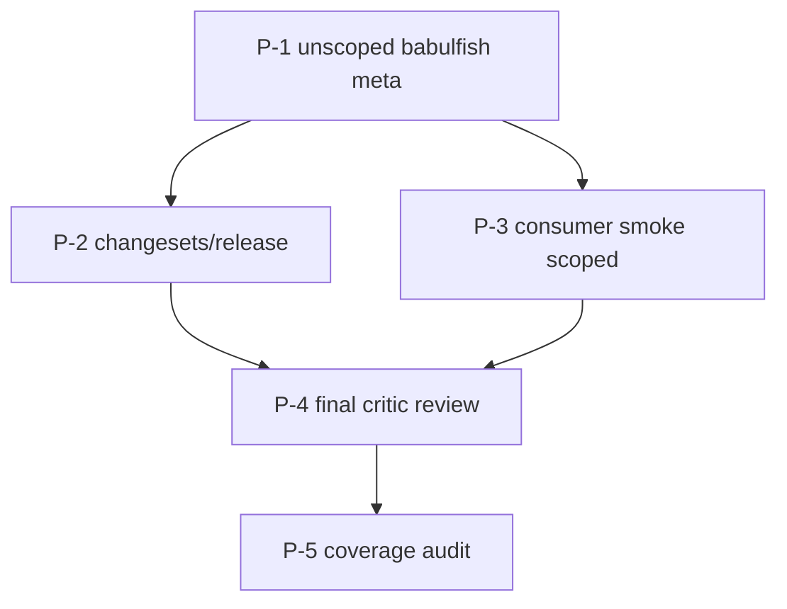

# Execution Plan — UI-Agnostic Core: Pre-Publish Polish

**Source design:** historical `docs/ui-agnostic-core.md` no longer exists; current repo truth lives in package READMEs, package manifests, and contract/conformance tests.
**Predecessor plan:** historical `docs/plans/ui-agnostic-core.md` no longer exists in-tree.
**Date split off:** 2026-04-13
**Last refreshed:** 2026-04-15
**Status:** active. This plan was written while deferred, then refreshed against the current repo state before implementation.

---

## Why this plan exists

The main structural split already landed: the repo now publishes a UI-agnostic core, a React binding, a styles package, and demos. What is still missing is the actual release-facing polish: the permanent unscoped compat package, a real release pipeline, a tarball consumer smoke test, and a final repo-state review/coverage pass that points at files that still exist.

Doing this polish before the package layout stabilized would have been churn. Doing it now matters because the repo already exposes the publishable surfaces and currently has release drift:

- `packages/babulfish/` no longer exists, but CI still points at it.
- There is no repo-root consumer smoke.
- There is no Changesets setup.
- `@babulfish/react/css` currently uses an invalid package `exports` target and will not survive a real tarball install.
- The docs linked by this plan's original draft are gone.

---

## Decisions

| # | Question | Decision | Notes |
|---|---|---|---|
| Q1 | Root `babulfish` post-publish | **A** — permanent alias to `@babulfish/react` | Keep the unscoped package forever as a convenience meta-package. It is not deprecated. |

---

## Task graph



Execution order is unchanged. Repo drift changed the file paths and acceptance details, not the dependency graph.

---

## Common PR constraints

Same as the original plan intent: one task = one PR, Mermaid diagram in the PR description, cross-linked siblings, Critic + Test Maven gates, Claude Code footer.

---

### P-1 — Unscoped `babulfish` compat meta-package

- **Owner:** `[Artisan]`
- **Blocks:** P-2, P-3
- **Blocked by:** none
- **Files:**
  - New: `packages/babulfish/package.json`
  - New: `packages/babulfish/src/index.ts`
  - New: `packages/babulfish/src/babulfish.css`
  - New: `packages/babulfish/tsup.config.ts`
  - New: `packages/babulfish/README.md`
- **Acceptance:**
  - `import { TranslatorProvider } from "babulfish"` resolves to `@babulfish/react`'s export surface.
  - `import "babulfish/css"` resolves to a local CSS bridge that delegates to `@babulfish/styles/css`.
  - `packages/babulfish/src/` contains only the compat shim: a JS/TS barrel plus the CSS bridge asset.
  - `src/index.ts` carries JSDoc stating that `babulfish` is a permanent convenience meta-package re-exporting `@babulfish/react`, not a deprecated path.
  - `pnpm --filter babulfish build` produces a tiny `dist/index.js`.
- **Dispatch template:**
  ```
  [Artisan] P-1 — Unscoped `babulfish` becomes permanent compat meta-package

  Goal: create the missing unscoped `babulfish` package as a permanent convenience re-export of `@babulfish/react`.

  Context: the earlier plan draft assumed `packages/babulfish/` still existed and needed replacement. It does not exist anymore. Build it from scratch.

  Inputs to read first:
  - packages/react/src/index.ts
  - packages/react/package.json
  - packages/styles/package.json

  Task:
  1. Create `packages/babulfish/package.json`. Name: `babulfish`. Dependencies: `@babulfish/react` and `@babulfish/styles` on `workspace:^`. Peer deps: `react ^18 || ^19`, `@huggingface/transformers ^4` (optional). Exports: `.` and `./css`.
  2. Create `packages/babulfish/src/index.ts` with a JSDoc banner and `export * from "@babulfish/react"`.
  3. Create `packages/babulfish/src/babulfish.css` containing `@import "@babulfish/styles/css";`.
  4. Create `packages/babulfish/tsup.config.ts` with one entry (`src/index.ts`) and externals for `react`, `@babulfish/react`, and `@babulfish/styles`.
  5. Write `packages/babulfish/README.md` as a short note + import example. Tone: convenience, not deprecation.
  6. Build and pack the package, then verify it installs alongside packed `@babulfish/react` and `@babulfish/styles`.

  Constraints:
  - Do NOT point package `exports` directly at another package specifier for `./css`; Node rejects that.
  - Do NOT deprecate the package in wording or metadata.
  - Do NOT re-export `@babulfish/core` from the unscoped package. Q1 is still React-flavored by design.
  ```

---

### P-2 — Changesets + release tooling

- **Owner:** `[Artisan]`
- **Blocks:** P-4
- **Blocked by:** P-1
- **Files:**
  - New: `.changeset/config.json`
  - New: `.github/workflows/release.yml`
  - Update: root `package.json`
  - Update: `.github/workflows/ci.yml`
- **Acceptance:**
  - `pnpm changeset` works at the repo root.
  - `pnpm changeset version` bumps `@babulfish/core`, `@babulfish/react`, `@babulfish/styles`, and `babulfish` in lockstep.
  - Private demo packages are not versioned or tagged by Changesets.
  - `release.yml` triggers on `main` push, installs dependencies, runs release-safe build/test checks, and opens a version PR or publishes via `changesets/action`.
  - `ci.yml` no longer points at a missing `packages/babulfish` path or missing root scripts.
- **Dispatch template:**
  ```
  [Artisan] P-2 — Changesets + release tooling

  Goal: stand up the publish pipeline so `@babulfish/core`, `@babulfish/react`, `@babulfish/styles`, and `babulfish` ship in lockstep once P-1 exists.

  Context: the original plan assumed four public packages already existed and ignored private-workspace handling. The refreshed repo needs both Changesets setup and CI drift cleanup.

  Inputs to read first:
  - root package.json
  - pnpm-workspace.yaml
  - .github/workflows/ci.yml

  Task:
  1. Add `@changesets/cli` as a root dev dependency.
  2. Create `.changeset/config.json` with:
     - `baseBranch: "main"`
     - `access: "public"`
     - `fixed: [["@babulfish/core", "@babulfish/react", "@babulfish/styles", "babulfish"]]`
     - `updateInternalDependencies: "patch"`
  3. Add root scripts: `changeset`, `version`, `release`.
  4. Create `.github/workflows/release.yml` using `changesets/action`. Install, run release-safe build/test commands, then open a version PR or publish with `NPM_TOKEN`.
  5. Update `.github/workflows/ci.yml` so it runs against the current repo shape instead of a deleted package path.

  Constraints:
  - Do NOT publish in this task.
  - Do NOT make `NPM_TOKEN` required before the publish step.
  - Keep the unscoped `babulfish` package in the fixed group so it never drifts from `@babulfish/react`.
  - Keep the build/test/docs gates in the root `release` script so the publish path and local dry-run path match.
  ```

---

### P-3 — Consumer smoke for the published layout

- **Owner:** `[Artisan]`
- **Blocks:** P-4
- **Blocked by:** P-1
- **Files:**
  - New: `scripts/consumer-smoke.mjs`
  - Update: root `package.json`
  - Update: `.github/workflows/ci.yml`
  - Update: `packages/react/package.json`
  - New: `packages/react/src/babulfish.css`
- **Acceptance:**
  - The smoke packs and installs the publishable tarballs in a temp project.
  - In a React-free temp project with peer auto-install disabled:
    1. `await import("@babulfish/core")` succeeds and `createBabulfish()` returns an object with `subscribe`, `snapshot`, and `dispose`.
    2. `await import("@babulfish/core/testing")` succeeds, `createDirectDriver()` succeeds, and a safe no-pipeline scenario such as `snapshot-no-spurious-notify` or `lifecycle-dispose-detaches` runs green.
    3. `await import("@babulfish/core/dom")` succeeds.
    4. `await import("@babulfish/core/engine")` succeeds.
    5. `import.meta.resolve("@babulfish/styles/css")` and `import.meta.resolve("@babulfish/react/css")` resolve to `.css` URLs.
    6. `await import("@babulfish/react")` fails before `react` is installed.
  - After installing `react` and `react-dom`, `@babulfish/react` imports successfully.
  - After P-1 lands, `babulfish` imports successfully with React installed, and `import.meta.resolve("babulfish/css")` resolves to the compat CSS bridge.
  - Smoke exits `0`.
- **Dispatch template:**
  ```
  [Artisan] P-3 — Consumer smoke for the published layout

  Goal: prove the tarball contract holds end-to-end for the publishable packages.

  Context: there is no existing consumer smoke anymore. The old plan assumed a script under `packages/babulfish/`; create a repo-root smoke from scratch.

  Inputs to read first:
  - packages/demo/scripts/smoke.mjs
  - packages/core/package.json
  - packages/react/package.json
  - packages/styles/package.json
  - packages/core/src/testing/scenarios.ts

  Task:
  1. Create `scripts/consumer-smoke.mjs` at repo root.
  2. Pack the publishable packages and install them together into a temp project.
  3. Disable peer auto-install for the no-React phase so missing `react` stays observable.
  4. Assert the core/runtime contract, core subpaths, CSS resolution, and missing-React failure mode.
  5. Fix `@babulfish/react/css` so it uses a local CSS bridge file instead of an invalid external-package `exports` target.
  6. After adding React to the temp project, assert positive imports for `@babulfish/react` and, once P-1 lands, `babulfish`.
  7. Wire the smoke into root scripts and CI.

  Constraints:
  - CSS should be resolved, not imported, in plain Node.
  - Install the packed tarballs together; do not rely on the registry.
  - Use an explicit safe no-pipeline conformance scenario. Do not assume all testing scenarios can run without mocks.
  - Clean up temp dirs and tarballs on exit.
  ```

---

### P-4 — Final Critic review across the full release

- **Owner:** `[Critic]`
- **Blocks:** P-5
- **Blocked by:** P-2, P-3
- **Files:** review packet at `.scratchpad/ui-agnostic-polish/p4-critic/manifest.md` plus `details/`
- **Acceptance:**
  - Multi-pass review: skeptic, user advocate, maintainer, security.
  - Every issue includes a concrete fix suggestion.
  - Includes at least three commendations.
  - Uses current repo-local truth, not missing predecessor docs or unavailable PR threads.
- **Dispatch template:**
  ```
  [Critic] P-4 — Final review before publish

  Goal: independent review of the publishable repo state after P-1 through P-3 land.

  Inputs to read first:
  - README.md
  - package.json
  - scripts/consumer-smoke.mjs
  - packages/*/README.md
  - packages/*/package.json
  - .github/workflows/{ci,release}.yml
  - packages/core/src/core/__tests__/contract.smoke.test.ts
  - packages/core/src/testing/scenarios.ts
  - packages/core/src/__tests__/conformance.direct.test.ts
  - packages/core/src/__tests__/conformance.vanilla-dom.test.ts
  - packages/react/src/__tests__/conformance.test.tsx
  - packages/react/src/__tests__/public-api.test.ts

  Review passes:
  1. SKEPTIC: framework leaks, snapshot freezing, shared engine identity, run-id cancellation, dispose semantics.
  2. USER ADVOCATE: install story, broken links, README/API truthfulness, copy-pastable quick starts.
  3. MAINTAINER: dependency edges, workspace consistency, stale references to removed paths, workflow command drift.
  4. SECURITY: globals, eval / Function constructor / dynamic require, unsafe HTML/DOM writes.

  Output:
  - `.scratchpad/ui-agnostic-polish/p4-critic/manifest.md`
  - `details/{skeptic,user-advocate,maintainer,security,commendations}.md`

  Constraints:
  - Every issue needs a concrete fix.
  - Include at least three commendations.
  - If PR threads do not exist, file follow-ups in this plan or scratchpad instead.
  ```

---

### P-5 — Public-surface coverage audit

- **Owner:** `[Test Maven]`
- **Blocks:** —
- **Blocked by:** P-4
- **Files:** audit at `.scratchpad/ui-agnostic-polish/p5-test-maven/manifest.md`
- **Acceptance:**
  - Audit enumerates every public export from `@babulfish/core`, `@babulfish/react`, `@babulfish/styles`, and `babulfish`.
  - Audit includes `@babulfish/core/engine/testing`, `@babulfish/react/css`, `@babulfish/styles/css`, and `babulfish/css`.
  - Audit maps each public surface to a test or smoke check that exercises it.
  - Audit uses current invariant sources: `packages/core/src/testing/scenarios.ts` and `packages/core/src/core/__tests__/contract.smoke.test.ts`.
  - Audit lists uncovered surfaces with concrete proposed test specs.
- **Dispatch template:**
  ```
  [Test Maven] P-5 — Public-surface coverage audit

  Goal: confirm every shipped public surface has at least one meaningful exercise, then list the gaps.

  Inputs to read first:
  - packages/core/package.json
  - packages/core/src/index.ts
  - packages/core/src/engine/index.ts
  - packages/core/src/engine/testing/index.ts
  - packages/core/src/dom/index.ts
  - packages/core/src/testing/index.ts
  - packages/react/package.json
  - packages/react/src/index.ts
  - packages/styles/package.json
  - packages/styles/README.md
  - packages/babulfish/package.json
  - packages/core/src/testing/scenarios.ts
  - packages/core/src/core/__tests__/contract.smoke.test.ts
  - existing tests under packages/core and packages/react
  - consumer smoke under scripts/consumer-smoke.mjs

  Task:
  1. Enumerate every public export path and symbol.
  2. Map each one to a test or smoke check.
  3. Verify shared conformance scenario groups per binding plus core-only contract checks.
  4. Verify the CSS contract: documented custom properties, animation/class hooks, and CSS path resolution.
  5. For every uncovered surface, write a one-paragraph test spec.

  Output:
  - `.scratchpad/ui-agnostic-polish/p5-test-maven/manifest.md`
  - `details/{coverage-table,gaps-and-specs}.md`

  Constraints:
  - Audit only. Do not add tests in this task.
  - Do not count trivial smoke with no behavioral assertion.
  ```

---

## Smallest first PR

**P-1** is still the entrypoint. `P-2` and `P-3` stack on it; `P-4` and `P-5` stay review/audit gates.
