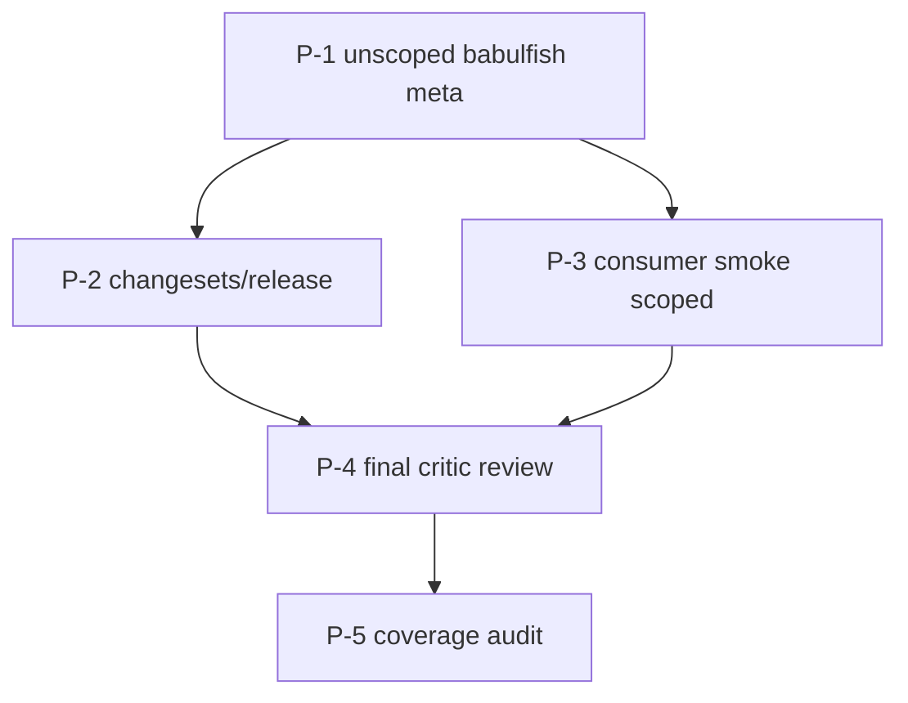

# Execution Plan — UI-Agnostic Core: Pre-Publish Polish

**Source design:** [`docs/ui-agnostic-core.md`](../ui-agnostic-core.md)
**Predecessor plan:** [`docs/plans/ui-agnostic-core.md`](./ui-agnostic-core.md)
**Date split off:** 2026-04-13
**Status:** deferred. Do **NOT** start until we are within days of cutting a first npm release (0.1.0). Everything here is pre-publish tax until then.

---

## Why this plan exists

The main `ui-agnostic-core.md` plan delivers the UI-agnostic framework and its per-UI demos while the library is still unshipped. These tasks only earn their keep once we are about to publish to npm: they exist to lock in the published contract (meta-package, release pipeline, scoped consumer smoke, final review + coverage gates).

Doing them early is wasted motion — there are no external consumers to protect, no versions to coordinate, and no tarball contract to test.

---

## Decisions (deferred from the main plan)

| # | Question | Decision | Notes |
|---|---|---|---|
| Q1 | Root `babulfish` post-publish | **A** — permanent alias to `@babulfish/react` | Under Tier 3, the unscoped `babulfish` becomes a permanent (not deprecated) compat meta-package. Implement at publish time, not before. |

---

## Task graph



All tasks in this plan blocked by the main `ui-agnostic-core.md` plan completing.

---

## Common PR constraints (apply to every dispatch template)

Same as the main plan — one task = one PR, Mermaid diagram in the PR description, cross-linked siblings, Critic + Test Maven gates, Claude Code footer.

---

### P-1 — Unscoped `babulfish` compat meta-package

- **Owner:** `[Artisan]`
- **Blocks:** P-2, P-3
- **Blocked by:** main plan complete (through T-7 demo migration, T-11 docs)
- **Files:**
  - Replace: `packages/babulfish/package.json` (thin shell depending on `@babulfish/react` workspace exact)
  - Replace: `packages/babulfish/src/index.ts` (re-exports React surface from `@babulfish/react`)
  - Replace: `packages/babulfish/tsup.config.ts` (single entry; minimal)
  - New: `packages/babulfish/README.md` (one paragraph: "convenience meta-package; prefer `@babulfish/react` for clarity")
  - Add: `packages/babulfish/src/css/index.ts` (or exports map entry) re-exporting `@babulfish/styles/css` so `babulfish/css` keeps working
- **Acceptance:**
  - `import { TranslatorProvider } from "babulfish"` resolves to `@babulfish/react`'s export.
  - `import "babulfish/css"` resolves to the same stylesheet `@babulfish/styles/css` does.
  - `packages/babulfish/src/` contains ONLY the meta-package shim (an `index.ts` re-export and a `css/` resolver if needed). All real source has already moved out in the main plan.
  - JSDoc on the meta-package's `index.ts` says: *"This is a convenience meta-package re-exporting `@babulfish/react`. New code can import from `@babulfish/react` directly for explicit-binding clarity. This package is permanent and not deprecated."*
- **Dispatch template:**
  ```
  [Artisan] P-1 — Unscoped `babulfish` becomes permanent compat meta-package

  Goal: keep `import "babulfish"` working forever as a permanent (not deprecated) re-export of @babulfish/react.

  Context: the main ui-agnostic-core plan emptied packages/babulfish/src/ of real source. This task replaces what's left with a thin shell that depends on @babulfish/react and re-exports it. The package is NOT deprecated — it's a convenience. We are about to publish 0.1.0; this is the point at which the meta-package earns its keep.

  Inputs to read first:
  - packages/react/src/index.ts (the surface you're re-exporting).
  - packages/styles/package.json (for the css re-export).

  Task:
  1. Replace packages/babulfish/package.json. Name: `babulfish` (unscoped). dependencies: `"@babulfish/react": "workspace:^"`, `"@babulfish/styles": "workspace:^"`. peerDependencies: `react ^18 || ^19`, `@huggingface/transformers ^4` (both optional). Exports: `.` and `./css`.
  2. Replace packages/babulfish/src/index.ts with `export * from "@babulfish/react"` (or named re-exports if `*` causes type issues). Add a JSDoc banner stating this is a permanent convenience meta-package, not deprecated.
  3. Replace packages/babulfish/tsup.config.ts with a minimal config: one entry (index.ts), externalize @babulfish/react and @babulfish/styles.
  4. For `babulfish/css`, the package.json exports map points directly at @babulfish/styles' css file (or a thin local file that re-exports it).
  5. Write packages/babulfish/README.md as a one-paragraph note + import example.
  6. `pnpm install`, `pnpm --filter babulfish build`. Build produces a tiny dist/index.js.
  7. Smoke: in a scratch dir, `pnpm --filter babulfish pack`, install the tarball with @babulfish/react and @babulfish/styles, run `node -e 'import("babulfish").then(m => console.log(Object.keys(m)))'`. Should list TranslatorProvider, TranslateButton, etc.

  Deliverable: a single PR titled `P-1 — Unscoped babulfish meta-package`.

  Constraints:
  - The meta-package is NOT deprecated. Wording must be neutral / convenience-flavored.
  - Do NOT publish. Versions stay at 0.1.0 on disk.
  - Do NOT try to re-export from @babulfish/core through the meta-package. The meta-package is React-flavored by design (Q1=A).
  - Do NOT delete packages/babulfish/. Its existence is the point.
  ```

---

### P-2 — Changesets + release tooling

- **Owner:** `[Artisan]`
- **Blocks:** P-4
- **Blocked by:** P-1
- **Files:**
  - New: `.changeset/config.json` (fixed-versioning across `@babulfish/core`, `@babulfish/react`, `@babulfish/styles`, `babulfish`)
  - New: `.github/workflows/release.yml` (uses `changesets/action`)
  - Update: root `package.json` scripts (add `release`, `version`, `changeset`)
  - Update: `pnpm-workspace.yaml` if needed
- **Acceptance:**
  - `pnpm changeset` interactively creates a changeset.
  - `pnpm changeset version` bumps all four packages in lockstep.
  - `pnpm changeset publish --dry-run` reports an intent to publish all four packages.
  - `release.yml` triggers on `main` push, runs install/build/test, opens a versioning PR via `changesets/action`.
- **Dispatch template:**
  ```
  [Artisan] P-2 — Changesets + release tooling

  Goal: stand up the publish pipeline so we can ship @babulfish/core, @babulfish/react, @babulfish/styles, and the unscoped `babulfish` meta together in lockstep.

  Context: we are preparing for 0.1.0. Fixed-versioning across all four packages until 1.0. After 1.0 we may relax — out of scope here.

  Inputs to read first:
  - Current root package.json and any existing CI under .github/workflows/.

  Task:
  1. Add @changesets/cli as a root devDependency.
  2. Create .changeset/config.json with `"fixed": [["@babulfish/core", "@babulfish/react", "@babulfish/styles", "babulfish"]]`, `"baseBranch": "main"`, `"access": "public"`.
  3. Add root package.json scripts: `"changeset": "changeset"`, `"version": "changeset version"`, `"release": "pnpm -r build && changeset publish"`.
  4. Create .github/workflows/release.yml using changesets/action. On push to main: install, build, test, then either open a Version PR or publish (token via NPM_TOKEN secret). Reference docs at https://github.com/changesets/changesets/blob/main/docs/automating-changesets.md.
  5. Add an initial empty changeset to confirm the flow (optional).
  6. Run `pnpm changeset version --snapshot dev` locally as a smoke test to confirm all four packages bump together. Revert the bump after.

  Deliverable: a single PR titled `P-2 — Changesets + release pipeline`.

  Constraints:
  - Do NOT publish in this PR. Setup only.
  - Do NOT make NPM_TOKEN required at install/build time. Only at publish.
  - The fixed-versioning array MUST include the unscoped `babulfish`. We never want the meta-package to drift from @babulfish/react.
  ```

---

### P-3 — Consumer smoke for the published layout

- **Owner:** `[Artisan]`
- **Blocks:** P-4
- **Blocked by:** P-1
- **Files:**
  - Move: `packages/babulfish/scripts/consumer-smoke.mjs` (if still present) → repo-root `scripts/consumer-smoke.mjs` (or under `packages/core/scripts/`)
  - Update assertions per the scoped layout
- **Acceptance:**
  - Smoke packs all four workspace packages, installs them in a temp React-free project, asserts:
    1. `await import("@babulfish/core")` succeeds; `Object.keys` contain `createBabulfish`; a call to `createBabulfish(config)` returns an object with `subscribe`, `snapshot`, `dispose`.
    2. `await import("@babulfish/core/testing")` succeeds; exports include `scenarios`; at least one scenario runs green against a direct core driver.
    3. `await import("@babulfish/core/dom")` succeeds, no React in resolved deps.
    4. `await import("@babulfish/core/engine")` succeeds.
    5. `await import("@babulfish/styles/css")` resolves to a `.css` file path.
    6. `await import("@babulfish/react")` fails or warns when `react` is not installed (peer-dep check).
    7. `await import("babulfish")` (unscoped) fails or warns the same way (since meta depends on @babulfish/react).
    8. With React installed, `import("babulfish")` and `import("@babulfish/react")` both resolve and expose the same surface.
  - Smoke exits 0.
- **Dispatch template:**
  ```
  [Artisan] P-3 — Consumer smoke for the scoped published layout

  Goal: prove the Tier-3 packaging contract holds end-to-end against real tarballs. This is the last gate before publish: if this smoke goes green, the tarballs are installable.

  Context: we are about to publish 0.1.0 to npm. The main plan's workspace-level build + demo boot already prove imports resolve in dev. This PR is about the published-tarball contract, which workspace symlinks don't exercise.

  Inputs to read first:
  - Existing smoke (if any) at packages/core/scripts/ or packages/babulfish/scripts/.

  Task:
  1. Move (or create) the smoke at scripts/consumer-smoke.mjs at repo root. Wire it into root package.json `consumer:smoke` and `docs:check` scripts (the latter still runs tsc first, then smoke).
  2. Pack all four packages using `pnpm -r pack` or per-package pack. Resolve workspace `*` deps in the temp project's package.json to point at the packed tarballs.
  3. Build a temp dir with a minimal package.json, install the four tarballs, then run `node -e '...'` snippets to assert the contract from the Acceptance list above. Include a scenario-runner call against @babulfish/core/testing so the smoke exercises real behavior, not just `Object.keys`.
  4. Make assertions clear: log `OK [@babulfish/core]: createBabulfish present` and so on.
  5. Exit 0 on full success; nonzero on first failure.

  Deliverable: a single PR titled `P-3 — Scoped consumer smoke`.

  Constraints:
  - The temp project must NOT have react in its dependencies for the React-free assertions; install react separately for the with-React assertions.
  - Exercise at least one @babulfish/core/testing scenario. A packaging check that never calls createBabulfish is too shallow.
  - Clean up the temp dir on exit.
  ```

---

### P-4 — Final Critic review across the full release

- **Owner:** `[Critic]`
- **Blocks:** P-5
- **Blocked by:** P-2, P-3
- **Files:** Review packet at `.scratchpad/ui-agnostic-polish/critic-final/manifest.md` (no source changes; review only)
- **Acceptance:**
  - Multi-pass review: skeptic (does the contract leak framework types?), user advocate (is the install story clear?), maintainer (can a stranger find their way?), security (no new globals or eval introduced?).
  - Every issue reported includes a concrete fix suggestion.
  - Includes commendations.
  - Issues filed as follow-up tasks (P-6+) added to this plan, OR as PR comments on the relevant PRs if they're still open.
- **Dispatch template:**
  ```
  [Critic] P-4 — Final review before publish

  Goal: independent review of everything shipped in the main plan plus P-1..P-3. Surface issues with concrete fixes; commend what worked.

  Context: this is the last gate before publishing 0.1.0 to npm. No more code changes from prior tasks should land before you finish; if you find blocking issues, file them as new tasks.

  Inputs to read first:
  - All PRs in the main ui-agnostic-core plan (or their merged commits) + P-1..P-3.
  - docs/plans/ui-agnostic-core.md and docs/plans/ui-agnostic-polish.md (this file) — every task's acceptance criteria.
  - docs/ui-agnostic-core.md (design decisions).

  Task: do four review passes:
  1. SKEPTIC: does the BabulfishCore contract leak any framework types? Is `Snapshot` actually frozen end-to-end? Does the race guard in core actually serialize on the run-id? Are `dispose` semantics tight (no leaked timers, no orphan AbortController)? Is the engine a single module-level instance across multiple createBabulfish calls?
  2. USER ADVOCATE: is the install story coherent? Does a reader of root README in <2 minutes know which package to install? Are quick-starts copy-pastable? Is the vanilla demo a true no-framework path?
  3. MAINTAINER: can a stranger to the repo trace the dependency edges? Are workspace deps consistent? Is there dead code left in packages/babulfish/src/ from incomplete moves?
  4. SECURITY: any new globals introduced? Any eval / Function constructor / dynamic require? Any user-supplied data flowing into innerHTML or DOM construction without sanitization?

  Output: .scratchpad/ui-agnostic-polish/critic-final/manifest.md (max 30 lines, executive summary) + details/{skeptic,user-advocate,maintainer,security,commendations}.md. For each issue, include: severity (block/strong-suggest/nit), the smallest concrete fix, and a proposed task (P-6+) if it warrants its own PR.

  Deliverable: review packet only. No source changes. Reply summarizes the top 5 issues + commendations.

  Constraints:
  - Every issue has a concrete suggestion. "Could be better" without a fix is not allowed.
  - Include at least three commendations. Negative-only review is incomplete review.
  ```

---

### P-5 — Public-surface coverage audit

- **Owner:** `[Test Maven]`
- **Blocks:** —
- **Blocked by:** P-4
- **Files:** Audit at `.scratchpad/ui-agnostic-polish/test-maven-coverage/manifest.md`. New tests filed as follow-up tasks (P-6+) if needed.
- **Acceptance:**
  - Audit confirms every public symbol in `@babulfish/core`, `@babulfish/react`, and `@babulfish/styles` (CSS contract) has at least one test exercising it.
  - The four invariants from design doc §6.2 are tested per binding (core directly, React via conformance, vanilla DOM via conformance).
  - Audit lists all uncovered surfaces with proposed test specs.
- **Dispatch template:**
  ```
  [Test Maven] P-5 — Public-surface coverage audit

  Goal: confirm every public symbol shipped by @babulfish/* has at least one test exercising it, and the binding-conformance invariants are tested per binding.

  Context: P-4 is the last code/docs review. P-5 is the test-coverage gate before we cut 0.1.0.

  Inputs to read first:
  - packages/core/src/index.ts, packages/core/src/{engine,dom,testing}/index.ts (the public surface).
  - packages/react/src/index.ts.
  - packages/styles/README.md (the CSS contract).
  - docs/ui-agnostic-core.md §6.2 invariants.
  - All existing test files under packages/{core,react}/src/__tests__/ and adjacent, including the vanilla DOM conformance from main-plan T-8.

  Task:
  1. Enumerate every public export from each @babulfish/* package.
  2. For each export, identify a test that exercises it. If none, list it as a gap.
  3. Confirm each of the four invariants is tested at least once for core directly, once per binding (React, vanilla DOM).
  4. Confirm the CSS contract: at least one test asserts the documented custom properties are settable (this can be a tiny JSDOM test in packages/styles/src/__tests__/contract.test.ts).
  5. For each gap, draft a one-paragraph test spec.

  Output: .scratchpad/ui-agnostic-polish/test-maven-coverage/manifest.md (max 30 lines) + details/{coverage-table.md, gaps-and-specs.md}. For each gap, propose a follow-up task (P-6+).

  Deliverable: audit only. No new tests in this PR (gaps become their own PRs).

  Constraints:
  - Do NOT add tests in this PR; the audit's value is in the surface inventory + gap list.
  - Do NOT count `expect(true).toBe(true)` smoke tests as coverage.
  ```

---

## Smallest first PR

**P-1** is the entrypoint. The rest stack on top.
