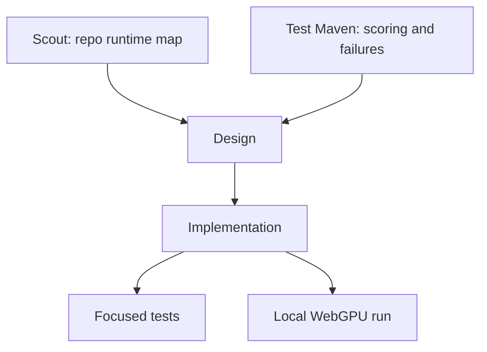

# WebGPU Translation Evals

## Goal

Add an explicit, opt-in browser eval command for the built-in chat-model adapters. It must run real models in Chromium with WebGPU required, write a JSON artifact, and stay out of default `pnpm test`.

## Dependency Graph



## Design

Use the existing vanilla demo Vite package as the browser host because it already carries the right dependency set and COOP/COEP headers. Add a separate eval page/module there, then drive it from a root Node script.

The eval page uses the public core path only:

1. `createBabulfish({ engine: { model, device: "webgpu", dtype } })`
2. `loadModel()`
3. `translateText(sourceText, targetLanguage)` for each fixed corpus case
4. `dispose()` before the next model

The Node runner starts Vite with the demo's config, launches Chromium through Playwright, executes the page-side eval function, and writes `.scratchpad/webgpu-evals/results.json`. If Playwright, Chromium, cross-origin isolation, `navigator.gpu`, adapter/device request, or the core WebGPU verdict is missing, it fails before treating the result as a model quality signal.

## Scope

- Default model: `qwen-2.5-0.5b`; `--model all` runs `qwen-2.5-0.5b`, `qwen-3-0.6b`, then `gemma-3-1b-it` one at a time.
- Corpus: prose to Spanish/French, markdown-ish text, preserved brand substrings, short UI labels, punctuation/quotes, Arabic smoke, and output-only compliance.
- Scoring: deterministic checks only: non-empty output, no prompt echo, no boilerplate wrappers, exact preserved substrings, markdown marker survival, output differs from prose source, and tiny regex/allowlist checks where useful.

## Non-Goals

- No default test integration.
- No mocked runtime.
- No prompt tuning.
- No reuse of `phi4-spike.ts` as the eval source of truth.
- No new public translation API unless eval implementation proves it is necessary.

## Validation

Focused checks:

```bash
pnpm --filter @babulfish/core exec vitest run src/engine/__tests__/translation-adapters.test.ts
pnpm --filter @babulfish/demo-vanilla exec vitest run src/webgpu-eval-scorer.test.ts
pnpm eval:webgpu
```

If the local machine cannot expose WebGPU to Chromium, `pnpm eval:webgpu` should exit nonzero with an environment failure and a partial artifact that says what to fix.
