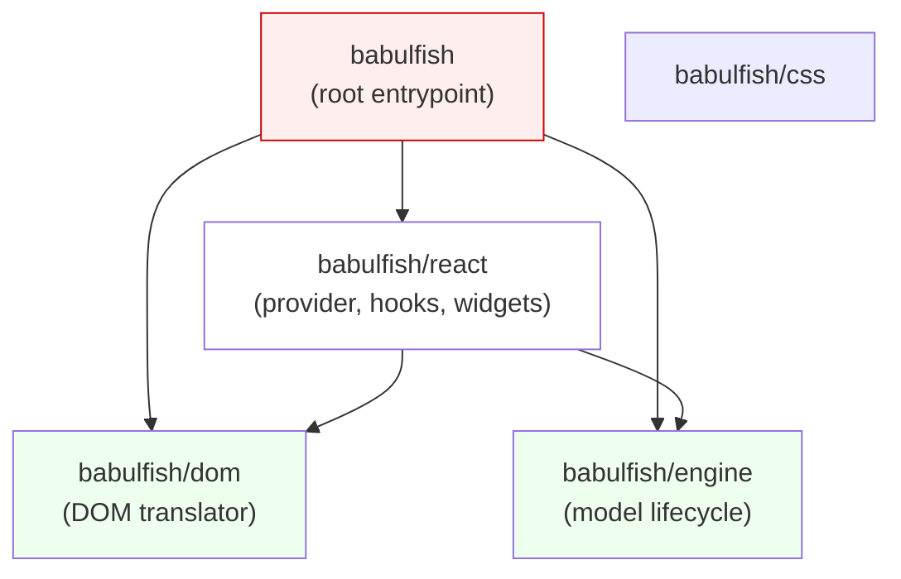
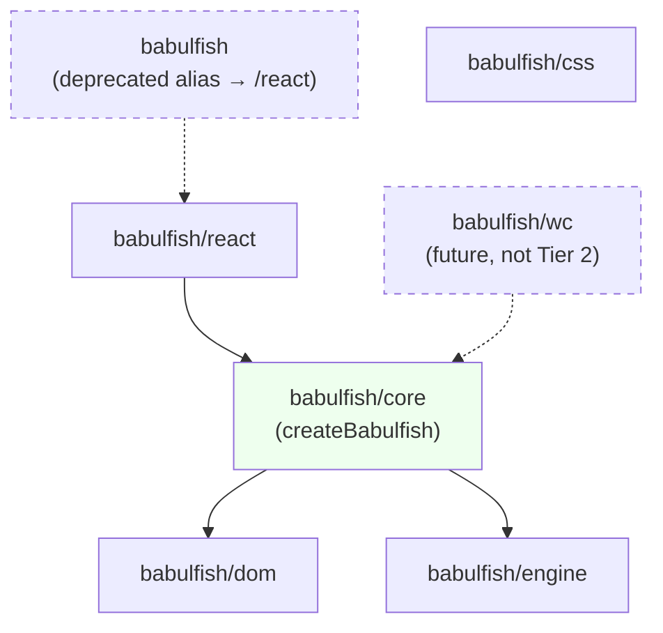
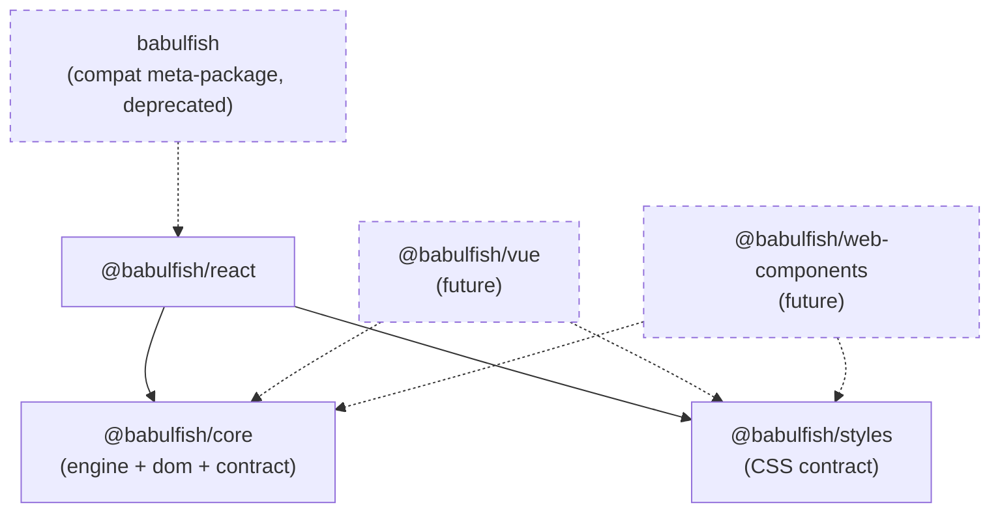

# UI-Agnostic Core — Design Doc

**Status:** proposal, not committed.
**Author:** Architect pass (Claude, orchestrated by Hiren).
**Date:** 2026-04-13.
**Scope:** `packages/babulfish`, with implications for `packages/demo` and any future bindings.

> TL;DR — the engine and DOM layers are already framework-clean and the subpath bundles already carry zero React cost. What's misrepresented is the identity of the root `babulfish` import, and what's missing is a named, framework-neutral core contract that future bindings can consume. My recommendation is **Tier 2**, done in two shippable steps.

---

## 1. Findings from the survey

### 1.1 Engine and DOM are genuinely framework-clean

Three sub-layers audited: `src/engine/`, `src/dom/`, `src/translator.ts`. No React imports, no JSX, no hook calls, no bundler assumptions.

| Layer | Verdict | Seam |
|---|---|---|
| `src/engine/*` | Clean | Only dependency is `@huggingface/transformers`, behind a lazy `await import(...)` in `src/engine/model.ts:129` |
| `src/dom/*` | Clean | Zero references to `react`, `@huggingface/transformers`, or hooks. The boundary holds via `DOMTranslatorConfig.translate` injection at `src/dom/translator.ts:29` |
| `src/translator.ts` | Clean | 27 lines of pure composition. Can be reused verbatim by any binding |

Two soft couplings, neither blocking, both worth fixing under a separate PR:

- **`src/dom/translator.ts:83,371,496`** — `document.querySelector` / `document.querySelectorAll` / `document.createTreeWalker` hard-coded to global `document`. A Web Component binding targeting Shadow DOM can't retarget. Fix: accept `root: ParentNode | Document` in `DOMTranslatorConfig`, default to `document`, and switch to `el.ownerDocument.createTreeWalker(...)`.
- **`src/engine/detect.ts:23`** — `navigator.maxTouchPoints` read after a `typeof window` guard only. Fine in real browsers; a polyfilled Node env with `window` but no `navigator` would throw. Cosmetic.

Both items are flagged as "nice before Tier 2 freezes a contract," not "must fix now."

### 1.2 Packaging: the zero-React claim is honest

Validated against built artifacts (`dist/`) and the packing smoke test.

- `dist/engine.js` — re-exports `createEngine` from an internal chunk with **zero top-level imports**. `@huggingface/transformers` is pulled lazily inside `createEngine`, not at import time.
- `dist/dom.js` — re-exports `createDOMTranslator` + markdown helpers. **No** `react`, `react-dom`, or `@huggingface/transformers` references. Clean.
- `dist/index.js` — does re-export the React surface via the shared React chunk. Matches the README's warning.
- `dist/react.js` — properly externalizes `react` and `react/jsx-runtime`.
- `src/translator.ts` is bundled into `dist/index.js` only. No accidental fanout.
- `scripts/consumer-smoke.mjs` packs a tarball, installs it in a React-free project, asserts subpath imports succeed, and asserts bare root `import("babulfish")` fails. The contract is tested end-to-end.

**Implication:** at the packaging layer, there is nothing to fix. The misrepresentation is about *naming and framing*, not about where React actually lives in the bundle graph.

### 1.3 The React binding is thin, but leaks three responsibilities

Classifying every export of `src/react/index.ts`:

| Export | Class | Notes |
|---|---|---|
| `TranslatorProvider` | React plumbing | Each binding has its own container; the component form is React-only |
| `useTranslator` | React flavor of generic glue | Today: hand-rolled `useState`+`useEffect`. Target: `useSyncExternalStore` over a core subscription |
| `useTranslateDOM` | React flavor of generic glue | Same story |
| `TranslateButton`, `TranslateDropdown` | UI component | Stay in the React binding. Not portable |
| `TranslateButtonProps`, `TranslateDropdownProps` | UI component | React-typed (`ReactNode`, render-props) — stay in binding |
| `DEFAULT_LANGUAGES` | Generic glue | Currently at `src/react/provider.tsx:35-50`. Belongs in core |
| `ModelState`, `TranslationState`, `TranslatorLanguage`, `TranslatorConfig` | Generic glue | Pure data types. Safe to move to core |
| `useTranslatorContext` / `TranslatorContextValue` | React plumbing / generic shape | The *shape* is the contract; the *context* is React |

Three pieces of logic live in the React provider that **every future binding will need to re-implement**, and they must not drift:

1. **`DEFAULT_LANGUAGES`** — 14-entry language list at `src/react/provider.tsx:35-50`.
2. **Progress + run-ID race guard** — `provider.tsx:92-171`. Wraps `hooks.onProgress` and debounces completions from stale translation calls.
3. **Capability snapshot** — React calls `getTranslationCapabilities()` from `src/engine/detect.ts` and stores the result in `useState`. Other bindings will repeat this wiring.

One latent bug surfaced during the audit: `src/react/use-translator.ts:106` synthesizes `new Error("Model loading failed")` instead of propagating the actual engine error. The current `engine.on("status-change" ...)` event payload doesn't carry error detail. Worth fixing when core takes ownership of state.

---

## 2. Proposed binding contract

### 2.1 Principles

- **One snapshot, one subscription.** A single frozen `Snapshot` exposed as `core.snapshot` plus `subscribe(listener)`. React maps it via `useSyncExternalStore`; Vue via `reactive`+`watch`; Svelte via `readable`; Web Components via `CustomEvent` dispatch on the host element.
- **Core owns state; bindings are projections.** No state ever lives in a binding that also lives in core. Drift between bindings is a bug.
- **Zero framework types in core.** No `ReactNode`, no `Ref`, no Vue `Ref`, no Svelte stores. Core is callable from plain TypeScript.
- **Widgets stay in bindings.** `TranslateButton`, `TranslateDropdown`, and any future equivalents in Vue/Svelte/WC are owned by the binding that ships them. Core never describes widgets.

### 2.2 TypeScript interface

```ts
// Data shapes — framework-neutral
export type Language = { readonly label: string; readonly code: string }

export type ModelState =
  | { readonly status: "idle" }
  | { readonly status: "downloading"; readonly progress: number } // 0..1
  | { readonly status: "ready" }
  | { readonly status: "error"; readonly error: unknown }

export type TranslationState =
  | { readonly status: "idle" }
  | { readonly status: "translating"; readonly progress: number } // 0..1

export type Capabilities = {
  readonly ready: boolean          // has detection run? SSR-safe first render
  readonly hasWebGPU: boolean
  readonly canTranslate: boolean
  readonly device: "webgpu" | "wasm" | null
  readonly isMobile: boolean
}

export type Snapshot = {
  readonly model: ModelState
  readonly translation: TranslationState
  readonly currentLanguage: string | null
  readonly capabilities: Capabilities
}

// The binding contract
export interface BabulfishCore {
  readonly snapshot: Snapshot                                      // always defined, always frozen
  subscribe(listener: (snapshot: Snapshot) => void): () => void    // returns unsubscribe
  loadModel(): Promise<void>
  translateTo(lang: string): Promise<void>                         // `"restore"` sentinel restores original
  restore(): void
  translate(text: string, lang: string): Promise<string>           // single-string, no DOM
  abort(): void
  readonly languages: ReadonlyArray<Language>
  dispose(): void
}

export type BabulfishConfig = {
  readonly engine?: EngineConfig
  readonly dom?: Omit<DOMTranslatorConfig, "translate">
  readonly languages?: ReadonlyArray<Language>
}

export function createBabulfish(config?: BabulfishConfig): BabulfishCore
```

### 2.3 How each binding maps

| Concern | React | Vue | Svelte | Web Component |
|---|---|---|---|---|
| Create core | `TranslatorProvider` on mount | `provide("babulfish", core)` | `setContext("babulfish", core)` | `connectedCallback` |
| Reactive read | `useSyncExternalStore(core.subscribe, () => core.snapshot)` | `reactive({...})` + `watch` | `readable(initial, set => core.subscribe(set))` | Re-dispatch `CustomEvent("snapshot")` |
| Method calls | `core.loadModel` etc. as stable refs | Same, via injected core | Same, via context | Imperative methods on the element |
| Dispose | `useEffect` cleanup | `onBeforeUnmount` | `onDestroy` | `disconnectedCallback` |

### 2.4 What stays owned by each binding

- Widgets: `TranslateButton`, `TranslateDropdown`, and their styling/slots.
- Framework-idiomatic escape hatches: `className`, render-props in React; `<slot>` in Vue/WC; snippets in Svelte.
- SSR neutralization, click-away, keyboard nav. Shared *algorithms* can migrate to core as pure functions (e.g. a listbox-key reducer) once a second binding exists and the duplication hurts. Don't pre-generalize.

---

## 3. Tier 1 — Minimal: docs + packaging honesty

**Thesis:** the lie is in the framing, not the code. Fix the framing.

### 3.1 Changes

**`packages/babulfish/package.json`**

- Update `description`: `"Client-side browser translation. Framework-agnostic engine and DOM translator, with a first-party React binding."`
- Reorder `keywords`: move `react` after `translation`, `i18n`, `webgpu`, `wasm`, `dom`.
- Add a new conditional subpath for a React-free composition helper (optional but cheap):
  ```jsonc
  "./core": {
    "import": "./dist/core.js",
    "types": "./dist/core.d.ts"
  }
  ```
- `tsup.config.ts` adds one entry: `core: "src/core/index.ts"`, where `src/core/index.ts` is a one-file barrel that re-exports `createEngine`, `createDOMTranslator`, `createTranslator`, the shared types, and (promoted) `DEFAULT_LANGUAGES`. No React; one reliable "I want everything non-React" import path.

**`packages/babulfish/README.md`**

- Reorder sections so the first install block is *not* `import { TranslatorProvider, TranslateButton } from "babulfish"`. Lead with a "Pick your surface" matrix:
  | You want... | Import from | Installs |
  |---|---|---|
  | No UI, raw translation | `babulfish/engine` | `babulfish` + `@huggingface/transformers` |
  | No UI, DOM walking only | `babulfish/dom` | `babulfish` |
  | Engine + DOM bundled (headless) | `babulfish/core` | `babulfish` + `@huggingface/transformers` |
  | React UI (batteries included) | `babulfish/react` | `babulfish` + `react` + `@huggingface/transformers` |
  | Root bare import (alias for React) | `babulfish` | same as `babulfish/react` |
- Relabel the ASCII architecture diagram: the top row is `babulfish/react` (not "babulfish").
- Add a short "Why three layers" paragraph explicitly stating the UI-agnostic surfaces are `babulfish/core`, `babulfish/engine`, `babulfish/dom`. React is a first-party binding shipped in the same package.

**`packages/babulfish/src/index.ts`**

No behavioral change. Add a JSDoc banner: *"This entrypoint is an alias for `babulfish/react` for historical reasons. New code should import from `babulfish/react` (for the React UI) or `babulfish/core` (for headless)."*

**`packages/babulfish/docs-examples/`**

Add `core-only.ts` alongside `engine-only.ts` and `dom-only.ts` that demonstrates `createTranslator` from `babulfish/core`. `consumer-smoke.mjs` grows one more assertion: `import("babulfish/core")` succeeds without React.

### 3.2 Consumer before / after

**Before (all imports valid, none removed):**
```ts
import { TranslatorProvider, TranslateButton } from "babulfish"      // React pulled
import { createEngine } from "babulfish/engine"                      // no React
import { createDOMTranslator } from "babulfish/dom"                  // no React
```

**After:**
```ts
import { TranslatorProvider, TranslateButton } from "babulfish/react" // clearer intent
import { createTranslator } from "babulfish/core"                     // NEW: headless, no React
import { createEngine } from "babulfish/engine"                       // unchanged
import { createDOMTranslator } from "babulfish/dom"                   // unchanged

// Root bare import still works, aliased to /react for back-compat; deprecated in docs
import { TranslatorProvider } from "babulfish"                        // still React-pulling
```

No `package.json` changes for consumers. No removed exports.

### 3.3 How React stays first-class

- `babulfish/react` is the documented primary import for React consumers — no deprecation, no warning banner.
- Root `babulfish` remains a working alias forever (Tier 1 does not deprecate root).
- The quick-start example on the README stays `npm install babulfish react @huggingface/transformers` and uses `babulfish/react` imports. That's still three lines to translate a page.

### 3.4 Tradeoffs vs. other tiers

- **Vs. staying put:** fixes the framing problem cleanly with zero risk.
- **Vs. Tier 2:** doesn't give us a named `BabulfishCore` contract. Future Vue/Svelte/WC bindings will have to re-derive state-management logic, likely duplicating the run-ID guard and capability detection. Technical debt accrues proportionally to the number of future bindings.
- **Risk:** Low. Pure additive. No breaking change.
- **Migration cost:** None. Consumers can move import paths at leisure.

---

## 4. Tier 2 — Moderate: reshape entrypoints, keep one package

**Thesis:** introduce a real core contract. Stop making each binding re-derive the same state machine.

### 4.1 Changes

**New source tree under `packages/babulfish/src/`:**
```
src/
├── core/
│   ├── index.ts              # public barrel: createBabulfish, types, defaults
│   ├── babulfish.ts          # createBabulfish factory; owns Snapshot + subscribe
│   ├── store.ts              # tiny pub/sub over frozen Snapshot (structural sharing)
│   ├── progress.ts           # run-ID race guard (lifted from provider.tsx:92-171)
│   ├── languages.ts          # DEFAULT_LANGUAGES (lifted from provider.tsx:35-50)
│   └── __tests__/            # contract-level tests (see §6.2)
├── engine/                   # unchanged
├── dom/                      # unchanged (with optional ParentNode root follow-up)
├── react/
│   ├── index.ts              # unchanged public surface
│   ├── provider.tsx          # ~70% smaller — just wires core into context
│   ├── use-translator.ts     # becomes useSyncExternalStore wrapper
│   ├── use-translate-dom.ts  # same treatment
│   ├── translate-button.tsx  # unchanged
│   └── translate-dropdown.tsx# unchanged
├── translator.ts             # deprecated; thin wrapper that calls createBabulfish().{engine,dom}
└── index.ts                  # alias re-export from ./react/ for one minor version
```

**`package.json` exports** adds `./core` (primary headless entrypoint). All other subpaths unchanged. `engine`, `dom`, `react`, `css` stay. Root `.` stays aliased to `react` for back-compat until the deprecation window closes.

**`tsup.config.ts`** gains a `core` entry. Still one build command.

**`translator.ts`** becomes `createTranslator = (c) => { const b = createBabulfish(c); return { engine: b._engine, dom: b._dom } }` — deprecated, keeps old shape. Remove in next major.

**Deprecation plan for root `babulfish`:**
- 0.2.x: root is an alias to `./react`, JSDoc says *"Deprecated: import from `babulfish/react` instead. This entrypoint will be removed in 0.3."*
- 0.3.0: root either (a) stops re-exporting React symbols and re-exports only core, or (b) becomes an empty barrel with a build-time deprecation warning. Decision deferred; see §9.

**New second-binding stress test — Web Component sketch** (do not ship in Tier 2; just validate contract):
```ts
// packages/babulfish/src/wc/translate-button.ts — NOT SHIPPED IN TIER 2
import { createBabulfish, type BabulfishCore, type Snapshot } from "../core/index.js"

class BabulfishButton extends HTMLElement {
  #core: BabulfishCore | null = null
  #unsubscribe: (() => void) | null = null
  #snapshot: Snapshot | null = null

  connectedCallback() {
    const config = parseConfigFromAttributes(this)
    this.#core = createBabulfish(config)
    this.#unsubscribe = this.#core.subscribe(snapshot => {
      this.#snapshot = snapshot
      this.#render()
      this.dispatchEvent(new CustomEvent("snapshotchange", { detail: snapshot }))
    })
    this.#render()
  }

  disconnectedCallback() {
    this.#unsubscribe?.()
    this.#core?.dispose()
  }

  async translateTo(lang: string) { await this.#core?.translateTo(lang) }

  #render() { /* template writes into shadowRoot based on this.#snapshot */ }
}
customElements.define("babulfish-button", BabulfishButton)
```

This fits the contract without modification *except* the Shadow DOM issue in §1.1 — which is why fixing `dom/translator.ts` to accept a `root: ParentNode` becomes a Tier-2 prerequisite rather than a nice-to-have.

### 4.2 Consumer before / after

**Before (React user on 0.1.x):**
```ts
import { TranslatorProvider, TranslateButton } from "babulfish"
import "babulfish/css"
```

**During deprecation window (0.2.x):**
```ts
import { TranslatorProvider, TranslateButton } from "babulfish/react"  // new
import "babulfish/css"
// The old `from "babulfish"` still works, emits a JSDoc deprecation notice in IDEs.
```

**Post-0.3 (if we remove root re-export):**
```ts
import { TranslatorProvider, TranslateButton } from "babulfish/react"  // required
import "babulfish/css"
```

**Headless user, any version ≥ 0.2:**
```ts
import { createBabulfish } from "babulfish/core"
const core = createBabulfish({ dom: { roots: ["#content"] } })
const off = core.subscribe(s => { /* react to snapshot.model.status, etc. */ })
await core.loadModel()
await core.translateTo("es-ES")
```

### 4.3 How React stays first-class

- `babulfish/react` continues to ship `TranslatorProvider`, `TranslateButton`, hooks. All public names unchanged.
- Internally, `useTranslator` collapses to a ~10-line `useSyncExternalStore` projection of `core.snapshot`. Behavior identical; line count down; tearing-safe and SSR-correct by construction.
- `provider.tsx` loses `~100 lines` of hand-rolled progress+race-guard logic (now in core). It becomes: create core, put it in context, cleanup on unmount.
- No user-facing API rename for React consumers other than the import path.

### 4.4 Tradeoffs vs. other tiers

- **Vs. Tier 1:** requires real code movement (~300 lines shuffled) and a minor-version deprecation of root. Pays back immediately: the React binding gets simpler, and a Vue/Svelte/WC binding is a weekend project instead of a re-derivation exercise.
- **Vs. Tier 3:** keeps a single package. Only one `version` to bump. React peer stays optional instead of required-by-default-package. No scope rename for `@babulfish/...`. Simpler release story; the tradeoff is that you can't semver React-binding changes independently of core changes, and consumers always install the same bundle.
- **Risk:** Medium. The code shuffle is bounded (new `src/core/`, thinner `src/react/provider.tsx`), but we do introduce a new public API (`createBabulfish`) that must be right the first time. Contract-level tests mitigate.
- **Migration cost:** One `import` path change per file for React consumers, over one minor-version window.

---

## 5. Tier 3 — Aggressive: split packages

**Thesis:** React is one binding among several. Treat it like a binding.

### 5.1 Changes

**Monorepo layout:**
```
packages/
├── core/                     # @babulfish/core — createBabulfish, types, defaults, engine, dom
│   ├── src/                  # (engine/, dom/, core/ from Tier 2 — same code, new home)
│   └── package.json          # peer: @huggingface/transformers
├── react/                    # @babulfish/react — the React binding
│   └── package.json          # peer: react, @babulfish/core
├── styles/                   # @babulfish/styles — shared CSS + custom property contract (optional)
│   └── src/babulfish.css
├── demo/                     # existing Next.js demo — migrates imports
└── babulfish/                # unscoped `babulfish` — compatibility meta-package (optional)
    └── package.json          # dependencies: @babulfish/react; re-exports for 0.x users
```

**Package split rationale:**
- `@babulfish/core` owns engine + DOM + contract. No UI framework peer deps. `@huggingface/transformers` stays a peer.
- `@babulfish/react` owns the binding. Peer deps: `react ^18 || ^19`, `@babulfish/core` (exact-minor).
- `@babulfish/styles` owns the shared CSS custom-property contract. Each binding decides whether to import it or ship its own.
- `babulfish` (unscoped) is a deprecated meta-package during the migration. It depends on `@babulfish/react` and re-exports everything for consumers who haven't migrated yet. We keep the name reserved on npm and point the repo README at the scoped packages.

**Versioning — recommendation: Changesets with fixed versioning initially.** All packages share the same version. When the contract stabilizes (say, 1.0), relax to independent versioning so binding-only bugfixes don't churn core. Rationale: we're at 0.1 and the contract isn't stable; forcing consumers to track four semvers during alpha is punishing.

**Peer-dep story per binding:**
- `@babulfish/core`: `@huggingface/transformers` (optional peer so engine-less consumers — pure DOM translator on top of a remote API — still work).
- `@babulfish/react`: `react ^18 || ^19` (required peer), `@babulfish/core` ^exact.
- `@babulfish/vue` (hypothetical): `vue ^3`, `@babulfish/core` ^exact.
- `@babulfish/web-components` (hypothetical): no framework peer, `@babulfish/core` ^exact.

**CSS story:** the `@babulfish/styles` package defines the CSS custom-property contract (`--babulfish-accent`, etc.). `@babulfish/react` depends on it and re-exports `@babulfish/react/css`. Future bindings either consume the same stylesheet or ship their own; the custom-property names are the stable interface.

**Demo migration:** `packages/demo` switches from `import { ... } from "babulfish"` to `import { ... } from "@babulfish/react"`. One file. `package.json` dep changes to `"@babulfish/react": "workspace:*"`. No config churn.

### 5.2 Consumer before / after

**Before (0.1.x):**
```jsonc
// package.json
"dependencies": {
  "babulfish": "^0.1.0",
  "react": "^19",
  "@huggingface/transformers": "^4"
}
```
```ts
import { TranslatorProvider, TranslateButton } from "babulfish"
```

**After (1.0):**
```jsonc
// package.json
"dependencies": {
  "@babulfish/react": "^1.0.0",
  "react": "^19",
  "@huggingface/transformers": "^4"
}
```
```ts
import { TranslatorProvider, TranslateButton } from "@babulfish/react"
import "@babulfish/react/css"
```

**Headless consumer (1.0):**
```jsonc
"dependencies": {
  "@babulfish/core": "^1.0.0",
  "@huggingface/transformers": "^4"
}
```
```ts
import { createBabulfish } from "@babulfish/core"
```

### 5.3 How React stays first-class

- `@babulfish/react` is mentioned on the first page of the root README, with the same quick-start snippet, equal billing to "if you want a headless core, use `@babulfish/core`".
- The conformance suite (§6.2) is developed against the React binding first; other bindings must match it.
- Anywhere we add a new core capability, the React binding gets it in the same release train.
- Root README has a "Pick your binding" matrix instead of a single quick-start — but React is the first row.

### 5.4 Tradeoffs vs. other tiers

- **Vs. Tier 2:** enables independent release cadences once stable, makes peer-dep constraints precise (React binding doesn't clutter core's peers), and frames the project as binding-plural from the npm listing down. Costs: four `package.json`s to maintain, a Changesets workflow, a harder release story, a breaking rename to `@babulfish/...`.
- **Vs. Tier 2 specifically for the contract:** identical contract. Tier 3 just relocates who owns it.
- **Risk:** High. Breaking rename (`babulfish` → `@babulfish/react`). Publishing scoped packages requires npm org. Changesets setup + CI. Compatibility meta-package is extra maintenance.
- **Migration cost:** Breaking. `0.x → 1.0` semver major. Codemod-able (`s/from "babulfish"/from "@babulfish\/react"/`) but still affects every consumer file.

---

## 6. Cross-cutting concerns (apply across all tiers)

### 6.1 CSS packaging

- **Tier 1 & 2:** `babulfish/css` stays a single stylesheet in the single package. The custom-property contract (`--babulfish-accent`, etc.) is the stable interface. If we ever add a non-React binding in Tier 2 that needs styling, it imports the same stylesheet.
- **Tier 3:** `@babulfish/styles` becomes its own package with the custom-property contract. Each binding either consumes it or ships its own. Decision per binding.

### 6.2 Testing strategy and conformance suite

The binding contract needs executable tests so every binding can prove it honors the contract.

**Tier 2 approach:**
- `src/core/__tests__/contract.test.ts` — exercises `createBabulfish` directly. Validates snapshot invariants, subscribe/unsubscribe, race-safe `translateTo`, `dispose` semantics.
- `src/react/__tests__/conformance.test.tsx` — imports a set of scenarios from core tests and asserts that a `<TranslatorProvider>` + `useTranslator` setup produces the same observable behavior. Snapshot equivalence after `loadModel`, translation progress monotonicity, etc.
- Share scenarios via a new helper: `src/core/testing/scenarios.ts` (exported via `babulfish/core/testing` subpath, or a private internal-only export).

**Tier 3 approach:**
- `@babulfish/core/testing` is a real subpath export. `@babulfish/react` and future bindings import it in their own test suites. A new binding's acceptance criterion is *"passes `@babulfish/core/testing/scenarios`."*
- The conformance suite doubles as documentation for binding authors.

**Non-negotiable invariants for any binding:**
1. `snapshot.model.status === "ready"` is observable after `loadModel()` resolves.
2. Two overlapping `translateTo(a)` / `translateTo(b)` calls end in state `currentLanguage === "b"`. No `"a"` stragglers.
3. After `dispose`, further `subscribe` calls are no-ops and existing listeners are detached.
4. SSR first render sees `capabilities.ready === false`; never throws.

### 6.3 Documentation

- **Tier 1:** one README, with a "Pick your surface" matrix at the top. React quick-start stays prominent but is now explicitly one row of the matrix.
- **Tier 2:** same single README, with a new "Building your own binding" section that shows the Web Component sketch.
- **Tier 3:** a small root README that describes the project and points to `packages/core/README.md`, `packages/react/README.md`, etc. Each package gets its own quick-start. The "pick a binding" matrix lives in the root README.

### 6.4 Semver and deprecation

- Tier 1 is non-breaking. Ship in 0.2.0 as additive.
- Tier 2 is a minor with a deprecation (root `babulfish` alias to `/react`, scheduled for removal in 0.3). Ship `createBabulfish` + `babulfish/core` in 0.2.0; remove root alias in 0.3.0.
- Tier 3 is a major (`1.0`). Publish scoped packages; ship a compatibility meta-package for one minor, then drop.

---

## 7. Recommendation

**Do Tier 2. Staged.**

Rationale — strong opinion, weakly held:

- **Tier 1 solves the framing problem but leaves the structural weakness in place.** We already know we want a second binding eventually (the README's "Custom UI" section implicitly advertises hooks, but not "pick any framework"). Doing Tier 1 and then Tier 2 within six months means two communication events to consumers (rename imports, then again re-add `core`). Better to do it once.
- **Tier 2 delivers the contract and keeps the blast radius small.** One package, one version, one build, one release. The deprecation window for root `babulfish` is a single JSDoc banner + a minor version of grace.
- **Tier 3 is premature.** We don't have a second binding in hand yet. We don't know whether CSS wants to be shared or owned per binding until a Vue or WC binding exists to force the question. Paying the scoped-rename cost before seeing the second binding's shape is speculative infrastructure.
- **The bridge from Tier 2 to Tier 3 is cheap later.** If we split packages once the contract is stable, the changes are almost entirely file moves, not re-designs. The current repo is already pnpm workspaces, so the plumbing is ready.

**Staged execution:**

1. **0.2.0-alpha.1 — Tier 1 packaging/docs.** One PR. Adds `babulfish/core` (alias for `createTranslator`-plus-types, no React). Reframes README. Updates description/keywords. `consumer-smoke.mjs` grows one assertion. Non-breaking. *This is the low-risk wedge.*
2. **0.2.0-alpha.2 — Tier 2 contract.** Introduces `createBabulfish`, `BabulfishCore`, `Snapshot`. Moves `DEFAULT_LANGUAGES`, progress guard, capability snapshot into core. React provider gets thinner. Deprecates root `babulfish` in JSDoc, keeps it working.
3. **0.2.0 release.** Bundle (1) + (2). Ship.
4. **Before 0.3.0:** fix the two soft-couplings (`document` parameterization in `src/dom/translator.ts`; `navigator` guard in `src/engine/detect.ts`). Neither breaks current behavior; both unblock future bindings.
5. **0.3.0:** remove root `babulfish` alias. Decide at that point whether Tier 3 rename is worth it.

This gets us honest framing fast, the contract within a minor, and the Tier-3 rename deferred to a real need.

---

## 8. Architecture (before / after)

### Before



Red: root claims to be the default `babulfish` but is the React binding in disguise.

### After Tier 2



`babulfish/core` is the framework-neutral contract. React and hypothetical WC are siblings.

### After Tier 3



---

## 9. Open questions for Hiren

1. **Root `babulfish` post-deprecation.** After the 0.2 → 0.3 window closes, do we (a) keep root as a permanent alias to `/react`, (b) remove root entirely (bare `import "babulfish"` errors), or (c) repurpose root as the headless `core` barrel? My lean: (a), because breaking bare root imports for a pure-rename benefit is hostile to existing consumers. Willing to be talked out of it.
2. **Tier-3 timing.** If we're going to split packages eventually, is it worth doing it at 1.0 even without a second binding in hand, or wait until we actually have one? I lean "wait" (premature infrastructure), but there's a real argument that the rename is cheaper to do before we accrete more 0.x users.
3. **`"restore"` as a language sentinel.** `DEFAULT_LANGUAGES[0]` has code `"restore"` and `translateTo("restore")` does a restore. This encodes a control code inside a data list. Worth replacing with an explicit `core.restore()` call in the contract (which already exists) and removing `"restore"` from `DEFAULT_LANGUAGES`? I lean yes, but it's a breaking UI change — drop-downs wire the sentinel value.
4. **Conformance suite location in Tier 2.** `babulfish/core/testing` as a public subpath, or internal-only with bindings importing via relative paths inside the same package? I lean public (with a clear "experimental" banner) so we don't have to re-export again in Tier 3.
5. **Error propagation during the contract move.** Fixing `use-translator.ts:106` requires `engine.on("status-change", ...)` to carry an `error` field. That's a small engine-event-shape change. Ship it in 0.2.0 as part of Tier 2, or separate PR first? Separate first is lower risk; Tier 2 depends on it.
6. **Shadow DOM support as part of Tier 2.** Parameterizing `dom/translator.ts` to accept `root: ParentNode | Document` unlocks WC bindings. Include in Tier 2 scope so the contract genuinely supports WC from day one, or defer until an actual WC binding is being written? I lean include — designing the contract around a hypothetical limitation is worse than fixing the limitation.

---

## Appendices

**Scratchpad artifacts (kept for this design cycle, ephemeral):**

- `/Users/hiren/dev/babulfish/.scratchpad/ui-agnostic-core/scout-engine-dom/manifest.md` — engine/DOM audit (+ `details/soft-coupling.md`)
- `/Users/hiren/dev/babulfish/.scratchpad/ui-agnostic-core/scout-packaging/manifest.md` — packaging audit
- `/Users/hiren/dev/babulfish/.scratchpad/ui-agnostic-core/scout-react-binding/manifest.md` — React binding classification (+ `details/surface-classification.md`, `details/binding-contract.ts.md`, `details/react-contamination.md`)
